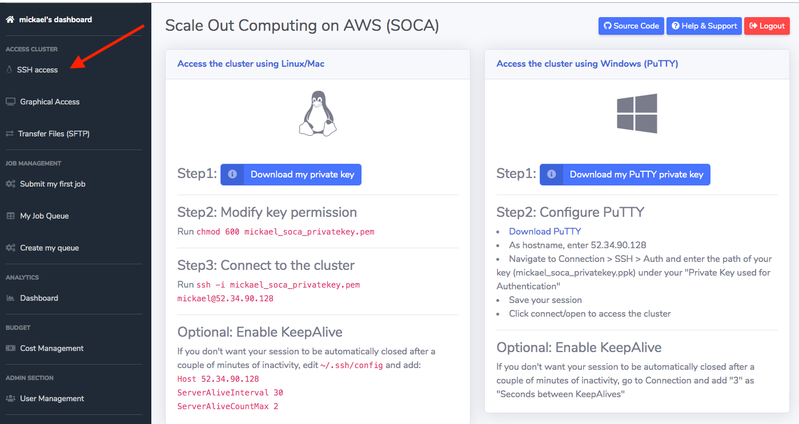

!!! info
    Backend storage on Scale-Out Computing on AWS is persistent. You will have access to the same filesystem ($HOME, /data and /apps) whether you access your cluster using SSH, Web Remote Desktop or Native Remote Desktop

## SSH access

To access your Scale-Out Computing on AWS cluster using SSH protocol, simply click  "SSH Access" on the left sidebar and follow the instructions. Scale-Out Computing on AWS will let you download your private key either in PEM or PPK format.



!!!info "SSH to an instance in a Private Subnet"
    If you need to access an instance that is in a Private (non-routable) Subnet, you can use ssh-agent to do this:
    
    ~~~bash hl_lines="1"
    $ ssh-add -K ~/Keys/my_key_region.pem
    Identity added: /Users/username/Keys/my_key_region.pem (/Users/username/Keys/my_key_region.pem)
    
    $ ssh-add -L
    <you should see your ssh key here>
    ~~~
    
    Now use ```-A``` with ssh and this will forward the key with your ssh login:
    
    ~~~bash
    $ ssh -A -i ~/Keys/my_key_region.pem centos@111.222.333.444
    ~~~
    
    Now that you have your key forwarded, you can login to an instance that is in the Private Subnet:
    ~~~bash
    $ ssh <USERNAME>@<PRIVATE_IP>
    ~~~

## Graphical access using Windows/Linux virtual desktop

Refer to [this page to learn how to launch your own Windows/Linux session and access SOCA via your virtual desktop](../web-interface/create-virtual-desktops/)