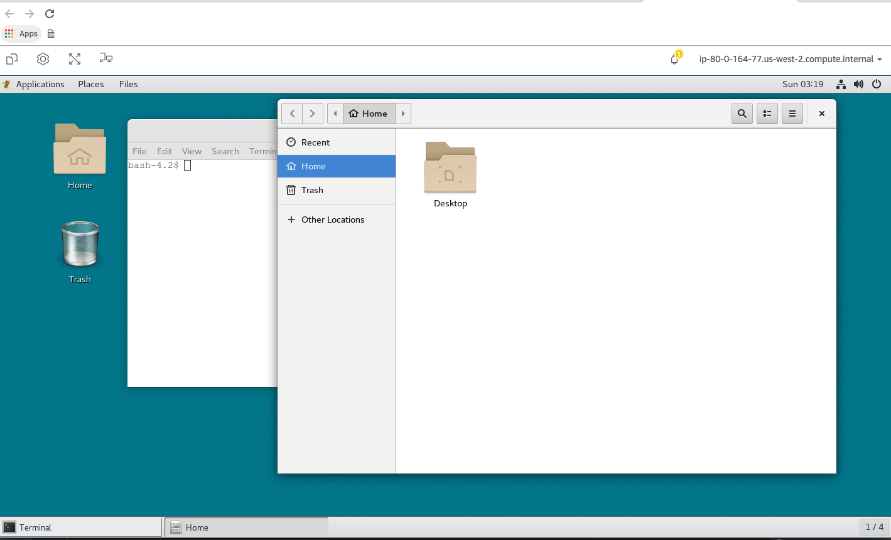
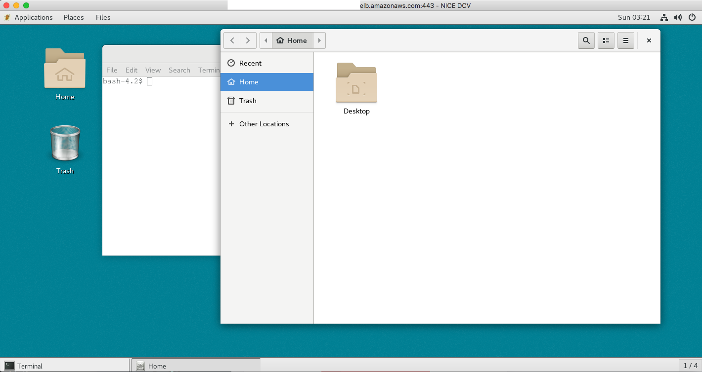

!!! info
    Backend storage on Scale-Out Computing on AWS is persistent. You will have access to the same filesystem ($HOME, /data and /apps) whether you access your cluster using SSH, Web Remote Desktop or Native Remote Desktop

## SSH access

To access your Scale-Out Computing on AWS cluster using SSH protocol, simply click  "SSH Access" on the left sidebar and follow the instructions. Scale-Out Computing on AWS will let you download your private key either in PEM or PPK format.


!!!info "SSH to an instance in a Private Subnet"
    If you need to access an instance that is in a Private (non-routable) Subnet, you can use ssh-agent to do this:
    
    ~~~bash hl_lines="1"
    $ ssh-add -K ~/Keys/my_key_region.pem
    Identity added: /Users/username/Keys/my_key_region.pem (/Users/username/Keys/my_key_region.pem)
    
    $ ssh-add -L
    <you should see your ssh key here>
    ~~~
    
    Now use ```-A``` with ssh and this will forward the key with your ssh login:
    
    ~~~bash
    $ ssh -A -i ~/Keys/my_key_region.pem centos@111.222.333.444
    ~~~
    
    Now that you have your key forwarded, you can login to an instance that is in the Private Subnet:
    ~~~bash
    $ ssh <USERNAME>@<PRIVATE_IP>
    ~~~

## Graphical access using DCV

To access your Scale-Out Computing on AWS cluster using a full remote desktop experience, click "Graphical Access" on the left sidebar. By default you are authorized to have 4 sessions (EC2 instances).


### Session Validity

You can choose how long your session will be valid. This parameter can be customized as needed


### Session type

You can choose the type of session you want to deploy, depending your needs. This parameter can be customized as needed


### Access your session

After you click "Launch my session", a new "desktop" job is sent to the queue. Scale-Out Computing on AWS will then provision the capacity and install all required packages including Gnome.
You will see an informational message asking you to wait up to 20 minutes before being able to access your remote desktop.


Once your session is ready, the message will automatically be updated with the connection information


You can access your session directly on your browser



You can also download the NICE DCV Native Clients for Mac / Linux and Windows and access your session directly through them

