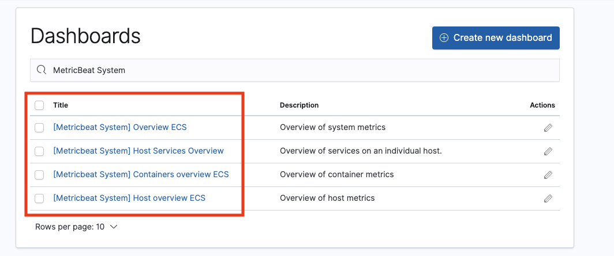
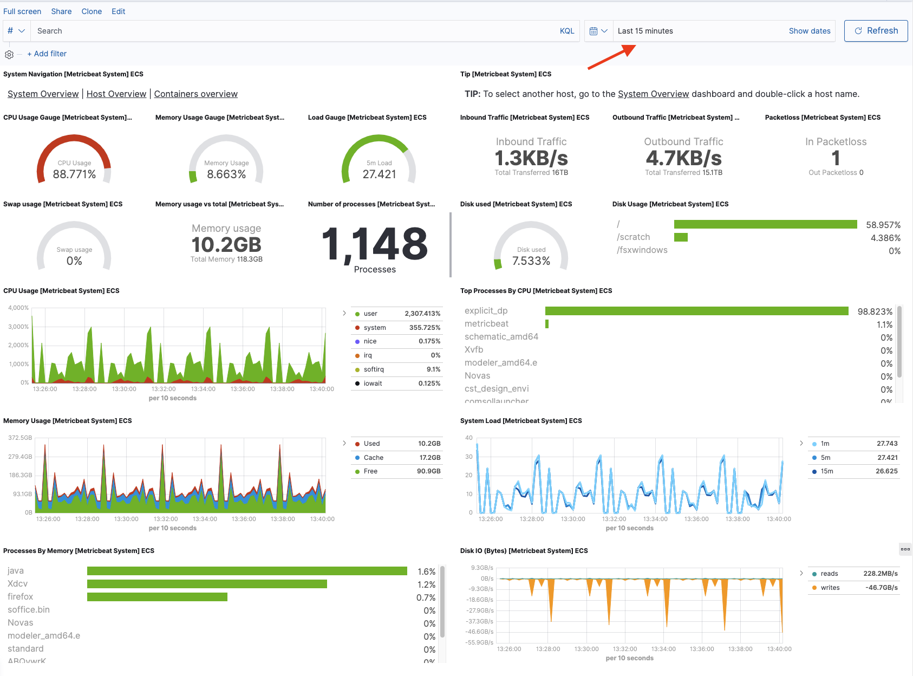
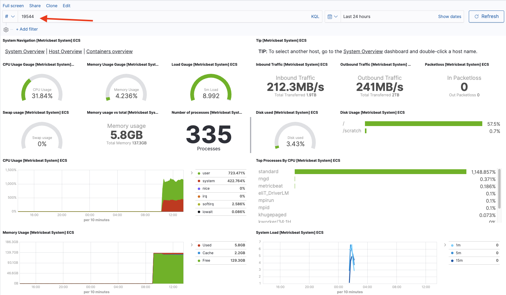

### What is MetricBeat

[Metricbeat](https://www.elastic.co/beats/metricbeat) is a lightweight shipper that you can install on your servers to periodically collect metrics from the operating system and from services running on the server.

### How to enable MetricBeat

MetricBeat is disabled by default. To enable it either submit a job with `system_metrics=True` or enable this parameter at the queue level. When this feature is active, SOCA will [automatically install and configure MetricBeat](https://github.com/awslabs/scale-out-computing-on-aws/blob/master/source/soca/cluster_node_bootstrap/ComputeNodeConfigureMetrics.sh) on all compute nodes provisioned for your jobs. Edit `ComputeNodeConfigureMetrics.sh` as needed (eg: change the check period, number of process to track etc ...)

!!!note 
    The very first job using MetricBeat will take an extra 45 secs as SOCA will perform the initial dashboard setup on Kibana. [This is a one time operation, and can be deactivated if you do not want to install MetricBeat dashboards by default](https://github.com/awslabs/scale-out-computing-on-aws/blob/master/source/soca/cluster_node_bootstrap/ComputeNodeConfigureMetrics.sh#L37-L44)

### Access MetricBeat data

MetricBeat is automatically integrated with your ElasticSearch cluster. Click 'Dashboard' and search for "MetricBeat System"

"Host Overview ECS" dashboard will give you system information related to nodes provisioned per job, users or queue. By default ELK reports "Last 15 minutes" data, so make sure you update the time selection accordingly

You can filter the results by job id, job owner, queue, process name or host IP. See the example below which return metrics information for job 19544

