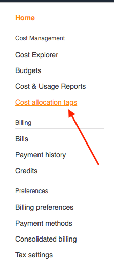
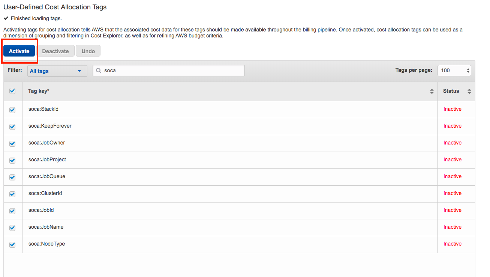

## AWS Cost Explorer

Any EC2 resource launched by Scale-Out Computing on AWS comes with an extensive list of EC2 tags that can be used to get detailed information about your cluster usage. List includes (but not limited to):

- Project Name
- Job Owner
- Job Name
- Job Queue
- Job Id

These are the default tags and you can add your own tags if needed. 

### Step1: Enable Cost Allocation Tags

!!!warning "Be patient"
    It could take up to 24 hours for the tags to be active

Click on your account name (1) then select "My Billing Dashboard" (2)  

Then click Cost Allocation tag

Finally, search all "Scale-Out Computing on AWS" tags then click "Activate"  

### Step 2: Enable Cost Explorer

In your billing dashboard, select "Cost Explorer" (1) and click "Enable Cost Explorer" (2).

### Step 3: Query Cost Explorer

Open your Cost Explorer tab and specify your filters. In this example I want to get the EC2 cost (1), group by day for my queue named "cpus" (2).  

To get more detailed information, select =='Group By'== and apply additional filters. 
Here is an example if I want user level information for "cpus" queue Click "Tag" section under "Group By" horizontal label (1) and select "soca:JobOwner" tag. Your graph will automatically be updated with a cost breakdown by users for "cpus" queue  

