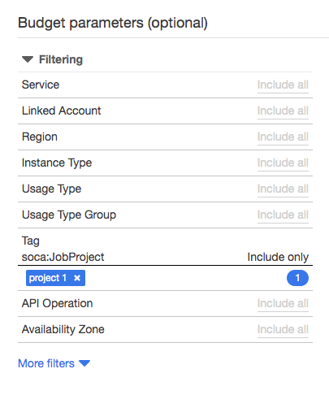
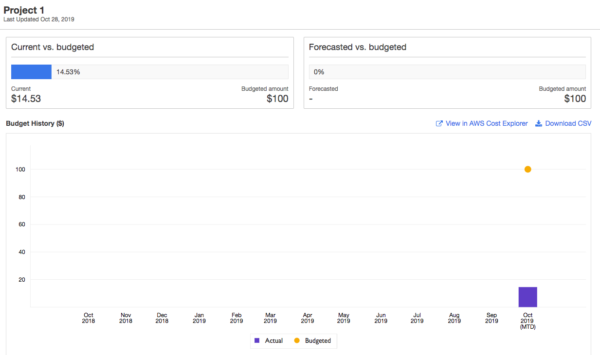
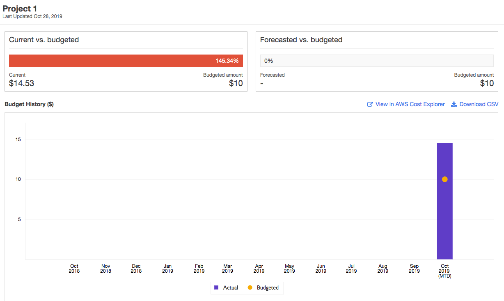

On this page, I will demonstrate how to configure a budget for a given project and reject job if you exceed the allocated budget

For this example, I will create a budget named "Project 1" and prevent user to submit job if (1) they do not belong to the project and (2) if the budget has expired.

[First, read this link](../../budget/review-hpc-costs/) to understand how to monitor your cluster cost and budgets on AWS.

## Configure the scheduler hook

To enable this feature, you will first need to verify the project assigned to each job during submission time. The script managing this can be found on your Scale-Out Computing on AWS cluster at `/apps/soca/<YOUR_SOCA_CLUSTER_ID>/cluster_hooks/queuejob/check_project_budget.py`
First, edit this file and manually enter your AWS account id:

~~~python hl_lines="2"
# User Variables
aws_account_id = '<ENTER_YOUR_AWS_ACCOUNT_ID>'
budget_config_file = '/apps/soca/<YOUR_SOCA_CLUSTER_ID>/cluster_manager/settings/project_cost_manager.txt'
user_must_belong_to_project = True  # Change if you don't want to restrict project to a list of users
allow_job_no_project = False  # Change if you do not want to enforce project at job submission
allow_user_multiple_projects = True  # Change if you want to restrict a user to one project
~~~

Then enable the hook by running the following commands as root (on the scheduler host):

~~~bash
user@host: qmgr -c "create hook check_project_budget event=queuejob"
user@host: qmgr -c "import hook check_project_budget application/x-python default /apps/soca/<YOUR_SOCA_CLUSTER_ID>/cluster_hooks/queuejob/check_project_budget.py"
~~~

## Test it

### Submit a job when budget is valid

Go to [AWS Billing](https://console.aws.amazon.com/billing/home?#/), click Budget on the left sidebar and create a new budget

Select "Cost Budget". Name your budget "Project 1" and configure the Period/Budget based on your requirements. 
For my example I will allocate a $100 per month recurring budget for my project called "Project 1" (use ==Tag: soca:JobProject==)

Set up a email notification when your budget exceed 80% then click "Confirm Budget"

As you can see, I have still money available for this project (budgeted $100 but only used $15). Let's try to submit a job

~~~bash
user@host$ qsub -- /bin/echo Hello
qsub: Error. You tried to submit job without project. Specify project using -P parameter
~~~

This does not work because the job was submitted without project defined. If you still want to let your users do that, edit `allow_job_no_project = False` on the hook file. Let's try the same request but specify `-P "Project 1"` during submission:

~~~bash
user@host$ qsub -P "Project 1" -- /bin/echo Hello
qsub: User mickael is not assigned to any project. See /apps/soca/cluster_manager/settings/project_cost_manager.txt
~~~

This time, the hook complains thant my user "mickael" is not mapped the the project. This is because (1) the budget does not exist on the HPC cluster or (2) my user has not been approved to use this project.
Edit `/apps/soca/cluster_manager/settings/project_cost_manager.txt` and configure your budget for this user:

~~~hl_lines="17 18"
# This file is used to prevent job submission when budget allocated to a project exceed your threshold
# This file is not used by default and must be configured manually using /apps/soca/cluster_hooks/queuejob/check_project_budget.py
# Help & Documentation: https://soca.dev/tutorials/set-up-budget-project/
#
#
# Syntax:
#   [project 1]
#   user1
#   user2
#   [project 2]
#   user1
#   user3
#   [project blabla]
#   user4
#   user5

[Project 1]
mickael
~~~

!!!danger "Important"
    The config section ("Project 1") **MUST** match the name of the budget your created on AWS Budget (it's case sensitive)

Save this file and try to submit a job, this time the job should go to the queue

~~~bash
user@host$ qsub -P "Project 1" -- /bin/echo Hello
5.ip-10-0-1-223
~~~

## Submit a job when budget is invalid

Now let's go back to your AWS budget, and let's simulate we are over-budget

Now try to submit a job for "Project 1", your request should be rejected
~~~bash
user@host$ qsub -P "Project 1" -- /bin/echo Hello
qsub: Error. Budget for Project 1 exceed allocated threshold. Update it on AWS Budget bash
~~~

The hook query the AWS Budget in real-time. So if your users are blocked because of budget restriction, you can at any time edit the value on AWS Budget and unblock them (assuming you still have some money left in your pocket :P )

As mentioned above, the project name on `/apps/soca/cluster_manager/settings/project_cost_manager.txt` and the name of your AWS Budget must match (case sensitive).
If a user tries to launch a job associated to a project which does not exist on AWS Budget or with an invalid name, you will see the following error:
~~~bash
bash-4.2$ qsub -P "Project 2" -- /bin/echo Hello
qsub: Error. Unable to query AWS Budget API. ERROR: An error occurred (NotFoundException) when calling the DescribeBudget operation: [Exception=NotFoundException] Failed to call DescribeBudget for [AccountId: <REDACTED_ACCOUNT_ID>] - Failed to call GetBudget for [AccountId: <REDACTED_ACCOUNT_ID>] - Unable to get budget: Project 2 - the budget doesn't exist.
~~~