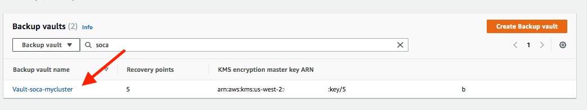
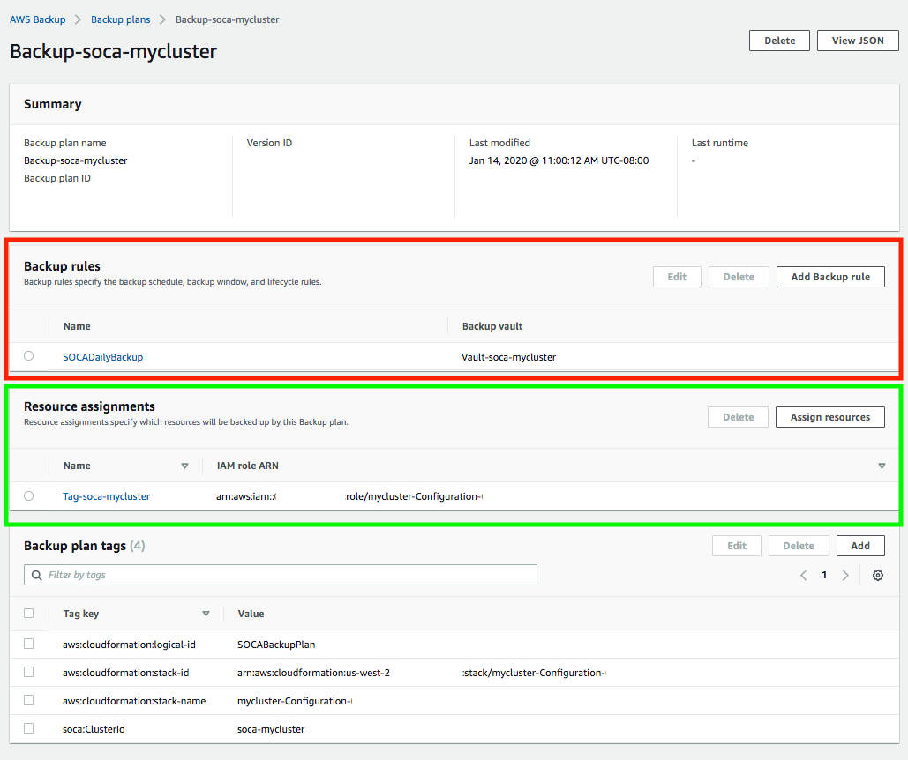
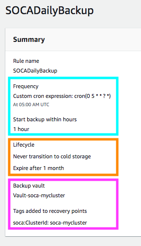
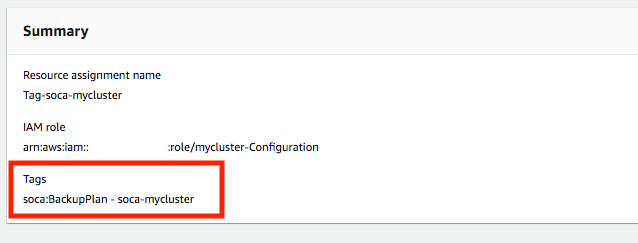
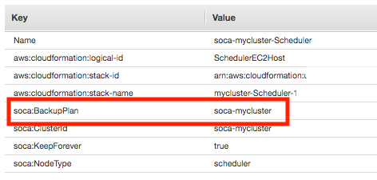
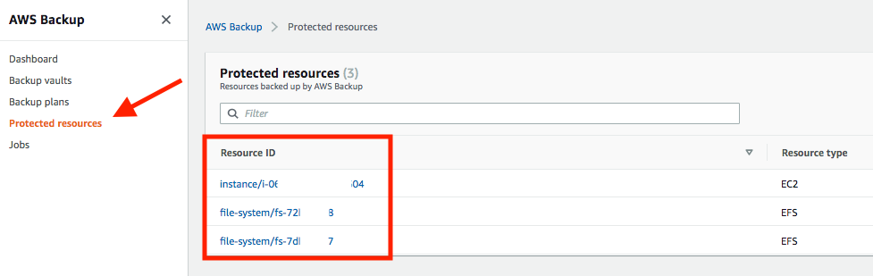
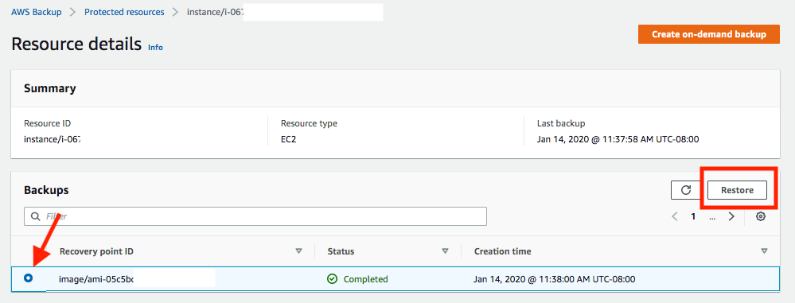
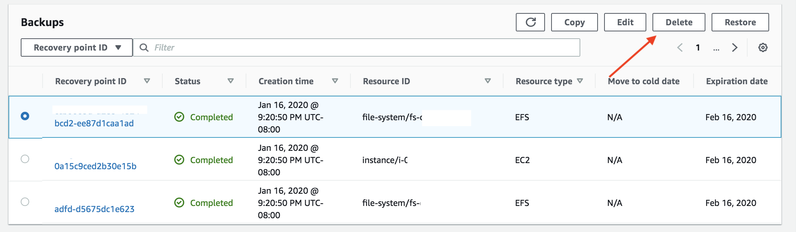
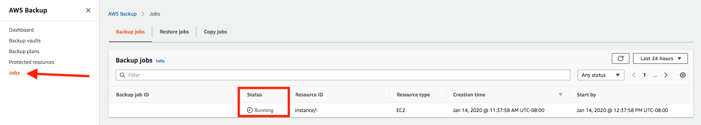

By default, Scale-Out Computing on AWS **automatically backup your EC2 scheduler and EFS filesystems every day and keep the backups for 30 days** using AWS Backup. During the installation, Scale-Out Computing on AWS creates a new backup vault and one backup plan. You can edit them if needed.

### What is AWS Backups?

[AWS Backup](https://aws.amazon.com/backup/) is a fully managed backup service that makes it easy to centralize and automate the back up of data across AWS services in the cloud. 
Using AWS Backup, you can centrally configure backup policies and monitor backup activity for AWS resources, such as Amazon EBS volumes, Amazon RDS databases, Amazon DynamoDB tables, Amazon EFS file systems.

### Backup Vault

A "Backup Vault" is where all your backups are stored. Your vault is automatically encrypted using your [Key Management Service (KMS)](https://aws.amazon.com/kms/) key and reference to your SOCA cluster ID (`soca-mycluster` in this example)

### Backup Plan

A "Backup Plan" is where you define all your backup strategy such as backup frequency, data retention or resource assignments.

#### Backup rules (red section)

By default, Scale-Out Computing on AWS creates one backup rule with the following parameters:

   - Backup will start every day between 5AM and 6AM UTC (blue section)
   - Backup will expire after 1 month (orange section)
   - Backup is stored on the encrypted vault created by SOCA (purple section)

If needed, you can edit this rule (or create a new one) to match your company backup strategy.

####  Resources Assignments (green section)

By default, Scale-Out Computing on AWS backup all data using the `soca:BackupPlan` tag. Value of this tag must match your cluster ID (`soca-mycluster` in this example).

!!!info "Supported Resources"
    AWS Backup only support the following resources:
    
    - EC2 instances
    - EBS disks
    - EFS filesystems
    - RDS (not used by SOCA)
    - DynamoDB (not used by SOCA)

### How to add/remove resources to the backup plan

Backup resources are managed by `soca:BackupPlan` tag. The value of this tag must match the value of your Backup Plan (by default it should match the name of your cluster).
Apply this tag to any EC2 instance, EBS volumes or EFS filesystem you want to backup.

### How to restore a backup?

On the left sidebar, click "Protected Resources" then choose the resource you want to restore

This will open a new window with additional information about this resource (either EFS or EC2). Select the latest entry you want to restore from the "Backups" section then click "Restore"

This will open a regular EC2 launch instance or EFS wizard. Specify the parameters (VPC, Subnet, Security Group, IAM role ...) you want to use and click "Restore Backup"

!!!info "Restore Role"
    - By default, you can only apply `SchedulerIAMRole` or `ComputeNodeIAMRole` to the EC2 resource you are restoring. If you want to restore one EC2 instance with a different role, you must edit `iam:PassRole` policy of your `SOCA-Backup` role.
    - Make sure to use the `SOCA-Backup` IAM role created by SOCA during initial installation. If you want to use the default role created by AWS Backup, make sure to add `iam:PassRole` permission.
    
### How to delete a backup ?

Select your vault, choose which recovery point you want to remove under the "Backups" section then click "Delete".

### Check the status of the backup jobs

On the left sidebar, check "Jobs" to verify if your backup jobs are running correctly

### What happen if you delete your Cloudformation stack?

Your backup vault won't be deleted if you have active backups in it. In case of accidental termination of your primary cloudformation template, you will still be able to recover your data by restoring the EFS and/or EC2.
To delete your AWS Backup entry, you first need to manually remove all backups present in your vault.

