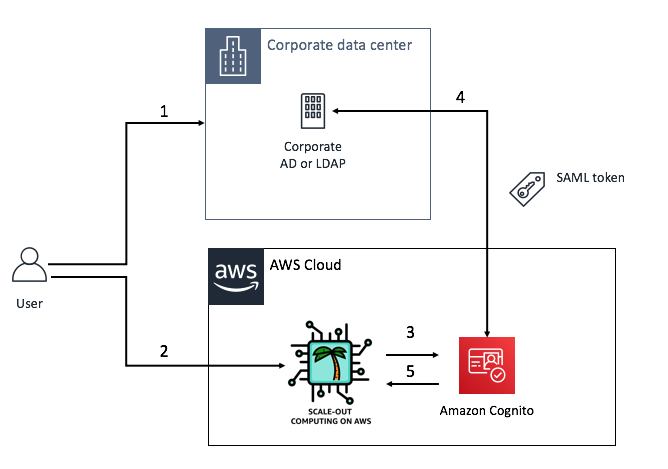
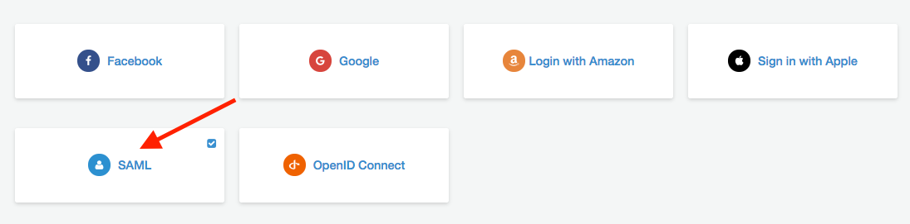
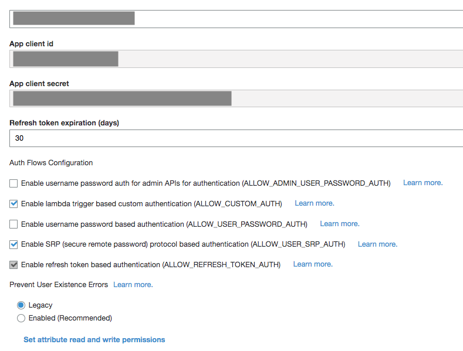
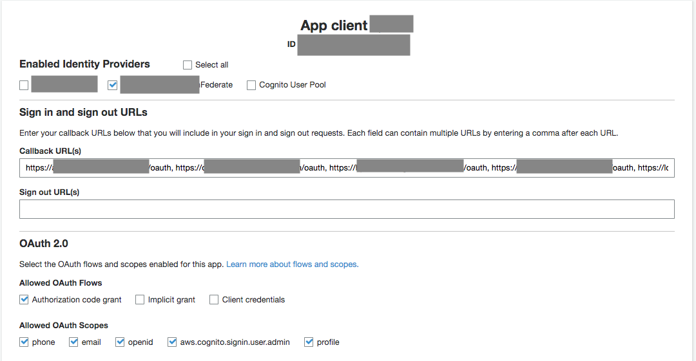

On this page, we will see how you can automatically authenticate your users to Scale-Out Computing on AWS using without having them to enter their password.

### What is Cognito / Oauth2

With [Amazon Cognito](https://aws.amazon.com/cognito/), your users can sign-in through social identity providers such as Google, Facebook, and Amazon, and through enterprise identity providers such as Microsoft Active Directory using SAML.
Amazon [Cognito User Pools provide](https://aws.amazon.com/blogs/mobile/understanding-amazon-cognito-user-pool-oauth-2-0-grants/) a secure user directory that scales to hundreds of millions of users. As a fully managed service, User Pools are easy to set up without any worries about server infrastructure. User Pools provide user profiles and authentication tokens for users who sign up directly and for federated users who sign in with social and enterprise identity providers.

Additionally, [read this link ](https://docs.aws.amazon.com/cognito/latest/developerguide/cognito-user-pools-app-idp-settings.html) if you are not already familiar with `Oauth2` workflow.

### How it works ?

- 1: Mary has an account on her corporate LDAP or Active Directory. This account has an username (e.g mary), an email (e.g mary@company.com) and other parameters (cost center, location ... ). She uses her account to log in to her corporate network.
- 2: Mary wants to access the web UI of SOCA (we assume she already has an active account on SOCA. If not, [refer to this page to learn how to manage user account on SOCA](../../web-interface/manage-ldap-users/))
    + 2.1: She can access the application by entering her SOCA LDAP username/password
    + 2.2: She can be automatically logged in using Amazon Cognito
- 3: Assuming SSO is enabled, SOCA will forward the access request Cognito which will use Mary's Corporate LDAP as a Federated identity to determine if she is a valid user. **This is the authentication part.**
- 4: Mary's Corporate LDAP will check her account (e.g based on Kerberos ticket) and return a SAML token. **This is the authorization part.**
- 5: Based on the authorization results, SOCA will automatically logs Mary in or reject her request

**What if Mary does not have an account on SOCA?**

Assuming a user has a valid credential on corporate LDAP/AD but not on SOCA, Cognito will redirect the user to the default SOCA login portal.

**How do you determine if a user has an account on SOCA?**

To verify if a corporate user is active and can log in, SOCA checks whether or not this user has an account. By default, we determine the user account name is the first part of an email address. 
For example, if the email returned by your corporate LDAP for a given user is `myuser@company.com`, we will assume this user the SOCA account is `myuser`. If this mapping does not apply to your company, you can change it by editing `/apps/soca/$SOCA_CONFIGURATION/cluster_web_ui/generic/auth.py`.

### Create your Cognito User Pool

!!!info
    This setup is different for each customer, refer fo the official AWS Documentaton for Cognito if needed.

First, you need to configure your [Cognito User Pool with your existing SAML provider](https://docs.aws.amazon.com/cognito/latest/developerguide/cognito-user-identity-pools.html). You can leave most settings by default as we won't be using any user password, custom login UI etc..
This step is optional if you already have a User Pool configured.

### Integrate your AD/LDAP with Cognito

Once your User Pool is created, go to `Federation > Identity Provider` and choose whatever IDP you want to use (most likely SAML if you are looking to integrate your corporate LDAP)
 

SAML integration vary based on your own corporate settings, reach out to your local IT if needed. Here are some extra links if you need more documentation related to SAML:

   - [SAML Authentication Flow](https://docs.aws.amazon.com/cognito/latest/developerguide/cognito-user-pools-saml-idp-authentication.html)
   - [Adding SAML Identity Providers to a User Pool](https://docs.aws.amazon.com/cognito/latest/developerguide/cognito-user-pools-saml-idp.html) 
   - [Create a SAML Provider on Cognito](https://docs.aws.amazon.com/cognito/latest/developerguide/cognito-user-pools-managing-saml-idp-console.html)

!!!warning SOCA Pre-Requisite 
    The only required parameters for Scale-Out Computing on AWS is the `email` attribute. 

### Create a Cognito Client 

On Cognito interface, click `User Pools > Federated Identities` then `General Settings > App Clients` and finally click `Add Another App Client`.

Note your client name, client id and client secret and leave all other parameters by default.

### Configure your Cognito Client

Now visit `App Integration > App client setting` and configure your application with the Identity Provider you just created (`Enabled Identity Provider`). 
You also want to specify the callback url(s) for all domains you are planning to use. The default callback URL you must specify is `https://<your_soca_elb_name>/oauth` but you can add any other URL if you have multiple environments (e.g: dev/test)

!!!danger "Important Info about Callback"
    Update the callback URLs with your custom domain if you are using one. If you don't do that, you will get a Cognito error with "Redirect URI mismatch"

### Configure SOCA

Edit `/apps/soca/$SOCA_CONFIGURATION/cluster_web_ui/generic/parameters.cfg` and update the `[cognito]` section as shown below:

~~~bash
[cognito]
## Cognito
enable_sso="true" # Set this flag to "true"
cognito_oauth_authorize_endpoint="https://<YOUR_COGNITO_POOL>.auth.<YOUR_REGION>.amazoncognito.com/oauth2/authorize"
cognito_oauth_token_endpoint="https://<YOUR_COGNITO_POOL>.auth.<YOUR_REGION>.amazoncognito.com/oauth2/token"
cognito_jws_keys_endpoint="https://cognito-idp.<YOUR_REGION>.amazonaws.com/<YOUR_REGION>_<YOUR_POOL_ID>/.well-known/jwks.json"
cognito_app_secret="<YOUR_APP_SECRET>"
cognito_app_id="<YOUR_APP_ID>"
cognito_root_url="<YOUR_WEB_URL>"
cognito_callback_url="<YOUR_CALLBACK_URL>"
~~~

!!!warning "Important"
    Make sure to use double quotes for all variables (eg. enable_sso="true" and not enable_sso='true')

### Restart the Web UI

Simply restart the Web UI by running:

~~~bash
/apps/soca/$SOCA_CONFIGURATION/cluster_web_ui/socawebui.sh stop
/apps/soca/$SOCA_CONFIGURATION/cluster_web_ui/socawebui.sh start
~~~

Now try to access `https://<YOUR_SOCA_DNS>/`, you should be automatically logged in.
 
Note that we keep `/login` as fallback authentication mechanism to LDAP, so make sure your users access `https://<YOUR_SOCA_DNS>/` and not `https://<YOUR_SOCA_DNS>/login` if they want to be automatically logged in with SSO

