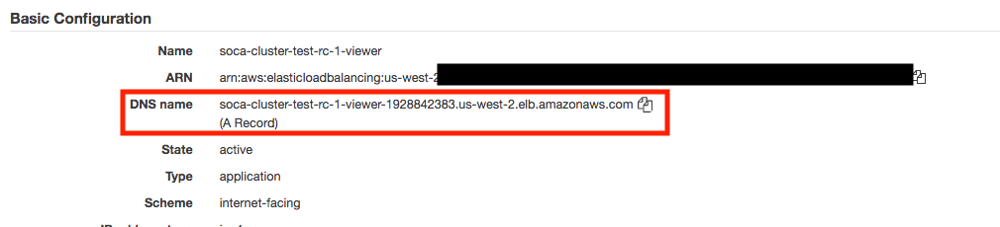
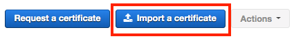
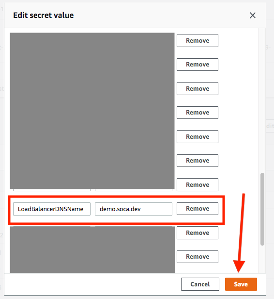
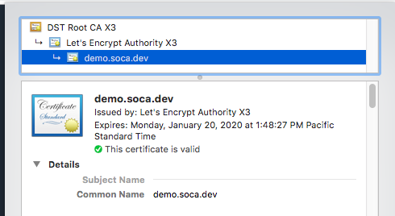
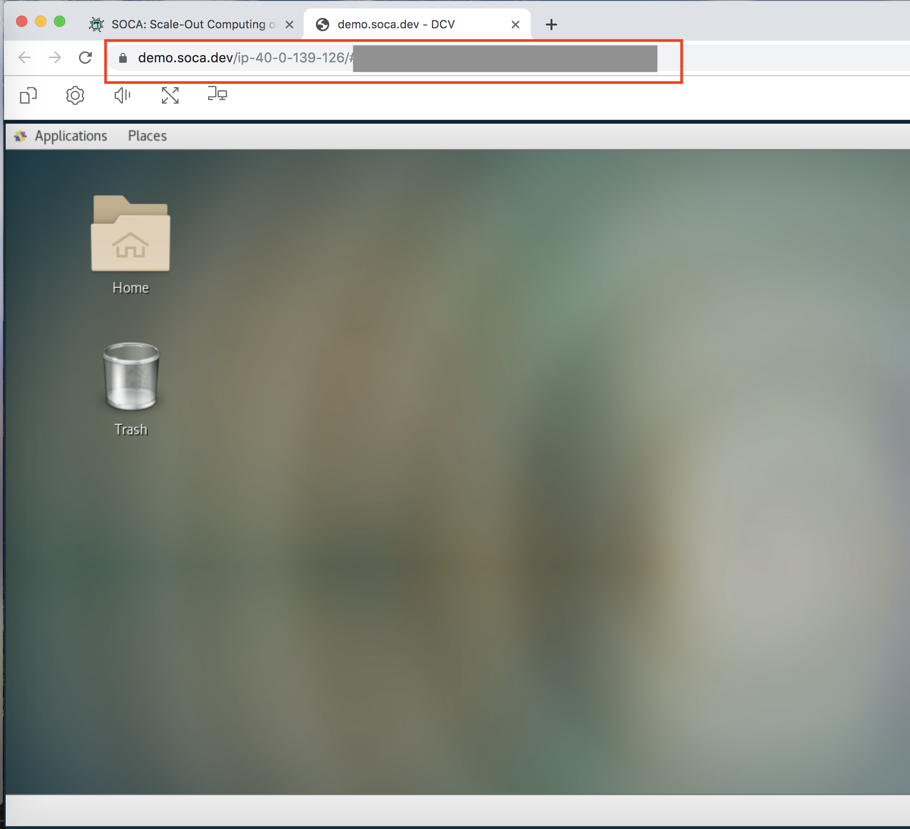

By default, Scale-Out Computing on AWS will use a non-friendly DNS name and create a unique certificate to enable access through your HTTPS endpoint. Because it's a self-signed certificate, browsers won't recognized it and you will get a security warning on your first connection. 

In this page, we will see how you can update Scale-Out Computing on AWS to match your company domain name.
# Create a new DNS record for Scale-Out Computing on AWS
For this example, let's assume I want to use `https://demo.soca.dev`. First locate the DNS associated to your ALB endpoint using the AWS console.

Create a new `CNAME` record which point to your ALB endpoint. Once done, validate your DNS is working properly using the `nslookup` command.

~~~bash
user@host: nslookup demo.soca.dev
Non-authoritative answer:
demo.soca.dev	canonical name = soca-cluster-test-rc-1-viewer-1928842383.us-west-2.elb.amazonaws.com.
Name:	soca-cluster-test-rc-1-viewer-1928842383.us-west-2.elb.amazonaws.com
Address: 52.40.2.185
Name:	soca-cluster-test-rc-1-viewer-1928842383.us-west-2.elb.amazonaws.com
Address: 54.68.240.4
Name:	soca-cluster-test-rc-1-viewer-1928842383.us-west-2.elb.amazonaws.com
Address: 52.27.180.89
~~~

# Upload your SSL certificate to ACM

Now that your friendly DNS is running, you will need to update the default ALB certificate to match your new domain. This assume you have a valid SSL certificate signed by a valid Certificate Authority (Symantec, Digicert ...)

To upload your certificate, visit the AWS Certificate Manager (ACM) bash and click "Import a Certificate".

Enter your private key, certificate and certificate chain (optional), then click Import.

Once the import is complete, note your certificate identifier.

# Update your ALB with the new certificate

Navigate to your Scale-Out Computing on AWS Load Balancer and choose "Listeners" tab. Select your HTTPS listener and click 'Edit' button.

Change the default certificate to point to your new certificate and save your change.

# Update your default domain for DCV 

Now that you have updated your domain, you must also update DCV to point to the new DNS. Open your Secret Manager bash and select your Scale-Out Computing on AWS cluster configuration. Click "Retrieve Secret Value" and then "Edit". 

Find the entry "LoadBalancerName" and update the value with your new DNS name (demo.soca.dev in my case) then click Save

# Validate everything

Now that you have your friendly DNS and SSL certificate configured, it's time to test.

Visit your new DNS (`https://demo.soca.dev` in my case) and make sure you can access Scale-Out Computing on AWS correctly.

Make sure your browser is detecting your new SSL certificate correctly.

Finally, [create a new DCV session](../../access-soca-cluster/#graphical-access-using-dcv) and verify the endpoint is using your new DNS name

