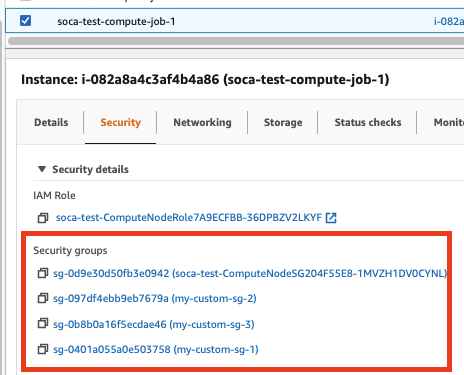
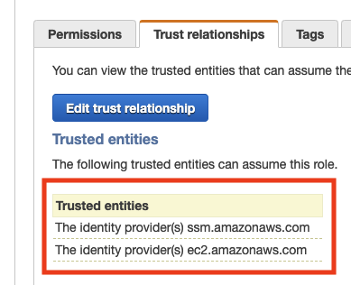
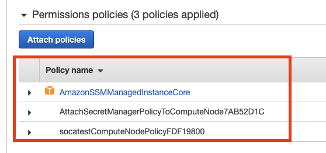
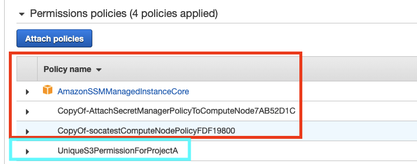
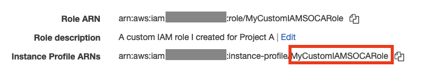
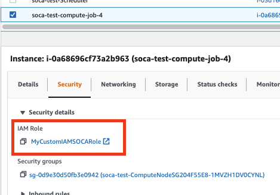

On this page, we will see how you can deploy your compute nodes with custom security groups or IAM role

### Security Groups

By default, compute nodes are provisioned with a single security group designed to enable all connectivity between the various services used by SOCA. You can extend this capability and specify up to 4 additional security groups for your jobs.

For security reasons, HPC admins must manually enable a list of security group IDs authorized for the queue. 
To do that, edit `/apps/soca/$SOCA_CONFIGURATION/cluster_manager/settings/queue_mapping.yml` and make sure `security_groups` is not listed as `restricted_parameters` and verify that your security groups ids are safelisted under `allowed_security_group_ids`:

```console hl_lines="6 8"
queue_type:
  compute:
    queues: ["myqueue"]
    ....
    # make sure securitys_group is not a restricted parameter
    restricted_parameters: [] 
    #  List all the security group ids allowed for your queue
    allowed_security_group_ids: ["sg-abcde","sg-fghijk"]
```

!!!note
    We recommend to also configure [queues access lists (ACLs)](../../security/manage-queue-acls/) to limit which individuals/LDAP groups are authorized to configure custom security groups

#### Submit a job with one extra security group

Submit a job as you would normally do and add `-l security_group=<Security_group_id>` to the submission command. For example:

~~~console
qsub -l security_groups=sg-0401a055a0e503758 -- /bin/echo test
0.ip-70-0-0-54
~~~

You can validate your job configuration by running `qstat -f`

~~~console hl_lines="3"
qstat -f 0 | grep Resource
    ...
    Resource_List.security_groups = sg-0401a055a0e503758
    ...
~~~

Alternatively, you can also verify if the nodes provisioned have assigned your custom security group successfully by checking the "Security" tab on EC2 console. 
Please note the `ComputeNodeSG` will always be assigned to your job as this is the default security group created by SOCA.


!!!warning "Security group not authorized"
    `qsub: Security group sg-0401a055a0e503758 is not authorized for this queue. Please enable it on /apps/soca/$SOCA_CONFIGURATION/cluster_manager/settings/queue_mapping.yml`

    To fix this error, simply safelist the security group id on the queue_mapping.py section assigned to your queue:
   
    `allowed_security_group_ids: ["sg-0401a055a0e503758"]`

#### Submit a job with more than one extra security group

You can specify up to 4 additional security groups by using `+` delimiter.

First, make sure all the security group ids are authorized on the queue. To do so, edit the `queue_mapping.yaml` and add all the security group ids you are planning to use:

~~~console
allowed_security_group_ids: ["sg-0401a055a0e503758","sg-0b8b0a16f5ecdae46","sg-097df4ebb9eb7679a"]
~~~

Finally submit a test job and add `-l security_groups=<sg_1>+<sg_2>+....+<sg_n>` to your job submission command:

~~~console
qsub -l security_groups=sg-0401a055a0e503758+sg-0b8b0a16f5ecdae46+sg-097df4ebb9eb7679a -- /bin/echo test
1.ip-70-0-0-54
~~~

Validate the EC2 nodes use the correct security groups by running `qstat -f` or directly check the EC2 console. Please note the ComputeNodeSG will always be assigned to your job as this is the default security group created by SOCA.




!!!note
    Due to AWS limitation, you can configure up to 4 additional security groups

#### Errors and Troubleshooting

If your jobs can't run, [refer to this link for troubleshooting procedure](../../web-interface/my-job-queue/#understand-why-your-job-cannot-start) or run `qstat -f <job_id>` and look for `error_message`.


### IAM role

By default, compute nodes are provisioned with an IAM role designed to enable all connectivity between the various services used by SOCA. 
You can extend this capability and specify your own IAM role for your simulation.

For security reasons, HPC admins must manually enable a list of IAM instance profile authorized for the queue. 
To do that, edit `/apps/soca/$SOCA_CONFIGURATION/cluster_manager/settings/queue_mapping.yml` and make sure `instance_profile` is not listed as `restricted_parameters` and verify that you instance profiles are safelisted under `allowed_instance_profiles`:

```console hl_lines="6 8"
queue_type:
  compute:
    queues: ["myqueue"]
    ....
    # make sure instance_profile is not a restricted parameter
    restricted_parameters: [] 
    #  List all the IAM instance profile name  allowed for your queue
    allowed_instance_profiles: ["MyProfile"]
```

!!!note
    We recommend to also configure [queues access lists (ACLs)](../../security/manage-queue-acls/) to limit which individuals/LDAP groups are authorized to configure custom IAM instance profiles

#### Create your own IAM role


##### Enable Trust Relationship for SSM 
On the custom IAM role, make sure to enable `ssm.amazonaws.com` as trusted entity (select IAM role and click Trust Relationships)



##### Copy base permissions from default IAM role

Then locate the default IAM role for your SOCA cluster and copy all the permissions to the new IAM role. 
The name of the base IAM role will always be `soca-<YourClusterName>-ComputeNodeRole<UniqueID>`. 

Locate the base role and copy the permissions below to your custom IAM role:



We recommend opening the IAM policies as JSON and simply copy/paste the content to the custom IAM role



Now your custom IAM share the required permission by SOCA (red section) as well as a list of unique permissions specific to this custom role (blue section)

##### Enable iam:PassRole permission

Finally, for security reasons, SOCA does not let you use other IAM roles by default, and you will have to grant permission to the Scheduler role (not ComputeNode).
The name of the scheduler IAM role will always be `soca-<YourClusterName>-SchedulerRole<UniqueID>`. 
Once selected, click "Add Inline Policy", click JSON and paste the following (replace "Resource" with the ARN of your IAM role):

~~~json
{
    "Version": "2012-10-17",
    "Statement": [
        {
            "Sid": "VisualEditor0",
            "Effect": "Allow",
            "Action": "iam:PassRole",
            "Resource": "arn:aws:iam::<AWS_AccountID>:role/<RoleName>"
        }
    ]
}
~~~
You can retrieve the ARN of the role you want to use via the IAM role console


#### Submit a job with a custom IAM role

Now that your IAM role is created, retrieve the name of the Instance Profile (note: name of IAM role and Instance profile can sometimes be different. Make sure you retrieve the instance profile name -in red- and not the actual role name)



Enable this role on `/apps/soca/$SOCA_CONFIGURATION/cluster_manager/settings/queue_mapping.yml`

~~~console
allowed_instance_profiles: ["MyCustomIAMSOCARole"]
~~~

Submit a job with `-l instance_profile` parameters:
~~~
qsub -l instance_profile=MyCustomIAMSOCARole -- /bin/echo test
4.ip-70-0-0-54
~~~

You can validate your job configuration by running `qstat -f`

~~~console hl_lines="3"
qstat -f 4 | grep Resource
    ...
    Resource_List.instance_profile = MyCustomIAMSOCARole
    ...
~~~

Alternatively, you can also verify if the nodes provisioned have assigned your custom IAM role successfully by checking the "Security" tab on EC2 console. 




!!!warning "Profile not authorized"
    `qsub: IAM instance profile MyCustomIAMSOCARole is not authorized for this queue. Please enable it on /apps/soca/$SOCA_CONFIGURATION/cluster_manager/settings/queue_mapping.yml`

    To fix this error, simply safelist the profile name on the queue_mapping.py section assigned to your queue:
   
    `allowed_instance_profiles: ["MyCustomIAMSOCARole"]`