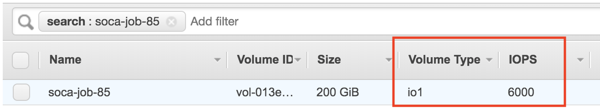

!!! info "Scale-Out Computing on AWS gives you the flexibility to customize your storage backend based on your requirements"
    - You can customize the root partition size
    - You can provision a local scratch partition
    - You can deploy standard SSD (gp2) or IO Optimized SSD (io1) volumes
    - Scale-Out Computing on AWS automatically leverages instance store disk(s) as scratch partition when applicable
    - In term of performance: Instance Store > EBS SSD IO > EBS SSD Standard > EFS
    
    [Refer to this link](https://aws.amazon.com/ebs/features/) to learn more about EBS volumes.

## EFS (shared) partitions

### /data partition

/data is an [Elastic File System](https://aws.amazon.com/efs/) partition mounted on all hosts. This contains the home directory of your LDAP users ($HOME = `/data/home/<USERNAME>`). **This partition is persistent**. Avoid using this partition if your simulation is disk I/O intensive (use /scratch instead)

### /apps partition

/apps is an [Elastic File System](https://aws.amazon.com/efs/) partition mounted on all hosts. This partition is designed to host all your CFD/FEA/EDA/Mathematical applications. **This partition is persistent**. Avoid using this partition if your simulation is disk I/O intensive (use /scratch instead)

The corresponding EFS file system is deployed with bursting Throughput mode which depends on burst credits. /apps has cron jobs that monitor the status of the cluster, scale-up and scale-down the cluster, and is also running the web application. If the cluster stays up and running for 1+ months and not much additional applications are installed under /apps, then EFS file system might run out of burst credits which could impact the web application. Starting v2.6.0, the solution deploys CloudWatch Alarms to monitor the burst credits for /apps EFS file system. When burst credits are close to be depleted, a lambda function is triggered to change the Throughput mode to provisioned at 5 MiB/sec. This increases the monthly cost of EFS by ~$30/month (for us-west-2 and us-east-1 regions). After some time, the file system would have earned enough burst credits, so the lambda function changes Throughput mode back to bursting as it is more cost effective. [Click here to learn more about EFS Throughput modes](https://docs.aws.amazon.com/efs/latest/ug/performance.html#throughput-modes)

## FSx

Scale-Out Computing on AWS supports FSx natively. [Click here to learn how to use FSx as backend storage for your jobs](../../storage/launch-job-with-fsx/).

## Instance (local) partitions

Below are the storage options you can configure at an instance level for your jobs. If needed, add/remove/modify the storage logic by editing `ComputeNode.sh` script to match your requirements.

### Root partition

By default Scale-Out Computing on AWS provision a 10GB EBS disk for the root partition. This may be an issue if you are using a custom AMI configured with a bigger root disk size or if you simply want to allocate additional storage for the root partition. 
To expand the size of the volume, submit a simulation using `-l root_size=<SIZE_IN_GB>` parameter.

~~~bash
user@host:qsub -l root_size=25 -- /bin/sleep 600
~~~

Result: Root partition is now 25GB

~~~bash hl_lines="3 9"
user@host: lsblk
NAME          MAJ:MIN RM SIZE RO TYPE MOUNTPOINT
nvme0n1       259:0    0  25G  0 disk
├─nvme0n1p1   259:1    0  25G  0 part /
└─nvme0n1p128 259:2    0   1M  0 part

user@host: df -h /
Filesystem      Size  Used Avail Use% Mounted on
/dev/nvme0n1p1   25G  2.2G   23G   9% /
~~~

### Scratch Partition

!!! info
    - It's recommended to provision `/scratch` directory whenever your simulation is I/O intensive.
    - `/scratch` is a local partition and will be deleted when you job complete. Make sure to copy the job output back to your $HOME
    - `/scratch` is automatically created when Instance supports local ephemeral storage

#### Request a /scratch partition with SSD disk

During job submission, specify `-l scratch_size=<SIZE_IN_GB>` to provision a new EBS disk (`/dev/sdj`) mounted as `/scratch`

~~~bash
user@host: qsub -l scratch_size=150 -- /bin/sleep 600
~~~

Result: a 150 GB /scratch partition is available on all nodes

~~~bash hl_lines="3 10"
user@host: lsblk
NAME          MAJ:MIN RM  SIZE RO TYPE MOUNTPOINT
nvme1n1       259:0    0  150G  0 disk /scratch
nvme0n1       259:1    0   10G  0 disk
├─nvme0n1p1   259:2    0   10G  0 part /
└─nvme0n1p128 259:3    0    1M  0 part

user@host: df -h /scratch
Filesystem      Size  Used Avail Use% Mounted on
/dev/nvme1n1    148G   61M  140G   1% /scratch
~~~

To verify the type of your EBS disk, simply go to your AWS bash > EC2 > Volumes and verify your EBS type is "gp2" (SSD). 
[Refer to this link](https://docs.aws.amazon.com/AWSEC2/latest/UserGuide/EBSVolumeTypes.html) for more information about the various EBS types available.

#### Request a /scratch partition with IO optimized disk

To request an optimized SSD disk, use `-l scratch_iops=<IOPS>` along with `-l scratch_size=<SIZE_IN_GB>`. [Refer to this link](https://docs.aws.amazon.com/AWSEC2/latest/UserGuide/EBSVolumeTypes.html) to get more details about burstable/IO EBS disks.
~~~bash
user@host: qsub -l scratch_iops=6000 -l scratch_size=200 -- /bin/sleep 600
~~~

Looking at the EBS bash, the disk type is now "io1" and the number of IOPS match the value specified at job submission.

### Instance store partition

!!! warning "Free storage is always good"
    You are not charged for instance storage (included in the price of the instance)

[Some instances come with default instance storage](https://docs.aws.amazon.com/AWSEC2/latest/UserGuide/InstanceStorage.html).
An instance store provides temporary block-level storage for your instance. This storage is located on disks that are physically attached to the host computer and is removed as soon as the node is deleted.

Scale-Out Computing on AWS automatically detects instance store disk and will use them as /scratch **unless you specify `-l scratch_size` parameter for your job**. In this case, Scale-Out Computing on AWS honors the user request and ignore the instance store volume(s).

#### When node has 1 instance store volume

For this example, I will use a "c5d.9xlarge" instance which is coming with a 900GB instance store disk.

~~~bash
user@host: qsub -l instance_type=c5d.9xlarge -- /bin/sleep 600
~~~

Result: Default /scratch partition has been provisioned automatically using local instance storage

~~~bash hl_lines="3 10"
user@host: lsblk
NAME          MAJ:MIN RM   SIZE RO TYPE MOUNTPOINT
nvme1n1       259:0    0 838.2G  0 disk /scratch
nvme0n1       259:1    0    10G  0 disk
├─nvme0n1p1   259:2    0    10G  0 part /
└─nvme0n1p128 259:3    0     1M  0 part

user@host: df -h /scratch
Filesystem      Size  Used Avail Use% Mounted on
/dev/nvme1n1    825G   77M  783G   1% /scratch
~~~

#### When node has more than 1 instance store volumes

In this special case, `ComputeNode.sh` script will create a raid0 partition using all instance store volumes available.
 
For this example, I will use a "m5dn.12xlarge" instance which is shipped with a 2 * 900GB instance store disks (total 1.8Tb).

~~~bash
user@host: qsub -l instance_type=m5dn.12xlarge -- /bin/sleep 600
~~~

Result: /scratch is a 1.7TB raid0 partition (using 2 instance store volumes)

~~~bash hl_lines="3 5 13"
user@host: lsblk
NAME          MAJ:MIN RM   SIZE RO TYPE  MOUNTPOINT
nvme1n1       259:0    0 838.2G  0 disk
└─md127         9:127  0   1.7T  0 raid0 /scratch
nvme2n1       259:1    0 838.2G  0 disk
└─md127         9:127  0   1.7T  0 raid0 /scratch
nvme0n1       259:2    0    10G  0 disk
├─nvme0n1p1   259:3    0    10G  0 part  /
└─nvme0n1p128 259:4    0     1M  0 part

user@host: df -h /scratch
Filesystem      Size  Used Avail Use% Mounted on
/dev/md127      1.7T   77M  1.6T   1% /scratch
~~~
### Combine custom scratch and root size

You can combine parameters as needed. For example, `qsub -l root_size=150 -l scratch_size=200 -l nodes=2` will provision 2 nodes with 150GB / and 200GB SSD /scratch

### Change the storage parameters at queue level

Edit `/apps/soca/$SOCA_CONFIGURATION/cluster_manager/settings/queue_mapping.yml` to configure default storage settings at a queue level:

~~~yaml hl_lines="7 8 15 16 23"
queue_type:
  compute:
    # /root will be 30 GB and /scratch will be a standard 100GB SSD
    queues: ["queue1", "queue2", "queue3"]
    instance_ami: "ami-082b5a644766e0e6f"
    instance_type: "c5.large"
    scratch_size: "100"
    root_size: "30"
    # .. Refer to the doc for more supported parameters
  memory:
    # /scratch will be a SSD with provisioned IO
    queues: ["queue4"]
    instance_ami: "ami-082b5a644766e0e6f"
    instance_type: "r5.large"
    scratch_size: "300"
    scratch_iops: "5000"

  instancestore:
    # /scratch will use the default instance store
    queues: ["queue5"]
    instance_ami: "ami-082b5a644766e0e6f"
    instance_type: "m5dn.12large"
    root_size: "300"
~~~
