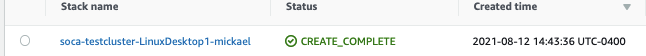
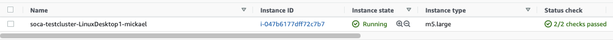
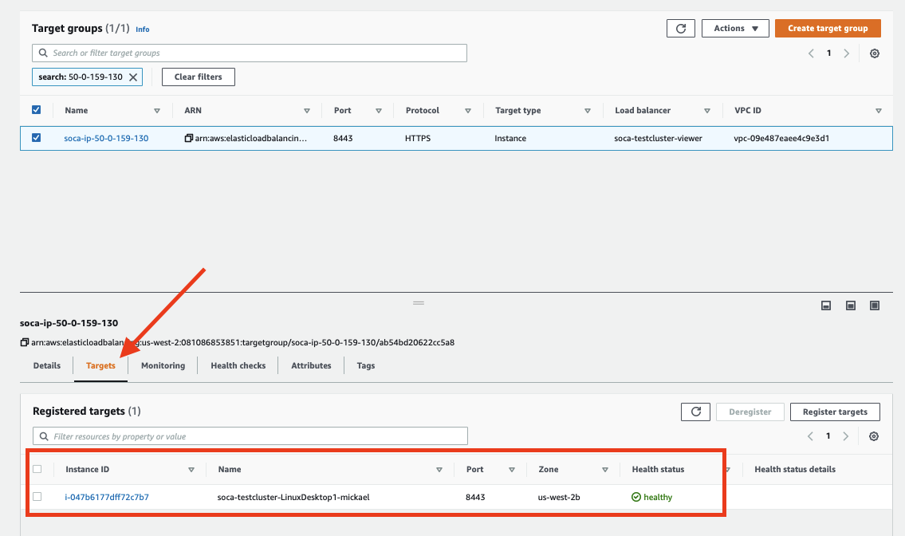
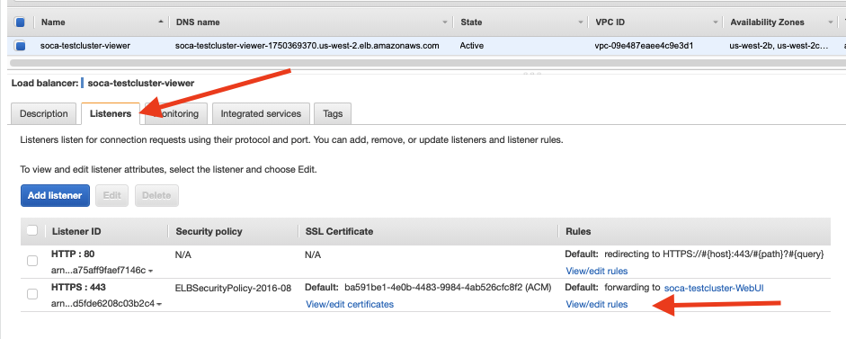
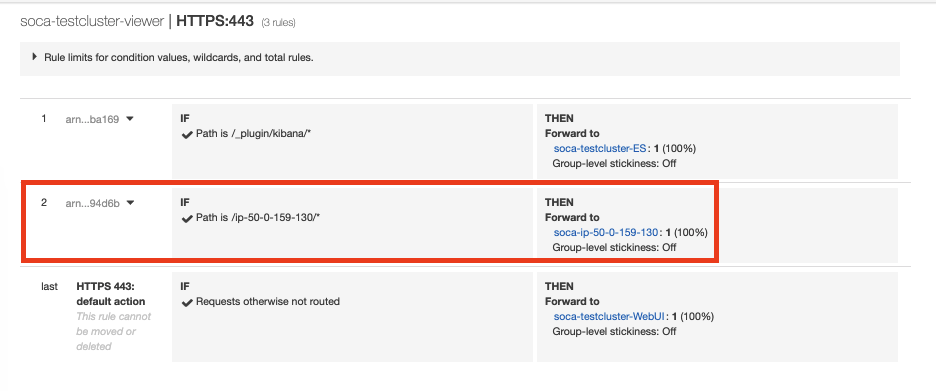
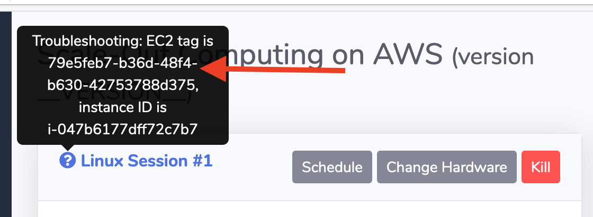

NICE DCV is a high-performance remote display protocol. It lets you securely deliver remote desktops and application streaming from any cloud or data center to any device, over varying network conditions. 
[Official documentation can be found here.](https://docs.aws.amazon.com/dcv/latest/adminguide/what-is-dcv.html)

## How DCV is integrated to SOCA

1 - User creates a Windows or Linux DCV session via [SOCA web interface](../../web-interface/create-virtual-desktops/)

2 - SOCA executes a couple of actions [via this function](https://github.com/awslabs/scale-out-computing-on-aws/blob/main/source/soca/cluster_web_ui/views/remote_desktop.py#L256):
  
  - Verify the user inputs (e.g: run ec2 dry-run, sanitize session name ...)
      
  -  Generate a cloudformation template via [dcv_cloudformation_builder.py](https://github.com/awslabs/scale-out-computing-on-aws/blob/main/source/soca/cluster_web_ui/dcv_cloudformation_builder.py)
  
  - A new entry will be added to database. Check [this link for Linux DCV](https://github.com/awslabs/scale-out-computing-on-aws/blob/main/source/soca/cluster_web_ui/views/remote_desktop.py#L469) and [this one for Windows DCV](https://github.com/awslabs/scale-out-computing-on-aws/blob/main/source/soca/cluster_web_ui/views/remote_desktop_windows.py#L398)


3 - Cloudformation will launch a EC2 instance and apply [DCV related tags](https://github.com/awslabs/scale-out-computing-on-aws/blob/main/source/soca/cluster_web_ui/dcv_cloudformation_builder.py#L56-L61) such as `soca:NodeType=dcv`, `soca:DCVSessionUUID` and `soca:DCVSystem`

3 - [dcv_alb_manager.py](https://github.com/awslabs/scale-out-computing-on-aws/blob/main/source/soca/cluster_manager/dcv_alb_manager.py) is a script running every minute on the scheduler. This script is responsible to update the Load Balancer with the new DCV instance as well as clean old/un-used load balancer rules. Log can be found under `/apps/soca/$SOCA_CONFIGURATION/cluster_manager/dcv_alb_manager.py.log`

  - Script will [detect the DCV host via EC2 tags](https://github.com/awslabs/scale-out-computing-on-aws/blob/main/source/soca/cluster_manager/dcv_alb_manager.py#L15)
  
  - A new [Target Group will be created](https://github.com/awslabs/scale-out-computing-on-aws/blob/main/source/soca/cluster_manager/dcv_alb_manager.py#L73)

  - DCV instance [will be registered](https://github.com/awslabs/scale-out-computing-on-aws/blob/main/source/soca/cluster_manager/dcv_alb_manager.py#L58) to the newly created target group

  - Finally, a [new load balancer rule will be created](https://github.com/awslabs/scale-out-computing-on-aws/blob/source/soca/cluster_manager/dcv_alb_manager.py#L110). Rule name will always be `/ip-x-x-x-x` where `x-x-x-x` is the private IP of the DCV instance

4 - Every time you access your DCV portal, [SOCA will query the database and retrieve your associated DCV information from the database](https://github.com/awslabs/scale-out-computing-on-aws/blob/main/source/soca/cluster_web_ui/views/remote_desktop.py#L121). To determine if your session is alive, [a `cURL` command will be executed to the DCV host](https://github.com/awslabs/scale-out-computing-on-aws/blob/main/source/soca/cluster_web_ui/views/remote_desktop.py#L200-L211). Based on the return code, the database entry will be updated and your session state can take the following values:

  - `state=running` if the curl command return `200`
    
  - `state=stopped` when you stop a running DCV session

  - `state=impaired` if the `ec2-describe-instance` determine your EC2 instance is not reachable

  - `state=pending` If the DCV session was created or restarted but the `cURL` command is not returning an HTTP/200 yet

For more information, [refer to `remote_desktop.py` file](https://github.com/awslabs/scale-out-computing-on-aws/blob/main/source/soca/cluster_web_ui/views/remote_desktop.py) or [`remote_desktop_windows.py` if yo uare debugging a Windows DCV](https://github.com/awslabs/scale-out-computing-on-aws/blob/main/source/soca/cluster_web_ui/views/remote_desktop_windows.py)

## Understand what service is failing

It's recommended to run `cURL -k -I` (uppercase i) on DCV session and look for the headers returned to understand what to look for:

~~~console hl_lines="6"
# curl -k -I https://<SOCA_URL>.us-west-2.elb.amazonaws.com/ip-50-0-159-130/?authToken=<TOKEN>#<SESSION_ID>
HTTP/2 200
date: Fri, 13 Aug 2021 19:56:12 GMT
content-type: text/html; charset="utf-8"
content-length: 439
server: dcv
x-frame-options: DENY
strict-transport-security: max-age=31536000; includeSubDomains
~~~

`server=dcv`: Application Load Balancer (ALB) and DCV service are operating correctly, however your DCV session is not reachable. Refer to the Debug section below to understand why your DCV service is not operating correctly

~~~console hl_lines="3"
# curl -k -I https://<SOCA_URL>.us-west-2.elb.amazonaws.com/ip-50-0-159-130/?authToken=<TOKEN>#<SESSION_ID>
HTTP/2 502
server: awselb/2.0
date: Fri, 13 Aug 2021 20:00:08 GMT
content-type: text/html
content-length: 122
~~~

`server=awselb/2.0`: Either your ALB is not configured correctly or the DCV service is not running on the DCV host

## Verify your CloudFormation stack is created correctly

Once you have triggered your virtual desktop via [SOCA web interface](../../web-interface/create-virtual-desktops/), verify that your CloudFormation stack is created correctly.



Now that you confirmed CloudFormation stack has been created successfully, make sure the EC2 instance associated to the stack is up and running. Make sure your instance is in running state and Status check is 2/2



!!!info
    CloudFormation stack name and Instance name will always be `soca-<CLUSTER_NAME>-<SESSION_NAME>-<SESSION_OWNER>`

## Verify the EC2 instance has been added to the load balancer correctly

Retrieve the private IP of your DCV host then navigate to EC2 Console > Load Balancing > Target Groups.
Search for `soca-ip-x-x-x-x` where `x-x-x-x` is the private IP of your DCV host. Click "Targets" and make sure your DCV instance is registered successfully with a healthy state.



If you do not see the target group, refer to `/apps/soca/$SOCA_CONFIGURATION/cluster_manager/dcv_alb_manager.py.log` and review any error messages

## Verify the Application Load Balancer (ALB) is updated correctly

Now that you have validated the target group, navigate to your ALB. Load balancer name will always be `soca-<CLUSTER_NAME>-viewer`. Once located, click "Listeners" tab then "View/Edit" rules for the `HTTPS:443` listener.



Verify you have a new ALB rule named `/ip-x-x-x-x` (where `x-x-x-x` is the private IP of the DCV host) pointing to the target group created for your instance.



If you do not see the ALB rule, refer to `/apps/soca/$SOCA_CONFIGURATION/cluster_manager/dcv_alb_manager.py.log` and review any error messages.

## Debug your Linux DCV session

You can find Linux DCV logs on `/apps` partition under `/apps/soca/$SOCA_CONFIGURATION/cluster_node_boostrap/logs/desktop/<USER_NAME>/<SESSION_NAME>/<DCV_HOST>/`.

!!!note
    If you delete a DCV session and recreate a new one with the same name, a new `<DCV_HOST>` directory will be created.

~~~console
ls /apps/soca/$SOCA_CONFIGURATION/cluster_node_bootstrap/logs/desktop/mickael/LinuxDesktop1/ip-50-0-159-130/
ComputeNodeConfigureMetrics.log
ComputeNodeInstallDCV.log
ComputeNodePostReboot.log
ComputeNode.sh.log
ComputeNodeUserCustomization.log
~~~

- [`ComputeNode.sh.log`](https://github.com/awslabs/scale-out-computing-on-aws/blob/source/soca/cluster_node_bootstrap/ComputeNode.sh) and [`ComputeNodePostReboot.log`](https://github.com/awslabs/scale-out-computing-on-aws/blob/source/soca/cluster_node_bootstrap/ComputeNodePostReboot.sh) are the two base script responsible for EC2 configuration

- [`ComputeNodeInstallDCV.log`](https://github.com/awslabs/scale-out-computing-on-aws/blob/source/soca/cluster_node_bootstrap/ComputeNodeInstallDCV.sh) is responsible for DCV installation and configuration.

- `ComputeNodeConfigureMetrics.log` and `ComputeNodeUserCustomization.log` are optional and do not impact DCV sessions.

#### What if I don't see the folder log?

If `/apps/soca/$SOCA_CONFIGURATION/cluster_node_boostrap/logs/desktop/<USER_NAME>/<SESSION_NAME>/<DCV_HOST>/` is not created, then most likely something [is wrong with the EC2 user data executed on the DCV host](https://github.com/awslabs/scale-out-computing-on-aws/blob/main/source/soca/cluster_web_ui/views/remote_desktop.py#L305).
[Use SSM to connect to the host](https://awslabs.github.io/scale-out-computing-on-aws/tutorials/install-soca-cluster/#what-if-ssh-port-22-is-blocked-by-your-it) if you cannot SSH to the DCV host via its private IP.

Once you are connected to the ssh shell, sudo as `root` and navigate to `/root/`. Make sure all required packages are there:

~~~console hl_lines="4 5 6"
[root@ip-50-0-159-130 ~]# ls -ltr
total 14136
drwxr-xr-x  2 3925172 users     4096 Apr 12 15:34 nice-dcv-2021.0-10242-el7-x86_64
-rw-r--r--  1 root    root  10762563 Apr 12 15:34 nice-dcv-2021.0-10242-el7-x86_64.tgz
-rw-r--r--  1 root    root      5375 Aug 12 18:44 config.cfg
-rw-r--r--  1 root    root   3686531 Aug 12 18:46 v20.0.1.tar.gz
drwxrwxr-x 13 root    root      4096 Aug 12 18:46 openpbs-20.0.1
-rw-r--r--  1 root    root      3406 Aug 12 18:48 open_ssl_ldap
~~~

Check if /apps and /data partitions are mounted correctly

~~~console hl_lines="8 9"
[root@ip-50-0-159-130 ~]# df -h
Filesystem                                 Size  Used Avail Use% Mounted on
devtmpfs                                   3.8G     0  3.8G   0% /dev
tmpfs                                      3.8G     0  3.8G   0% /dev/shm
tmpfs                                      3.8G  860K  3.8G   1% /run
tmpfs                                      3.8G     0  3.8G   0% /sys/fs/cgroup
/dev/nvme0n1p1                              10G  3.9G  6.2G  39% /
fs-xxxxxxx.efs.us-west-2.amazonaws.com:/  8.0E  3.0M  8.0E   1% /data
fs-yyyyyyy.efs.us-west-2.amazonaws.com:/  8.0E  1.2G  8.0E   1% /apps
tmpfs                                      777M   28K  777M   1% /run/user/21245
tmpfs                                      777M     0  777M   0% /run/user/0
~~~

#### Debug EC2 User Data

If something is wrong, check te following logs to retrieve any potential errors during the initial execution:

- /var/log/cloud-init

- /var/log/cloud-init-output

- /var/log/messages

An easy way to make retrieve any user-data error is to run `cat /var/log/messages | grep cloud-init`.

#### Manually interact with DCV


If the DCV system seems ok, verify that your DCV session is up and running by running `dcv list-sessions`.

```console
dcv list-sessions
Session: '79e5feb7-b36d-48f4-b630-42753788d375' (owner:mickael type:virtual)
```

If you do not see any session, run `dcv create-session --owner <USER_NAME> --storage-root "/data/home/<USER_NAME>/storage-root" <DCV_SESSION_ID>` where `<DCV_SESSION_ID>` is the ID of your session that you can retrieve via the web ui. 




Check for any logs under `/var/log/dcv/` if you get any errors during your session creation


#### Verify DCV autostart after reboot


Sudo as the DCV user then run `crontab -l` to confirm the crontab is active

```console hl_lines="3"
[root@ip-50-0-159-130 ~]# sudo su mickael
[mickael@ip-50-0-159-130 root]$ crontab -l
@reboot dcv create-session --owner mickael --storage-root "/data/home/mickael/storage-root" 79e5feb7-b36d-48f4-b630-42753788d375 # Do Not Delete
```

## Debug your Windows DCV session

DCV is [installed on Windows via EC2 User-Data](https://github.com/awslabs/scale-out-computing-on-aws/blob/main/source/soca/cluster_node_bootstrap/windows/ComputeNodeInstallDCVWindows.ps).
Once your EC2 host is up and running, [use SSM to connect the EC2 instance](https://awslabs.github.io/scale-out-computing-on-aws/tutorials/install-soca-cluster/#what-if-ssh-port-22-is-blocked-by-your-it) to open a powershell environment. Instance name will always be `soca-<CLUSTER_NAME>-<SESSION_NAME>-<SESSION_OWNER>`. Make sure your instance is in running state and Status check is 2/2

~~~powershell
# Run this command to get the EC2 UserData log
Get-Content C:\ProgramData\Amazon\EC2-Windows\Launch\Log\UserdataExecution.log

# Run this command to get SOCA related log
Get-Content C:\ProgramData\Amazon\EC2-Windows\Launch\Log\UserdataExecutionSOCA.log
~~~

You can also verify the different registry entry configured for DCV.

~~~powershell
# SOCA Bootstrap will set custom Regedit such as:
New-ItemProperty -Path "Microsoft.PowerShell.Core\Registry::\HKEY_USERS\S-1-5-18\Software\GSettings\com\nicesoftware\dcv\security" -Name "auth-token-verifier" -PropertyType "String" -Value "https://%SOCA_SchedulerPrivateIP%/api/dcv/authenticator" -Force

# To verify the value, run Get-ItemProperty followed by the path name
Get-ItemProperty -Path "Microsoft.PowerShell.Core\Registry::\HKEY_USERS\S-1-5-18\Software\GSettings\com\nicesoftware\dcv\security"
~~~

Refer to the EC2 data script to get a list of all registry entries.

Also verify your DCV session is up and running

~~~powershell hl_lines="6"
# Verify if dcvserver is up and running
PS C:\Windows\system32> Get-Service dcvserver

Status   Name               DisplayName
------   ----               -----------
Running  dcvserver          DCV Server

# Verify if your session is active via "dcv.exe describe-session console"
PS C:\Windows\system32> & 'C:\Program Files\NICE\DCV\Server\bin\dcv.exe' describe-session console
Session:
        id: console
        owner: mickael
        display layout: 1280x1024+0+0
~~~

## Retrieve your DCV information on the database

Connect to the scheduler instance and sudo as root user and  run `sqlite3 /apps/soca/$SOCA_CONFIGURATION/cluster_web_ui/db.sqlite`

~~~console
# sqlite3 /apps/soca/$SOCA_CONFIGURATION/cluster_web_ui/db.sqlite
SQLite version 3.7.17 2013-05-20 00:56:22
Enter ".help" for instructions
Enter SQL statements terminated with a ";"
sqlite>
~~~

Type `.tables` to list all SOCA SQL tables. DCV sessions information are stored under `windows_dcv_sessions` and `linux_dcv_session`

~~~console hl_lines="4 6"
sqlite> .tables 
ami_list              
flask_sessions        
windows_dcv_sessions
api_keys 
linux_dcv_sessions
application_profiles  
project_list
~~~

You can now run your own SQL queries to retrieve all data (`select * from linux_dcv_sessions;`) or use more complex queries such as:

~~~sql
-- Return all active Linux session for user
select * from linux_dcv_sessions where user="<USER>" and is_active=1;

-- Return all inactive Linux sessions
select * from linux_dcv_sessions where is_active=0;

-- Return specific session 
select * from linux_dcv_sessions where tag_uuid="79e5feb7-b36d-48f4-b630-42753788d375";

-- Return all sessions that have schedule disabled for saturday
select * from linux_dcv_sessions where schedule_saturday_start=0 and schedule_saturday_stop=0;
~~~

!!!note "SQL Schema"
    Column names can be found on [models.py](https://github.com/awslabs/scale-out-computing-on-aws/blob/main/source/soca/cluster_web_ui/models.py#L35-L109)

## Most Common Errors

### Custom Python environment

You must use Python provided by the system by default. This issue usually happen when you installed tools such as Anaconda3 which override the default profile and configure Anaconda3's Python environment as default.
To verify what version of Python you are using, run `which python3`

~~~console
# Invalid Python, your DCV session will not start
$ which python3
/apps/anaconda3/bin/python3

# Correct Python environment
$ which python3
/bin/python3
~~~

To fix this issue, edit your `.bash_profile` or `.bash_rc` and make sure your `PATH` is updated correctly

~~~
# Incorrect Path as Anaconda3 will override the default Python
export PATH=/apps/anaconda3/bin:$PATH

# Correct Path.
export PATH=$PATH:/apps/anaconda3/bin
~~~


