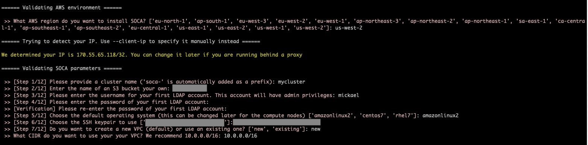
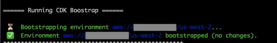
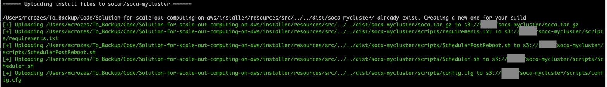
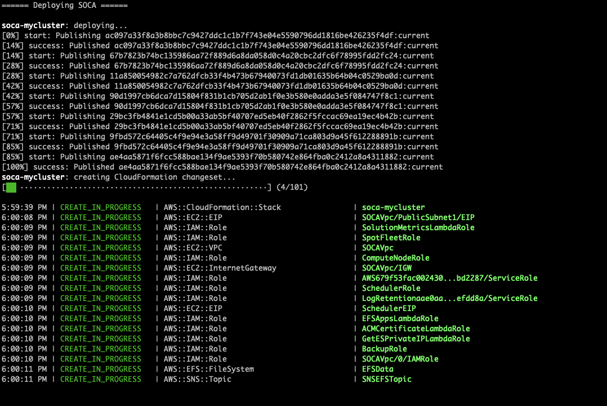
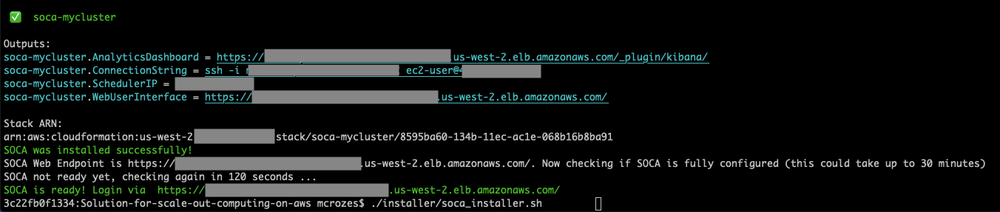
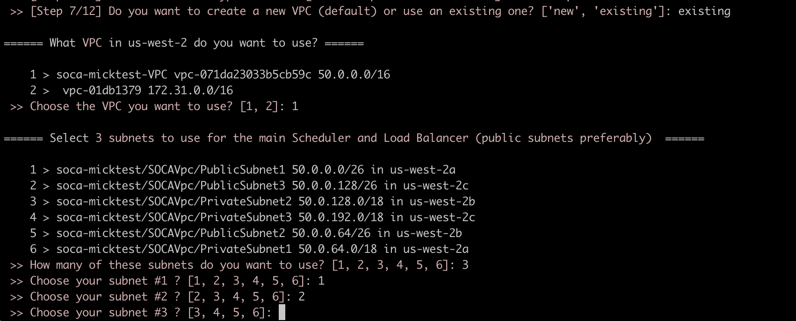
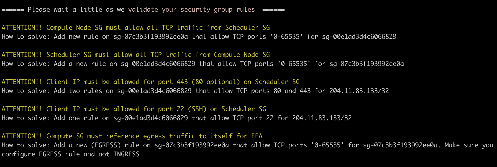
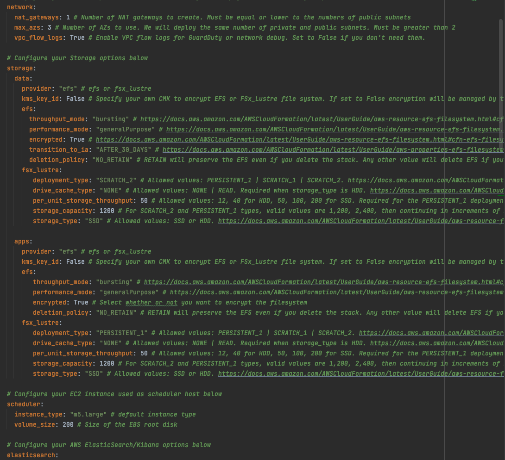

!!!info 
    This document is applicable to **SOCA versions 2.7.0 and newer.**
    ____
    For older versions, please refer to [the legacy documentation](../install-soca-cluster-legacy/)

## IAM policies required to install SOCA

You can find the list of all required IAM policies to install SOCA via `installer/SOCAInstallerIamPolicy.json`. If needed, you can create [an IAM policy](https://docs.aws.amazon.com/IAM/latest/UserGuide/access_policies.html) and assign it to the IAM user/role you are planning to use to install SOCA.

- 1) Go to IAM console, select "Policies" in the left sidebar menu then click "Create Policy"
- 2) Select "JSON" and copy/paste the content of `installer/SOCAInstallerIamPolicy.json`
- 3) Select the IAM User/Role you are using to install SOCA
- 4) Click "Add Permissions" and attach the policy you just created

!!!note
    You can specify a local IAM profile during SOCA installation via `soca_installer.sh --profile <YOUR_IAM_PROFILE>`

## Download the latest SOCA revision

Scale-Out Computing on AWS is open-source and available on Github ([https://github.com/awslabs/scale-out-computing-on-aws](https://github.com/awslabs/scale-out-computing-on-aws)).
To get started, simply clone the repository:

~~~bash
# Clone using HTTPS
user@host: git clone https://github.com/awslabs/scale-out-computing-on-aws .

# Clone using SSH
user@host: git clone git@github.com:awslabs/scale-out-computing-on-aws.git .
~~~

## Install SOCA

Once you have cloned your repository, execute `installer/soca_installer.sh` script. The installer will perform the following tasks:

- Check if Python3 is available on your system
- Create a custom Python virtual-environment and install required libraries
- Install NodeJS, NPM, CDK and AWS CLI if needed
- Setup your SOCA cluster

Installer is built with AWS Cloud Development Kit (CDK). [Learn more information about CDK here](https://docs.aws.amazon.com/cdk/latest/guide/home.html).

Execute `soca_install.sh` script located in the `installer` folder:

~~~bash
# Assuming your current working directory is the root level of SOCA
./installer/soca_install.sh
~~~

You will then be prompted for your cluster parameters. Follow the instructions and choose a S3 bucket you own, the name of your cluster, the SSH keypair to use and other cluster parameters.

!!!note "Silent Installation" 
    You can pass all parameters via arguments to automate the installation process. 
    Run `./soca_installer.sh --help` to see all options available

Once all the parameters are specified, installer will run `cdk bootstrap`. 
This action will create a staging S3 bucket and [store all assets generated by CDK](https://docs.aws.amazon.com/cdk/latest/guide/bootstrapping.html). No actions will be performed if you already have your environment enabled for CDK.

SOCA will then upload the scripts (<100 mb) required to configure the scheduler to the S3 bucket you specified during installation.

Finally, the installer will trigger a `cdk deploy` command and the deployment will start. This will create a new CloudFormation stack on your AWS account.

Once the cloudformation stack is created, the installer will verify if your SOCA cluster is configured correctly.
The installer will exit once your SOCA is fully configured and reachable.

## Use existing AWS resources

If needed, you can tell SOCA to re-use existing AWS resources running on your AWS account. This is particularly useful for blue/green deployment or when you want to upgrade your SOCA cluster without affecting your production workflows.

Here is a list of all existing AWS resources you can specify when installing a new SOCA cluster:

- VPC
- Subnets
- Security Groups
- IAM roles
- AWS Directory Service
- AWS OpenSearch (formerly Elasticsearch)

To re-use existing resources, enter "existing" when asked. SOCA installer will automatically scan your AWS resources and provide you with options

!!!note "Configuration checks"
    Installer will verify your security groups configuration and provide you with recommendation if your security groups are missing key rules
    
    

    Installer will automatically append required SOCA policies when re-using IAM roles

## (Optional) Customize default values

SOCA gives you the ability to customize all resources created during the installation. For example, you can choose how many NAT Gateways to deploy (default to 1), the KMS encryption to use for your filesystems (default to aws/key), the instance type (default to m5.large) to provision for the scheduler and more.

Edit `installer/default_config.yml` if you want to change the default values

## Uninstall SOCA

SOCA is managed by CloudFormation. To uninstall SOCA, simply delete the stack associated to your cluster. As a safety measure SOCA backups (EFS, Scheduler) are not deleted by default and you will have to remove them manually from AWS Backups.

## Post Install

### What if SSH port (22) is blocked by your IT?

Scale-Out Computing on AWS supports [AWS Session Manager](https://docs.aws.amazon.com/systems-manager/latest/userguide/session-manager.html) in case you corporate firewall is blocking SSH port (22). SSM let you open a secure shell on your EC2 instance through a secure web-based session.

First, access your AWS EC2 Console and select your Scheduler instance, then click "Connect" button

{: style="height:250x;width:500px"}

Select "Session Manager" and click Connect

{: style="height:300px;width:550px"}

You now have access to a secure shell directly within your browser

### Important Services

!!!note 
    All services on SOCA will automatically restart if you restart your scheduler instance
   
Run the following command (as root) if you want to restart any service: 

   - Scheduler: `service pbs start`
   - SSSD: `service sssd start`
   - OpenLDAP: `service openldap start`
   - Web UI `/apps/soca/$SOCA_CONFIGURATION/cluster_web_ui/socawebui.sh start`
   - NFS partitions `mount -a` (mount configuration is available on `/etc/fstab`)

## 1-Click installer for Demo/POc

You can use the [1-Click installer for quick proof-of-concept (PoC), demo and/or development work](https://aws.amazon.com/solutions/scale-out-computing-on-aws/). This installer is hosted on an AWS controlled S3 bucket and customization is limited, so we do not recommend this for your production cluster. Always refers to the Github repository for the latest SOCA version.

[1-Click Install](https://console.aws.amazon.com/cloudformation/home?region=us-east-1#/stacks/new?&templateURL=https://s3.amazonaws.com/solutions-reference/scale-out-computing-on-aws/latest/scale-out-computing-on-aws.template){: .md-button }

### Operational Metrics

This solution includes an option to send anonymous operational metrics to AWS. We use this data to better understand how customers use this solution and related services and products. 
Note that AWS will own the data gathered via this survey. Data collection will be subject to the [AWS Privacy Policy](https://aws.amazon.com/privacy/). 

To opt out of this feature, modify the `/apps/soca/$SOCA_CONFIGURATION/cluster_manager/cloudformation_builder` and set `allow_anonymous_data_collection` variable to `False`

When enabled, the following information is collected and sent to AWS:

       - Solution ID: The AWS solution identifier
       - Base Operating System: The operating system selected for the solution deployment
       - Unique ID (UUID): Randomly generated, unique identifier for each solution deployment
       - Timestamp: Data-collection timestamp
       - Instance Data: Type or count of the state and type of instances that are provided for by the Amazon EC2 scheduler instance for each job in each AWS Region
       - Keep Forever: If instances are running when no job is running
       - EFA Support: If EFA support was selected
       - Spot Support: If Spot support was invoked for new auto-scaling stacks
       - Stack Creation Version: The version of the stack that is created or deleted
       - Status: The status of the stack (stack_created or stack_deleted)
       - Scratch Disk Size: The size of the scratch disk selected for each solution deployment
       - Region: The region where the stack is deployed
       - FSxLustre: If the job is using FSx for Lustre

## What's next ?

Learn [how to access your cluster](../tutorials/access-soca-cluster.md), [how to submit your first job](../tutorials/launch-your-first-job.md) or even [how to change your Scale-Out Computing on AWS DNS](../security/update-soca-dns-ssl-certificate.md) to match your personal domain name.

