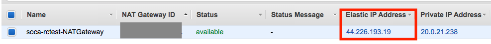

In this page, we will see how Scale-Out Computing on AWS manages job and capacity provisioning based on license availabilities.

!!!configuration "Example configuration"
    Test settings used for all examples:
    
    - License Server Hostname: ==`licenses.soca.dev`==
    - License Server port: ==`5000`==
    - License Daemon port: ==`5001`==
    - Feature to check: ==`Audio_System_Toolbox`==
    - Scale-Out Computing on AWS cluster name: ==`rctest`==


## Firewall Configuration
Depending your configuration, you may need to edit the security groups to allow traffic to/from your license servers.

!!!info "FlexLM server installed on Scheduler host"
    No further actions are required if you have installed your FlexLM server on the scheduler host as Scale-Out Computing on AWS automatically whitelist all traffic between the scheduler and the compute nodes.

!!!warning FlexLM TCP ports
    FlexLM configure two ports for each application (DAEMON and SERVER ports). You need to whitelist both of them.

**Allow traffic from your license server IP to Scale-Out Computing on AWS**

Assuming my license server IP is ==10.0.15.18==, simply go to the EC2 console, locate your `Scheduler` and `ComputeNode` security groups (filter by your cluster name) associated to your Scale-Out Computing on AWS cluster and whitelist both SERVER and DAEMON ports:


**Allow traffic from Scale-Out Computing on AWS to your license server**

Since FlexLM use client/server protocol, you will need to authorize traffic coming from Scale-Out Computing on AWS to your license servers for both SERVER and DAEMON ports. You will need to whitelist the IP for your scheduler as well as the NAT Gateway used by the compute nodes.
Your Scheduler Public IP is listed on CloudFormation, to retrieve your NAT Gateway IP, visit VPC console, select NAT Gateway and find the NAT Gateway IP associated to your Scale-Out Computing on AWS cluster.


## Upload your lmutil

lmutil binary is not included with Scale-Out Computing on AWS. You are required to upload it manually and update `/apps/soca/$SOCA_CONFIGURATION/cluster_manager/license_check.py` with the location of your file.

```python hl_lines="2"
arg = parser.parse_args()
lmstat_path = "PATH_TO_LMUTIL"
if lmstat_path == "PATH_TO_LMUTIL":
    print('Please specify a link to your lmutil binary (edit line 19 of this file')
    sys.exit(1)
```
!!!note 
    You do not need to install FlexLM server manager. Only `lmutil` binary is required.
    
!!!danger "lmutil and RHEL based distro" 
    FlexLM may requires 32 bits lib depending your system. If launching `lmutil` returns an `ELF` version mismatch, simply install `yum install redhat-lsb` (or equivalent)
    
    
## How to retrieve number of licenses available
Scale-Out Computing on AWS includes a script (`/apps/soca/$SOCA_CONFIGURATION/cluster_manager/license_check.py`) which output the number of FlexLM available for a given feature. This script takes the following arguments:
    
- -s: The license server hostname
- -p: The port used by your flexlm deamon
- -f: The feature name ==(case sensitive)==
- (Optional) -m: Reserve licenses number for non HPC usage
    
Let say you have 30 Audio_System_Toolbox licenses and 4 are currently in use. The command below will list how many licenses are currently available to use for your jobs:
```bash
license_check.py -s licenses.soca.dev -p 5000 -f Audio_System_Toolbox
26
```
Now let's say you want to reserve 15 licenses for non HPC/Scale-Out Computing on AWS usage:
```bash
license_check.py -s licenses.soca.dev -p 5000 -f Audio_System_Toolbox -m 15 
11
```

!!!info 
    `license_check.py` is simply a `lmutil` wrapper. You can get the same output by running the command below and adding some regex validations. You can edit the script to match your own requirements if needed
    ```bash
    lmutil lmstat -a -c 5000@licenses-soca.dev | grep "Users of Audio_System_Toolbox:"
    ```

## Integration with Scale-Out Computing on AWS

!!!danger "IMPORTANT"
    The name of the resource **must** be `*_lic_*`. We recommend using `<application>_lic_<feature_name>`

Update your `/apps/soca/$SOCA_CONFIGURATION/cluster_manager/settings/licenses_mapping.yml` and create a new resource. This file must follow the YAML syntax. 

```yaml hl_lines="4"
# There is no requirements for section names, but I recommend having 1 section = 1 application

matlab:
  matlab_lic_audiosystemtoolbox: "/apps/soca/$SOCA_CONFIGURATION/cluster_manager/license_check.py -s licenses.soca.dev -p 5000 -f Audio_System_Toolbox"

# Example for other daemons/features
comsol:
  comsol_lic_acoustic: "/apps/soca/$SOCA_CONFIGURATION/cluster_manager/license_check.py -s licenses.soca.dev -p 27718 -f ACOUSTICS"
  comsol_lic_cadimport: "/apps/soca/cluster_manager/license_check.py -s licenses.soca.dev -p 27718 -f CADIMPORT"

synopsys:
  synopsys_lic_testbenchruntime: "/apps/soca/$SOCA_CONFIGURATION/cluster_manager/license_check.py -s licenses.soca.dev -p 27020 -f VT_TestbenchRuntime"
  synopsys_lic_vcsruntime: "/apps/soca/$SOCA_CONFIGURATION/cluster_manager/license_check.py -s licenses.soca.dev -p 27020 -f VCSRuntime_Net"
  synopsys_lic_vipambaaxisvt: "/apps/soca/$SOCA_CONFIGURATION/cluster_manager/license_check.py -s licenses.soca.dev -p 27020 -f VIP-AMBA-AXI-SVT"
```

This parameter will let Scale-Out Computing on AWS knows your license mapping and capacity will only be provisioned if enough licenses are available based on job's requirements.
    
Since you are about to create a new custom resource, additional configuration is required at the scheduler level.
On the scheduler host, edit ==`/var/spool/pbs/sched_priv/sched_config`== and add a new `server_dyn_res`

```bash
server_dyn_res: "matlab_lic_audiosystemtoolbox !/apps/soca/$SOCA_CONFIGURATION/cluster_manager/license_check.py -s licenses.soca.dev -p 5000 -f Audio_System_Toolbox"
```

On the same file, add your new resource under `resources` section. This section will not allow a job to run if the amount of assigned resources exceeds the available amount.

```bash
resources: "matlab_lic_audiosystemtoolbox, ncpus, mem, arch, host, vnode, aoe, eoe, compute_node"
```

Finally, edit ==`/var/spool/pbs/server_priv/resourcedef`== and add your new resource with `type=long`

```bash hl_lines="7"
...
ht_support type=string
base_os type=string
fsx_lustre_bucket type=string
fsx_lustre_size type=string
fsx_lustre_dns type=string
matlab_lic_audiosystemtoolbox type=long
```

Once done, restart the scheduler using `service pbs restart`
 
## Test 

For this example, let's assume we do have 3 "Audio_System_Toolbox" licenses available
```bash
/apps/soca/$SOCA_CONFIGURATION/cluster_manager/license_check.py -s licenses.soca.dev -p 5000 -f Audio_System_Toolbox
3
```

Let's try to submit a job which require 5 licenses

```bash
qsub -l matlab_lic_audiosystemtoolbox=5 -- /bin/sleep 600
31.ip-20-0-2-69
```

Let's check the log files under `/apps/soca/$SOCA_CONFIGURATION/cluster_manager/log/<QUEUE_NAME>`. Scale-Out Computing on AWS will ignore this job due to the lack of licenses available

```text hl_lines="1 6 7"
 [157] [INFO] [License Available: {'matlab_lic_audiosystemtoolbox': 3}]
 [157] [INFO] [Next User is mickael]
 [157] [INFO] [Next Job for user is ['31']]
 [157] [INFO] [Checking if we have enough resources available to run job_31]
 ....
 [157] [INFO] [No default value for matlab_lic_audiosystemtoolbox. Creating new entry with value: 5]
 [157] [INFO] [Ignoring job_31 as we we dont have enough: matlab_lic_audiosystemtoolbox]
```

If you have multiple jobs in the queue, the license counter is dynamically updated each time the dispatcher script is running (every 3 minutes):
```text hl_lines="1 6 11"
 [157] [INFO] [License Available: {'matlab_lic_audiosystemtoolbox': 10}]
 [157] [INFO] [Checking if we have enough resources available to run job_31]
 ....
 [157] [INFO] [No default value for matlab_lic_audiosystemtoolbox. Creating new entry with value: 5]
 # Next job in in queue
 [157] [INFO] [License Available: {'matlab_lic_audiosystemtoolbox': 5}]
 [157] [INFO] [Checking if we have enough resources available to run job_32]
 ....
 [157] [INFO] [No default value for matlab_lic_audiosystemtoolbox. Creating new entry with value: 5]
 # Next job in in queue
 [157] [INFO] [License Available: {'matlab_lic_audiosystemtoolbox': 0}]
 [157] [INFO] [Checking if we have enough resources available to run job_33]
 ....
 [157] [INFO] [No default value for matlab_lic_audiosystemtoolbox. Creating new entry with value: 5]
 [157] [INFO] [Ignoring job_33 as we we dont have enough: matlab_lic_audiosystemtoolbox]
```

!!!danger "Scale-Out Computing on AWS ensures licenses provisioned for given jobs are in use before provisioning capacity for new jobs"
    Let say you have 10 licenses available and you submit `job1` and `job2` which both have a requirement of 5 licenses. Scale-Out Computing on AWS will determine licenses are available and will start provision the capacity. 
    
    Shortly after you submit `job3` which require another 5 licenses. The first 2 jobs may not have started yet, meaning you still have 10 licenses available (even though the 10 licenses will be used by job1 and job2 as soon as they start). 
    In that case we skip `job3` until both `job1` and `job2` and in running state.
    

!!!warning "Invalid Resource"
    You can not submit if you are using an invalid resource (aka: resource not recognized by the scheduler). If you are getting this error, refer to section ==Integration with Scale-Out Computing on AWS==)
    ```bash
    qsub -l matlab_lic_fakeresource=3 -- /bin/sleep 60
    qsub: Unknown resource Resource_List.matlab_lic_fakeresource
    ```