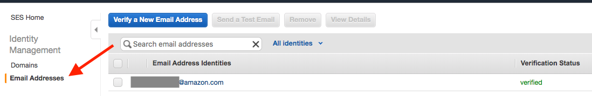
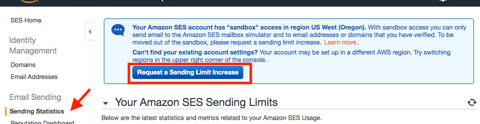

In this page, I will show you how to configure email notification when your job start/stop. For this example, I will use [Simple Email Service (SES)](https://docs.aws.amazon.com/ses/latest/DeveloperGuide/getting-started.html), but you can use any SMTP provider.

!!!info 
    **Note1:** By default, the Scale-Out Computing on AWS admin user you created during the installation does not have any associated email address. If you want to use this account you must edit LDAP and add the "mail" attribute. 
    
    **Note2:** All qmgr command must be executed on the scheduler host

## Configure SES sender domain

Open the SES console and verify your domain (or specific email addresses). For this example I will verify my entire domain (soca.dev) and enable DKIM support to prevent email spoofing.

Click 'Verify this domain', you will get list of DNS records to update for verification. Once done, wait a couple of hours and you will receive a confirmation when your DNS are validated.

## Configure Recipients addresses

By default SES limits you to send email to unique recipients which you will need verify manually

If you want to be able to send email to any addresses, [you need to request production access](https://docs.aws.amazon.com/ses/latest/DeveloperGuide/request-production-access.html).

## Notification code
Create a hook file (note: this file can be found under `/apps/soca/$SOCA_CONFIGURATION/cluster_hooks/job_notifications.py` on your Scale-Out Computing on AWS cluster)

Edit the following section to match your SES settings
~~~
ses_sender_email = '<SES_SENDER_EMAIL_ADDRESS_HERE>'
ses_region = '<YOUR_SES_REGION_HERE>'
~~~

## Create the hooks
Once your script is created, configure your scheduler hooks by running the following commands:
~~~bash
user@host: qmgr -c "create hook notify_job_start event=runjob"
user@host: qmgr -c "create hook notify_job_complete event=execjob_end"
user@host: qmgr -c "import hook notify_job_start application/x-python default /apps/soca/$SOCA_CONFIGURATION/cluster_hooks/job_notifications.py"
user@host: qmgr -c "import hook notify_job_complete application/x-python default /apps/soca/$SOCA_CONFIGURATION/cluster_hooks/job_notifications.py"
~~~

Note: If you make any change to the python file, you **must** re-run the `import hook` command

## Test

Let's submit a test job which will last 5 minutes

~~~bash
qsub -N mytestjob -- /bin/sleep 300
~~~

Now let's verify if I received the alerts correctly.

**Job start:**

**5 minutes later:**

## Add/Update email

Run `ldapsearch -x uid=<USER>` command to verify if your user has a valid `mail` attribute and if this attribute is pointing to the correct email address. The example below shows a user without email attribute.

~~~bash
user@host: ldapsearch -x uid=mickael
## mickael, People, soca.local
dn: uid=mickael,ou=People,dc=soca,dc=local
objectClass: top
objectClass: person
objectClass: posixAccount
objectClass: shadowAccount
objectClass: inetOrgPerson
objectClass: organizationalPerson
uid: mickael
uidNumber: 5001
gidNumber: 5001
cn: mickael
sn: mickael
loginShell: /bin/bash
homeDirectory: /data/home/mickael
~~~

To add/update an email address, create a new ldif file (eg: update_email.ldif) and add the following content

~~~ldap
dn: uid=mickael,ou=People,dc=soca,dc=local
changetype: modify
add: mail
mail: mickael@soca.dev
~~~

Then execute the `ldapadd` as root
~~~bash
user@host: ldapadd -x -D cn=admin,dc=soca,dc=local -y /root/OpenLdapAdminPassword.txt -f update_email.ldif
modifying entry "uid=mickael,ou=People,dc=soca,dc=local"
~~~

Finally re-run the ldapsearch command and validate your user now has `mail` attribute

~~~bash hl_lines="16"
user@host: ldapsearch -x uid=mickael
dn: uid=mickael,ou=People,dc=soca,dc=local
objectClass: top
objectClass: person
objectClass: posixAccount
objectClass: shadowAccount
objectClass: inetOrgPerson
objectClass: organizationalPerson
uid: mickael
uidNumber: 5001
gidNumber: 5001
cn: mickael
sn: mickael
loginShell: /bin/bash
homeDirectory: /data/home/mickael
mail: mickael@soca.dev
~~~

## Check the logs

Scheduler hooks are located: 

- /var/spool/pbs/server_logs/ for notify_job_start on the Scheduler
- /var/spool/pbs/mom_logs/ for notify_job_complete on the Execution Host(s)
