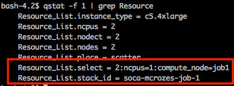

## Submit your job

!!!info "Things to know before you start"
    * Jobs start on average 5 minutes after submission (this value may differ depending on the number and type of compute resource you need to be provisioned). [You can reduce this cold-start by pre-configuring your AMI](../../tutorials/reduce-compute-node-launch-time-with-custom-ami/)
    * Nodes are ephemeral and tie to a given job id. If needed, [you can launch 'AlwaysOn' instances](../../tutorials/launch-always-on-instances/) that will be running 24/7.
    * If your simulation requires a lot of disk I/O, [it's recommended to use high performance SSD-NVMe](../../tutorials/integration-ec2-job-parameters/#storage) disks (using /scratch location) and not default $HOME path
    * Use [the web-based simulator](../../job-configuration-generator/) to generate your qsub/script command.

!!!success "Web Based Job Submission"
    In addition of regular qsub, SOCA supports [web based job submission](../../web-interface/submit-hpc-jobs-web-based-interface/) as well as via [HTTP REST API](../../web-interface/control-hpc-job-with-http-web-rest-api/)

To get started, create a simple text file and name it "job_submit.que". See below for a simple template (you will be required to edit whatever is between **)

~~~console
#!/bin/bash
## BEGIN PBS SETTINGS: Note PBS lines MUST start with #
#PBS -N **your_job_name**
#PBS -V -j oe -o **your_job_name**.qlog
#PBS -P **your_project**
#PBS -q **your_queue**
#PBS -l nodes=**number_of_nodes_for_this_job**
## END PBS SETTINGS
## BEGIN ACTUAL CODE
** your code goes here **
## END ACTUAL CODE
~~~

## Run your job

Run `qsub job_submit.que` to submit your job to the queue.  

~~~console
user@host:~$ qsub job_submit.que
3323.ip-10-10-10-28
~~~

If your qsub command succeed, you will receive an id for your job (3323 in this example). To get more information about this job, run `qstat -f 3323` (or `qstat -f 3323 -x` is the job is already terminated).  
Your job will start as soon as resources are available (usually within 5 minutes after job submission)

## Delete a job from the queue

Run `qdel <job_id>` to remove a job from the queue. If the job was running, associated capacity will be terminated within 4 minutes.  

## Custom AWS scheduler resources (optional)

[Here is a list](../integration-ec2-job-parameters) of scheduler resources specially designed for workloads running on AWS. The line starting with -l (lowercase L) is meant to define scheduler resources which will be used by this job. 
Syntax is as follow:  

* In a script: `#PBS -l parameter_name=parameter_value,parameter_name_2=parameter_value_2`
* Using qsub: `qsub -l parameter_name=parameter_value -l parameter_name_2=parameter_value_2 myscript.sh`

!!!info
    [If you don't specify them, your job will use the default values configured for your queue (see `/apps/soca/$SOCA_CONFIGURATION/cluster_manager/settings/queue_mapping.yml`) ](../integration-ec2-job-parameters/#how-to-use-custom-parameters)

## Specify an EC2 Instance Type (optional)

Scale-Out Computing on AWS supports all type of EC2 instance. If you don't specify it, job will use a default type which may not be optimal (eg: simulation is memory intensive but default EC2 is compute optimized) If you are not familiar with EC2 instances, take some time to review [https://aws.amazon.com/ec2/instance-types/](https://aws.amazon.com/ec2/instance-types/)  
If you want to force utilization of a specific instance type (and not use the default one), simply change the line and modify instance_type value  
`#PBS -l [existing_parameters...],instance_type=**instance_type_value**`

## Specify a license restriction (optional)

!!!info "License Mapping"
    Please refer to /apps/soca/$SOCA_CONFIGURATION/cluster_manager/settings/licenses_mapping.yml for a list of licenses you can restrict. Contact your Administrator if your license is not available yet.

If your job needs to check-out a specific license to run, you want to make sure enough licenses are available before provisioning capacity for the job. To do so, you can add a new resource which will be your license name and the number of license you need.  
Example: Your job will only start if we have at least 2 Synopsys VCSRuntime_Net licenses available.  
`#PBS -l [existing_parameters...],synopsys_lic_vcsruntimenet=2`  

* * *

## Manage your application logs

PBS will automatically generate a .qlog file once the job is complete as shown below.  
`#PBS -V -j oe -o **your_job_name**.qlog`  
If you need more verbose log, we recommend you using STDERR/STDOUT redirection on your code  

* * *

## My job is queued. What next? (AWS orchestration)

First, let's make sure your jobs have been sent to the queue. You can run default `qstat` or use `aligoqstat` which is a custom wrapper developed for Scale-Out Computing on AWS.  

**Web Based**

**CLI**

As soon as jobs are sent to the queue, our in-house dispatcher script which will decide if the job can start based on hardware availabilities, priorities or license requirements.  
Run `qstat -f **job_id** | grep Resource`.

**Web Based**

**CLI**

If you see `stack_id` or `compute_node` resource (under select), that means all requirements are met and capacity is being provisioned (aka: CloudFormation stack is created and capacity is being provisioned).  

  

Look at your EC2 console. This is what you will see (syntax is <strong>\*\*cluster_id\*\*-compute-node-\*\*job_id\*\*</strong>):  

 

Instances are being provisioned successfully, now let's make sure they are correctly being added to the scheduler by running `pbsnodes -a`  
**Note:** PBS is updated as soon as the host are being added to EC2\. You will need to wait a couple of minutes before the state change from "down" to "free" as Scale-Out Computing on AWS has to configure each node (install libraries, scheduler ...)

~~~hl_lines="6 33"
user@host:~$ pbsnodes -a
#Host Ready
ip-90-0-118-49
     Mom = ip-90-0-118-49.us-west-2.compute.internal
     ntype = PBS
     state = free
     pcpus = 16
     jobs = 1.ip-90-0-24-214/0
     resources_available.arch = linux
     resources_available.availability_zone = us-west-2a
     resources_available.compute_node = job1
     resources_available.host = ip-90-0-118-49
     resources_available.instance_type = c5.4xlarge
     resources_available.mem = 31890060kb
     resources_available.ncpus = 16
     resources_available.subnet_id = subnet-055c0dcdd6ddbb020
     resources_available.vnode = ip-90-0-118-49
     resources_assigned.accelerator_memory = 0kb
     resources_assigned.hbmem = 0kb
     resources_assigned.mem = 0kb
     resources_assigned.naccelerators = 0
     resources_assigned.ncpus = 1
     resources_assigned.vmem = 0kb
     queue = normal
     resv_enable = True
     sharing = default_shared
     last_state_change_time = Sun Sep 29 23:30:05 2019

# Host not ready yet
ip-90-0-188-37
     Mom = ip-90-0-188-37.us-west-2.compute.internal
     ntype = PBS
     state = state-unknown,down
     resources_available.availability_zone = us-west-2c
     resources_available.compute_node = job2
     resources_available.host = ip-90-0-188-37
     resources_available.instance_type = r5.xlarge
     resources_available.subnet_id = subnet-0d046c8668ccfdcb0
     resources_available.vnode = ip-90-0-188-37
     resources_assigned.accelerator_memory = 0kb
     resources_assigned.hbmem = 0kb
     resources_assigned.mem = 0kb
     resources_assigned.naccelerators = 0
     resources_assigned.ncpus = 0
     resources_assigned.vmem = 0kb
     queue = normal
     comment = node down: communication closed
     resv_enable = True
     sharing = default_shared
     last_state_change_time = Sun Sep 29 23:28:05 2019` 
~~~

Simply wait a couple of minutes. Your jobs will start as soon as the PBS nodes are configured. 
 
  

The web ui will also reflect this change.

  

* * *

## Examples

!!!example "Job Submission Simulator"
    Use [the web-based simulator](../../job-configuration-generator/) to generate your qsub/script command.
    
!!!info "How to set a parameter"
    - In a script: #PBS -l parameter_name=parameter_value,parameter_name_2=parameter_value_2
    - Using qsub: qsub -l parameter_name=parameter_value -l parameter_name_2=parameter_value_2 myscript.sh
    

Refer to [this page to get a list of all supported parameters](../integration-ec2-job-parameters/)
For the rest of the examples below, I will run a simple script named "script.sh" with the following content:
 
~~~bash
#!/bin/bash
# Will output the hostname of the host where the script is executed
# If using MPI (more than 1 node), you will get the hostname of all the hosts allocated for your job
echo `hostname`
~~~
***

#### Run a simple script on 1 node using default settings on 'normal' queue
~~~bash
#!/bin/bash
#PBS -N my_job_name
#PBS -V -j oe -o my_job_name.qlog
#PBS -P project_a
#PBS -q normal
#PBS -l nodes=1
## END PBS SETTINGS
cd $HOME
./script.sh >> my_output.log 2>&1
~~~
***

#### Run a simple script on 1 node using default settings on 'normal' queue
~~~bash
#!/bin/bash
#PBS -N my_job_name
#PBS -V -j oe -o my_job_name.qlog
#PBS -P project_a
#PBS -q normal
#PBS -l nodes=1
## END PBS SETTINGS
cd $HOME
./script.sh >> my_output.log 2>&1
~~~
***

#### Run a simple MPI script on 3 nodes using custom EC2 instance type

This job will use a 3 c5.18xlarge instances
~~~bash
#!/bin/bash
#PBS -N my_job_name
#PBS -V -j oe -o my_job_name.qlog
#PBS -P project_a
#PBS -q normal
#PBS -l nodes=3,instance_type=c5.18xlarge
## END PBS SETTINGS
cd $PBS_O_WORKDIR
cat $PBS_NODEFILE | sort | uniq > mpi_nodes
export LD_LIBRARY_PATH=$LD_LIBRARY_PATH:/apps/openmpi/4.0.1/lib/
export PATH=$PATH:/apps/openmpi/4.0.1/bin/
# c5.18xlarge is 36 cores so -np is 36 * 3 hosts
/apps/openmpi/4.0.1/bin/mpirun --hostfile mpi_nodes -np 108 script.sh > my_output.log
~~~
***

#### Run a simple script on 3 nodes using custom License Restriction

This job will only start if we have at least 4 Comsol Acoustic licenses available
~~~bash
#!/bin/bash
#PBS -N my_job_name
#PBS -V -j oe -o my_job_name.qlog
#PBS -P project_a
#PBS -q normal
#PBS -l nodes=3,instance_type=c5.18xlarge,comsol_lic_acoustic=4
## END PBS SETTINGS
cd $PBS_O_WORKDIR
cat $PBS_NODEFILE | sort | uniq > mpi_nodes
export LD_LIBRARY_PATH=$LD_LIBRARY_PATH:/apps/openmpi/4.0.1/lib/
export PATH=$PATH:/apps/openmpi/4.0.1/bin/
# c5.18xlarge is 36 cores so -np is 36 * 3 hosts
/apps/openmpi/4.0.1/bin/mpirun --hostfile mpi_nodes -np 108 script.sh > my_output.log
~~~

***

#### Run a simple script on 5 nodes using custom AMI

This job will use a user-specified AMI ID
~~~bash
#!/bin/bash
#PBS -N my_job_name
#PBS -V -j oe -o my_job_name.qlog
#PBS -P project_a
#PBS -q normal
#PBS -l nodes=5,instance_type=c5.18xlarge,instance_ami=ami-123abcde
## END PBS SETTINGS
cd $PBS_O_WORKDIR
cat $PBS_NODEFILE | sort | uniq > mpi_nodes
export LD_LIBRARY_PATH=$LD_LIBRARY_PATH:/apps/openmpi/4.0.1/lib/
export PATH=$PATH:/apps/openmpi/4.0.1/bin/
# c5.18xlarge is 36 cores so -np is 36 * 5 hosts
/apps/openmpi/4.0.1/bin/mpirun --hostfile mpi_nodes -np 180 script.sh > my_output.log
~~~
***

#### Run a simple script on 5 nodes using custom AMI using a different OS

This job will use a user-specified AMI ID which use a operating system different than the scheduler
~~~bash
#!/bin/bash
#PBS -N my_job_name
#PBS -V -j oe -o my_job_name.qlog
#PBS -P project_a
#PBS -q normal
#PBS -l nodes=5,instance_type=c5.18xlarge,instance_ami=ami-123abcde,base_os=centos7
## END PBS SETTINGS
cd $PBS_O_WORKDIR
cat $PBS_NODEFILE | sort | uniq > mpi_nodes
export LD_LIBRARY_PATH=$LD_LIBRARY_PATH:/apps/openmpi/4.0.1/lib/
export PATH=$PATH:/apps/openmpi/4.0.1/bin/
# c5.18xlarge is 36 cores so -np is 36 * 5 hosts
/apps/openmpi/4.0.1/bin/mpirun --hostfile mpi_nodes -np 180 script.sh > my_output.log
~~~
***

#### Run a simple script on 5 m5.24xlarge SPOT instances as long as instance price is lower than $2.5 per hour

This job will use SPOT instances. Instances will be automatically terminated if BID price is higher than $2.5 / per hour per instance

~~~bash
#!/bin/bash
#PBS -N my_job_name
#PBS -V -j oe -o my_job_name.qlog
#PBS -P project_a
#PBS -q normal
#PBS -l nodes=5,instance_type=m5.24xlarge,spot_price=2.5
## END PBS SETTINGS
cd $PBS_O_WORKDIR
cat $PBS_NODEFILE | sort | uniq > mpi_nodes
export LD_LIBRARY_PATH=$LD_LIBRARY_PATH:/apps/openmpi/4.0.1/lib/
export PATH=$PATH:/apps/openmpi/4.0.1/bin/
# m5.24xlarge is 48 cores so -np is 48 * 5 hosts
/apps/openmpi/4.0.1/bin/mpirun --hostfile mpi_nodes -np 240 script.sh > my_output.log
~~~
***

#### Run a simple script on 5 m5.24xlarge SPOT instances as long as instance price is lower than OD price

~~~bash
#!/bin/bash
#PBS -N my_job_name
#PBS -V -j oe -o my_job_name.qlog
#PBS -P project_a
#PBS -q normal
#PBS -l nodes=5,instance_type=m5.24xlarge,spot_price=auto
## END PBS SETTINGS
cd $PBS_O_WORKDIR
cat $PBS_NODEFILE | sort | uniq > mpi_nodes
export LD_LIBRARY_PATH=$LD_LIBRARY_PATH:/apps/openmpi/4.0.1/lib/
export PATH=$PATH:/apps/openmpi/4.0.1/bin/
# m5.24xlarge is 48 cores so -np is 48 * 5 hosts
/apps/openmpi/4.0.1/bin/mpirun --hostfile mpi_nodes -np 240 script.sh > my_output.log
~~~
***

#### Submit a job with EFA

 Make sure to use an instance type supported by EFA [https://docs.aws.amazon.com/AWSEC2/latest/UserGuide/efa.html#efa-instance-types](https://docs.aws.amazon.com/AWSEC2/latest/UserGuide/efa.html#efa-instance-types)
~~~
#!/bin/bash
#PBS -N my_job_name
#PBS -V -j oe -o my_job_name.qlog
#PBS -P project_a
#PBS -q normal
#PBS -l nodes=5,instance_type=c5n.18xlarge,efa_support=true
## END PBS SETTINGS
cd $PBS_O_WORKDIR
cat $PBS_NODEFILE | sort | uniq > mpi_nodes
export LD_LIBRARY_PATH=$LD_LIBRARY_PATH:/apps/openmpi/4.0.1/lib/
export PATH=$PATH:/apps/openmpi/4.0.1/bin/
# c5n.18xlarge is 36 cores so -np is 36 * 5
/apps/openmpi/4.0.1/bin/mpirun --hostfile mpi_nodes -np 180 script.sh > my_output.log
~~~
***

#### Use 50 c5.xlarge for your job and fallback to m5.xlarge and r5.xlarge if capacity is not available

AWS honors the instance order, so it will try to provision 50 c5.large first and fallback to m5.xlarge/r5.xlarge if needed (in case your account has instance limitation or AWS can't allocate more than X instance type on a given AZ/region). Ultimately, you may end up with the following configuration (but not limited to):

- 50 c5.xlarge
- 30 c5.xlarge, 20 m5.xlarge
- 20 c5.xlarge, 20 m5.xlarge, 10 r5.xlarge
- Or any other combination. The only certain know is that you will get 50 instances

~~~
#!/bin/bash
#PBS -N my_job_name
#PBS -V -j oe -o my_job_name.qlog
#PBS -P project_a
#PBS -q normal
#PBS -l nodes=50,instance_type=c5.xlarge+m5.xlarge+r5.xlarge
## END PBS SETTINGS
cd $PBS_O_WORKDIR
cat $PBS_NODEFILE | sort | uniq > mpi_nodes
export LD_LIBRARY_PATH=$LD_LIBRARY_PATH:/apps/openmpi/4.0.1/lib/
export PATH=$PATH:/apps/openmpi/4.0.1/bin/
# c5n.18xlarge is 36 cores so -np is 36 * 5
/apps/openmpi/4.0.1/bin/mpirun --hostfile mpi_nodes -np 180 script.sh > my_output.log
~~~
***

#### Use multiple SPOT instance type

~~~
#!/bin/bash
#PBS -N my_job_name
#PBS -V -j oe -o my_job_name.qlog
#PBS -P project_a
#PBS -q normal
#PBS -l nodes=5,instance_type=c5.xlarge+m5.xlarge+r5.xlarge, spot_price=auto
## END PBS SETTINGS
cd $PBS_O_WORKDIR
cat $PBS_NODEFILE | sort | uniq > mpi_nodes
export LD_LIBRARY_PATH=$LD_LIBRARY_PATH:/apps/openmpi/4.0.1/lib/
export PATH=$PATH:/apps/openmpi/4.0.1/bin/
# c5n.18xlarge is 36 cores so -np is 36 * 5
/apps/openmpi/4.0.1/bin/mpirun --hostfile mpi_nodes -np 180 script.sh > my_output.log
~~~
***

#### Provision 50 instances (10 On-Demand and 40 SPOT)

~~~
#!/bin/bash
#PBS -N my_job_name
#PBS -V -j oe -o my_job_name.qlog
#PBS -P project_a
#PBS -q normal
#PBS -l nodes=50,instance_type=c5.large,spot_allocation_count=40
## END PBS SETTINGS
cd $PBS_O_WORKDIR
cat $PBS_NODEFILE | sort | uniq > mpi_nodes
export LD_LIBRARY_PATH=$LD_LIBRARY_PATH:/apps/openmpi/4.0.1/lib/
export PATH=$PATH:/apps/openmpi/4.0.1/bin/
# c5n.18xlarge is 36 cores so -np is 36 * 5
/apps/openmpi/4.0.1/bin/mpirun --hostfile mpi_nodes -np 180 script.sh > my_output.log
~~~
***

#### Multi-lines parameters

Custom AMI running on a different distribution than the scheduler, with EFA enable, without placement group and within a specific subnet_id

~~~bash
#!/bin/bash
#PBS -N my_job_name
#PBS -V -j oe -o my_job_name.qlog
#PBS -P project_a
#PBS -q normal
## Resources can be specified on multiple lines
#PBS -l nodes=5,instance_type=c5n.18xlarge,efa_support=yes
#PBS -l placement_group=false,base_os=rhel7,ami_id=ami-12345,subnet_id=sub-abcde
## END PBS SETTINGS
cd $PBS_O_WORKDIR
cat $PBS_NODEFILE | sort | uniq > mpi_nodes
export LD_LIBRARY_PATH=$LD_LIBRARY_PATH:/apps/openmpi/4.0.1/lib/
export PATH=$PATH:/apps/openmpi/4.0.1/bin/
# c5n.18xlarge is 36 cores so -np is 36 * 5
/apps/openmpi/4.0.1/bin/mpirun --hostfile mpi_nodes -np 180 script.sh > my_output.log
~~~