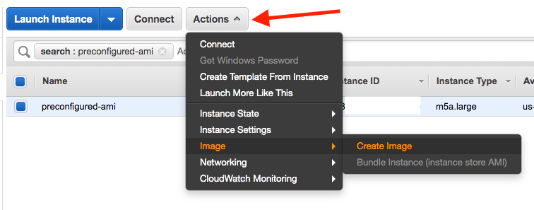
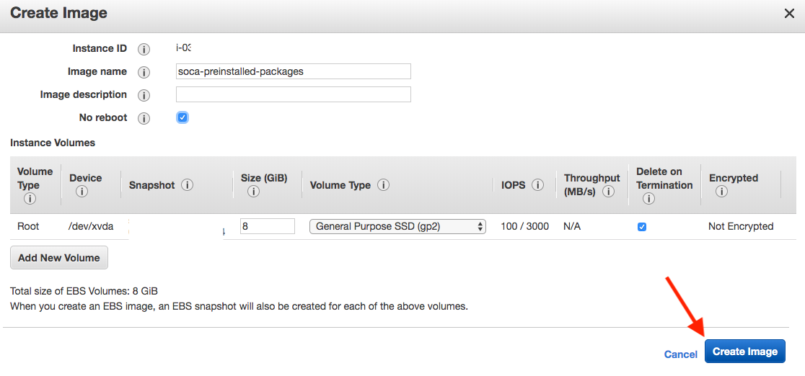
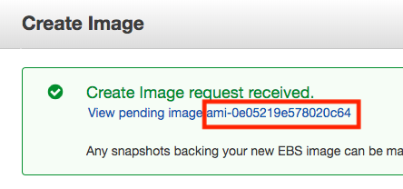
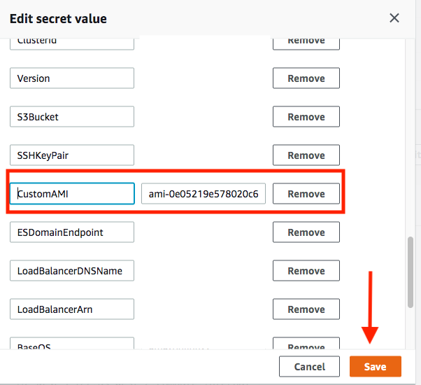

By default, SOCA provision a vanilla AMI and install all required packages in ~3 to 5 minutes. 
If this cold time is not acceptable for your workload, you can [launch AlwaysOn instance](../../tutorials/launch-always-on-instances/) or pre-bake your AMI with all required libraries.

### Step 1: Locate your base AMI

Run `cat /etc/environment | grep SOCA_INSTALL_AMI` on your scheduler host

~~~bash hl_lines="13"
$ ssh -i <key> ec2-user@<ip>
Last login: Wed Oct  2 20:06:47 2019 from <ip>

   _____  ____   ______ ___
  / ___/ / __ \ / ____//   |
  \__ \ / / / // /    / /| |
 ___/ // /_/ // /___ / ___ |
/____/ \____/ \____//_/  |_|
Cluster: soca-uiupdates
> source /etc/environment to SOCA paths

[ec2-user@ip-30-0-1-28 ~]$ cat /etc/environment | grep SOCA_INSTALL_AMI
export SOCA_INSTALL_AMI=ami-082b5a644766e0e6f
[ec2-user@ip-30-0-1-28 ~]$
~~~

### Step 2: Launch a temporary EC2 instance

Launch a new EC2 instance using the `SOCA_INSTALL_AMI` image

### Step 3: Pre-configure your AMI

!!!info "Important"
    Step 3 is only required if you want to reduce the time required for your compute node to boot. You can skip this section if you just want to install your customization on your AMI and let SOCA handles PBS/Gnome/System packages installation. 

#### 3.1 Pre-Install system packages
You can pre-install the packages listed on [https://github.com/awslabs/scale-out-computing-on-aws/blob/master/source/scripts/config.cfg](https://github.com/awslabs/scale-out-computing-on-aws/blob/master/source/scripts/config.cfg). You will need to run `yum install` for:

- SYSTEM_PKGS
- SCHEDULER_PKGS
- OPENLDAP_SERVER_PKGS
- SSSD_PKGS

!!!info "Easy Install"    
    - Copy the content of the `config.cfg` on your filesystem (say `/root/config.cfg`)
    - Run `source /root/config.cfg`
    - Run the following commands:
        - `yum install -y $(echo ${SYSTEM_PKGS[*]})`
        - `yum install -y $(echo ${SCHEDULER_PKGS[*]})`
        - `yum install -y $(echo ${OPENLDAP_SERVER_PKGS[*]})`
        - `yum install -y $(echo ${SSSD_PKGS[*]})`
    
    ____
    [Here is an example](https://github.com/awslabs/scale-out-computing-on-aws/blob/master/source/scripts/Scheduler.sh#L34) of how you can install packages listed in an array in bash.

#### 3.2: Pre-Install the scheduler
To reduce the launch time of your EC2 instance, it's recommended to pre-install OpenPBS. 
First, refer to [https://github.com/awslabs/scale-out-computing-on-aws/blob/master/source/scripts/config.cfg](https://github.com/awslabs/scale-out-computing-on-aws/blob/master/source/scripts/config.cfg) and note all OpenPBS related variables as you will need to use them below (see highlighted lines):

~~~bash hl_lines="5 6 7"
# Sudo as Root
sudo su -

# Define OpenPBS variable
export OPENPBS_URL=<variable_from_config.txt> # ex https://github.com/openpbs/openpbs/archive/v20.0.1.tar.gz
export OPENPBS_TGZ=<variable_from_config.txt> # ex v20.0.1.tar.gz
export OPENPBS_VERSION=<variable_from_config.txt> # ex 20.0.1

# Run the following command to install OpenPBS
cd ~
wget $OPENPBS_URL
tar zxvf $OPENPBS_TGZ
cd openpbs-$OPENPBS_VERSION
./autogen.sh
./configure --prefix=/opt/pbs
make -j6
make install -j6
/opt/pbs/libexec/pbs_postinstall
chmod 4755 /opt/pbs/sbin/pbs_iff /opt/pbs/sbin/pbs_rcp
systemctl disable pbs
~~~

!!!note "Installation Path"
    Make sure to install OpenPBS under `/opt/pbs`
    
#### 3.3: (Optional) Pre-Install Gnome

- If you are using `RHEL`, run `yum groupinstall "Server with GUI" -y`

- If you are using `Centos`, run `yum groupinstall "GNOME Desktop" -y`

- If you are using `Amazon Linux`, run `yum install -y $(echo ${DCV_AMAZONLINUX_PKGS[*]})`

#### 3.4: Reboot your EC2 machine

#### 3.5: Make sure you do not have any libvirt of firewalld/iptables

Post reboot, some distribution may automatically start libvirt or firewall. If that's the case you must delete them otherwise PBS won't be able to contact the master scheduler.
To find if you have a running libvirt, run `ifconfig` and check if you have `virbr0` interface such as:

~~~bash hl_lines="20 21 22 23 24 25 26 27"
ifconfig
ens5: flags=4163<UP,BROADCAST,RUNNING,MULTICAST>  mtu 9001
        inet 10.10.2.19  netmask 255.255.255.0  broadcast 10.10.2.255
        inet6 fe80::8b1:6aff:fe8a:5ad8  prefixlen 64  scopeid 0x20<link>
        ether 0a:b1:6a:8a:5a:d8  txqueuelen 1000  (Ethernet)
        RX packets 81  bytes 11842 (11.5 KiB)
        RX errors 0  dropped 0  overruns 0  frame 0
        TX packets 92  bytes 12853 (12.5 KiB)
        TX errors 0  dropped 0 overruns 0  carrier 0  collisions 0

lo: flags=73<UP,LOOPBACK,RUNNING>  mtu 65536
        inet 127.0.0.1  netmask 255.0.0.0
        inet6 ::1  prefixlen 128  scopeid 0x10<host>
        loop  txqueuelen 1000  (Local Loopback)
        RX packets 8  bytes 601 (601.0 B)
        RX errors 0  dropped 0  overruns 0  frame 0
        TX packets 8  bytes 601 (601.0 B)
        TX errors 0  dropped 0 overruns 0  carrier 0  collisions 0

virbr0: flags=4099<UP,BROADCAST,MULTICAST>  mtu 1500
        inet 192.168.122.1  netmask 255.255.255.0  broadcast 192.168.122.255
        ether 52:54:00:ea:5a:b9  txqueuelen 1000  (Ethernet)
        RX packets 0  bytes 0 (0.0 B)
        RX errors 0  dropped 0  overruns 0  frame 0
        TX packets 0  bytes 0 (0.0 B)
        TX errors 0  dropped 0 overruns 0  carrier 0  collisions 0
~~~

If that's the case, disable `libvirt` by running
~~~
/bin/systemctl disable libvirtd.service
ip link set virbr0 down
brctl delbr virbr0
~~~

Then, make sure you do not have iptables (`iptables -L`) running. If needed, disable `firewalld` by running `/bin/systemctl disable firewalld`

   

### Step 4: Create your AMI
Once you are done, go back to EC2 console, locate your instance and click "Actions > Image > Create Image"

Choose an AMI name and click 'Create Image'.

Your AMI is now being created. Please note it may take a couple of minutes for the AMI to be ready. To check the status, go to EC2 Console and then click "AMIs" on the left sidebar

!!!warning "Stop your temporary EC2 instance"
    Once your AMI has been created, you can safely terminate the EC2 instance you just launched as you won't need it anymore.

### Step 5: Test your new AMI

~~~bash hl_lines="2 5"
# Test 1: Submit a job with a vanilla AMI
$ qsub -l instance_type=c5.9xlarge -- /bin/date 

# Test 2: Submit a job with a pre-configured AMI
$ qsub -l instance_type=c5.9xlarge -l instance_ami=ami-0e05219e578020c64 -- /bin/date 
~~~

**Results:**

- Test1 (Vanilla): **3 minutes 45 seconds** to provision EC2 capacity, register node on SOCA and start the job
- Test2 (Pre-Configured): **1 minute 44 seconds** to provision EC2 capacity, register host on SOCA and start the job
 
### Step 6: Update default AMI (Optional)

#### Single job
As you are planning to use a custom AMI, you will be required to specify `-l instance_ami=<IMAGE_ID>` at job submission.
It's recommended to go with the "Entire Queue" option below if you do not want to manually specify this resource each time you submit a job

#### Entire queue
Edit `/apps/soca/$SOCA_CONFIGURATION/cluster_manager/settings/queue_mapping.yml` and update the default AMI

~~~yaml hl_lines="4"
queue_type:
  compute:
    queues: ["queue1", "queue2", "queue3"] 
    instance_ami: "<YOUR_AMI_ID>" # <- Add your new AMI 
    instance_type: ...
~~~

Any jobs running in the queue configured on the `queue_mapping` will now use your pre-configured AMI by default. You do not need to specify `-l instance_ami` at job submission anymore.

#### Entire cluster

If you want to change the default AMI to use regardless of queue/job, open your Secret Manager console and select your Scale-Out Computing on AWS cluster configuration. Click “Retrieve Secret Value” and then “Edit”.
Find the entry “CustomAMI” and update the value with your new AMI ID then click Save

