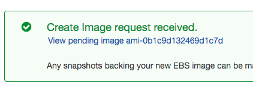
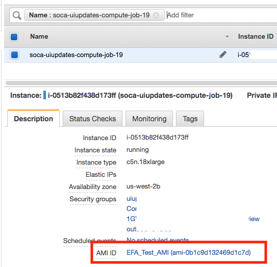
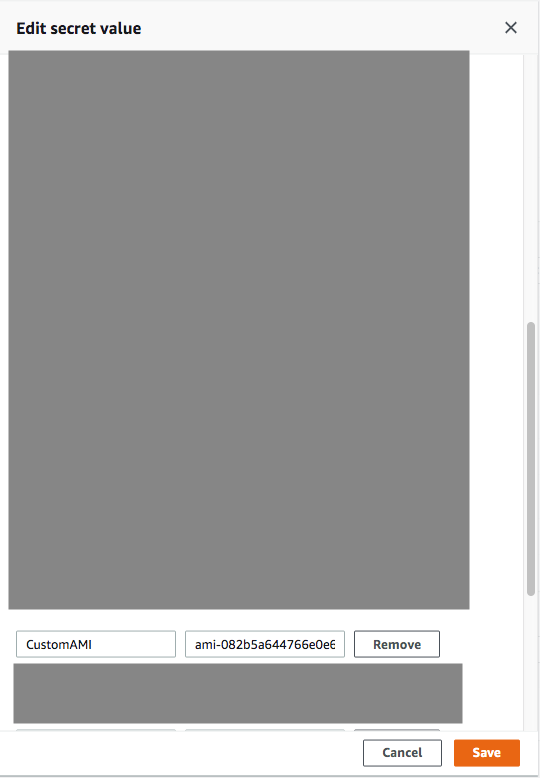

### Step 1: Locate your Scale-Out Computing on AWS AMI

Run `cat /etc/environment | grep Scale-Out Computing on AWS_INSTALL_AMI` on your scheduler host

~~~bash hl_lines="13"
38f9d34dde89:~ mcrozes$ ssh -i <key>> ec2-user@<IP>
Last login: Wed Oct  2 20:06:47 2019 from 205.251.233.178

   _____  ____   ______ ___
  / ___/ / __ \ / ____//   |
  \__ \ / / / // /    / /| |
 ___/ // /_/ // /___ / ___ |
/____/ \____/ \____//_/  |_|
Cluster: soca-uiupdates
> source /etc/environment to load Scale-Out Computing on AWS paths

[ec2-user@ip-30-0-1-28 ~]$ cat /etc/environment | grep Scale-Out Computing on AWS_INSTALL_AMI
export Scale-Out Computing on AWS_INSTALL_AMI=ami-082b5a644766e0e6f
[ec2-user@ip-30-0-1-28 ~]$
~~~

### Step 2: Launch a temporary EC2 instance

Launch a new EC2 instance using the `Scale-Out Computing on AWS_INSTALL_AMI` 

### Step 3: Customize your AMI

In this example, I am installing some libraries to enable EFA support 

!!!info "Native support for EFA"
    Scale-Out Computing on AWS supports EFA natively using `--efa_support=true` at job submission

!!!danger "Pre-Requisite"
    - You can use RHEL7, Centos7 or Amazon Linux 2 distributions
    - Do not use /scratch, /apps or /data partitions as these are restricted location for Scale-Out Computing on AWS

First, let me prepare my AMI and do all the customization I need.
~~~bash
# Sudo as Root
[ec2-user@ip-30-0-73-38 ~]$ sudo su -

# Download EFA Installer
[root@ip-30-0-73-38 ~]# curl --silent -O https://s3-us-west-2.amazonaws.com/aws-efa-installer/aws-efa-installer-1.5.4.tar.gz
100 44.5M  100 44.5M    0     0  84.9M      0 --:--:-- --:--:-- --:--:-- 84.9M

# Extract 
[root@ip-30-0-73-38 ~]# tar -xf aws-efa-installer-1.5.4.tar.gz

# Navigate to the folder 
[root@ip-30-0-73-38 ~]# cd aws-efa-installer

# Install
[root@ip-30-0-73-38 aws-efa-installer]# sudo ./efa_installer.sh -y
= Starting Amazon Elastic Fabric Adapter Installation Script =
= EFA Installer Version: 1.5.4 =

== Installing EFA dependencies ==
Loaded plugins: extras_suggestions, langpacks, priorities, update-motd
Package pciutils-3.5.1-3.amzn2.x86_64 already installed and latest version
Resolving Dependencies
--> Running transaction check
---> Package kernel-devel.x86_64 0:4.14.123-111.109.amzn2 will be installed
--> Processing Dependency: gcc >= 7.2.1 for package: kernel-devel-4.14.123-111.109.amzn2.x86_64
................
.... LOT OF TEXT ....
................
Limits for Elastic Fabric Adapter configured.
== Testing EFA device ==
Starting server...
Starting client...
bytes   #sent   #ack     total       time     MB/sec    usec/xfer   Mxfers/sec
64      10      =10      1.2k        0.02s      0.06    1124.90       0.00
256     10      =10      5k          0.00s     16.15      15.85       0.06
1k      10      =10      20k         0.00s     61.69      16.60       0.06
4k      10      =10      80k         0.00s    227.56      18.00       0.06
64k     10      =10      1.2m        0.00s    876.15      74.80       0.01
1m      10      =10      20m         0.01s   2078.45     504.50       0.00
===================================================
EFA installation complete.
- Please logout/login to complete the installation.
- Libfabric was installed in /opt/amazon/efa
- Open MPI was installed in /opt/amazon/openmpi
===================================================
~~~

Logout of the instance and then log back in. Finally, confirm the EFA adapter is up and running

~~~bash
[root@ip-30-0-82-154 ~]# fi_info -p efa
provider: efa
    fabric: EFA-fe80::828:bfff:fe5c:95d4
    domain: efa_0-rdm
    version: 2.0
    type: FI_EP_RDM
    protocol: FI_PROTO_EFA
provider: efa
    fabric: EFA-fe80::828:bfff:fe5c:95d4
    domain: efa_0-dgrm
    version: 2.0
    type: FI_EP_DGRAM
    protocol: FI_PROTO_EFA
provider: efa;ofi_rxd
    fabric: EFA-fe80::828:bfff:fe5c:95d4
    domain: efa_0-dgrm
    version: 1.0
    type: FI_EP_RDM
    protocol: FI_PROTO_RXD
~~~

So at this point you have your own custom AMI with EFI software installed. Let's see how we can use this AMI directly with Scale-Out Computing on AWS to run some jobs.

### Step 4: Create your AMI
Go back to EC2 console, locate your instance and click "Actions > Image > Create Image"

Choose an AMI name and click 'Create Image'

Your AMI is now being created. Please note it may take a couple of minutes for the AMI to be ready. To check the status, go to EC2 Console and then click "AMIs" on the left sidebar

!!!warning "Stop your temporary EC2 instance"
    Once your AMI has been created, you can safely terminate the EC2 instance you just launched as you won't need it anymore.

### Step 5: Launch a job with your custom AMI
Go back to Scale-Out Computing on AWS and prepare to launch a job with some specific parameters:
 - As you are planning to use a custom AMI, you will be required to specify `-l instance_ami=<IMAGE>` at job submission.
 
To confirm my job using an EFA enabled AMI, the only command executed is the one which retrieve EFA device information
~~~bash
bash-4.2$ qsub -l efa_support=true -l instance_type=c5n.18xlarge -l instance_ami=ami-0b1c9d132469d1c7d -N job-to-test-EFA  -- /opt/amazon/efa/bin/fi_info -p efa
19.ip-30-0-1-28
~~~

Wait for your job to start. You can also confirm on the EC2 console that your job is using the correct AMI. 

You can also check the queue log `/apps/soca/cluster_manager/logs/<QUEUE_NAME>` to make sure your parameters are validated by the dispatcher.
~~~bash
[2019-10-03 00:53:52,586] [190] [INFO] [efa_support resource is specified, will attach one EFA adapter]
[2019-10-03 00:53:52,586] [190] [INFO] [image resource is specified, will use new ec2 AMI: ami-0b1c9d132469d1c7d]
[2019-10-03 00:53:52,586] [190] [INFO] [instancetype resource is specified, will use new ec2 instance type: c5n.18xlarge]
~~~

Once your job complete, check the STDOUT and confirm the output of `/opt/amazon/efa/bin/fi_info -p efa` is correct

~~~bash
bash-4.2$ cat job-to-test-EFA.o19
provider: efa
    fabric: EFA-fe80::49:adff:fef8:88b6
    domain: efa_0-rdm
    version: 2.0
    type: FI_EP_RDM
    protocol: FI_PROTO_EFA
provider: efa
    fabric: EFA-fe80::49:adff:fef8:88b6
    domain: efa_0-dgrm
    version: 2.0
    type: FI_EP_DGRAM
    protocol: FI_PROTO_EFA
provider: efa;ofi_rxd
    fabric: EFA-fe80::49:adff:fef8:88b6
    domain: efa_0-dgrm
    version: 1.0
    type: FI_EP_RDM
    protocol: FI_PROTO_RXD
~~~

### AMI different than scheduler OS

By default, Scale-Out Computing on AWS will try to install the packages  based on the scheduler operating system. If your AMI use a different OS, you will need to specify it during job submission using `-l base_os` parameters. 
Supported values are centos7, rhel7 or amazonlinux2

~~~bash
# Assuming your Scale-Out Computing on AWS default OS is Centos7 but you want to use a Amazon Linux 2 AMI
bash-4.2$ qsub -l base_os=amazonlinux2 -l instance_ami=<YOUR_AMI> script.sh
~~~

### Update default AMI

#### Single job
Simply submit a job and use `-l instance_ami` parameter

#### Entire queue
Edit `/apps/soca/cluster_manager/settings/queue_mapping.yml` and update the default AMI

~~~yaml hl_lines="4"
queue_type:
  compute:
    queues: ["queue1", "queue2", "queue3"] 
    instance_ami: "<YOUR_AMI_ID>" # <- Add your new AMI 
    instance_type: ...
~~~

#### Entire cluster

Open your Secret Manager console and select your Scale-Out Computing on AWS cluster configuration. Click “Retrieve Secret Value” and then “Edit”.
Find the entry “CustomAMI” and update the value with your new AMI ID then click Save

