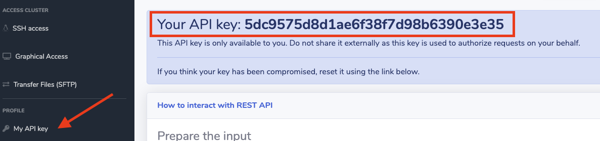

!!!note "API Documentation"
    You can interact with your SOCA cluster (create users, groups, queue, submit jobs, view jobs etc ..) via a simple REST interface. Documentation and examples can be found on `https://your_soca_url/api/doc` (note: [Your SOCA must have a valid SSL certificate](../../security/update-soca-dns-ssl-certificate/)

!!!note "Submit a job via web"
    In addition of REST API, SOCA also support job management via a web based interface. [Click here to learn more](../../web-interface/submit-hpc-jobs-web-based-interface/)

## Step1: Retrieve your API key

To retrieve your API key, navigate to "My API Key" section on the left sidebar.

!!!danger "Important"
    Your API key is unique and linked to your account. Do not share it with anyone. If you think your key has been compromised, reset it immediately via the link on the same page

## Step2: Prepare your job input

For this example, let's assume we want to submit a simple "Hello World" job as shown below:

~~~bash
#!/bin/bash
#PBS -N testjob
#PBS -V -j oe -o testjob_output.qlog
#PBS -P myproject
#PBS -q normal
#PBS -l nodes=1,instance_type=c5.large
/bin/echo "Hello World"
~~~

To be able to send this job to SOCA via HTTP, you must first encode this file using `base64.` There are multiple ways to create a base64 hash, on Linux/Mac, the easiest method is to use `base64` encode function:

~~~console
$ base64 job_submit.sh
IyEvYmluL2Jhc2gKI1BCUyAtTiB0ZXN0am9iCiNQQlMgLVYgLWogb2UgLW8gdGVzdGpvYl9vdXRwdXQucWxvZwojUEJTIC1QIG15cHJvamVjdAojUEJTIC1xIG5vcm1hbAojUEJTIC1sIG5vZGVzPTEsaW5zdGFuY2VfdHlwZT1jNS5sYXJnZQovYmluL2VjaG8gIkhlbGxvIFdvcmxkIgo=
~~~

You can verify the hash is correct by running the `base64` decode function (this should return your original input file)

~~~bash
$ echo "IyEvYmluL2Jhc2gKI1BCUyAtTiB0ZXN0am9iCiNQQlMgLVYgLWogb2UgLW8gdGVzdGpvYl9vdXRwdXQucWxvZwojUEJTIC1QIG15cHJvamVjdAojUEJTIC1xIG5vcm1hbAojUEJTIC1sIG5vZGVzPTEsaW5zdGFuY2VfdHlwZT1jNS5sYXJnZQovYmluL2VjaG8gIkhlbGxvIFdvcmxkIgo" | base64 --decode
#!/bin/bash
#PBS -N testjob
#PBS -V -j oe -o testjob_output.qlog
#PBS -P myproject
#PBS -q normal
#PBS -l nodes=1,instance_type=c5.large
/bin/echo "Hello World"
~~~

## Step3: Send the job to SOCA

To be able to submit the POST request, you will need to specify three headers:

* X-SOCA-USER and set the value to `<YOUR_SOCA_USER>`
* X-SOCA-TOKEN and set the value to `<YOUR_SOCA_TOKEN>`
* Content-Type and set the value to `multipart/form-data`

Once you have your headers configured, submit a HTTP/POST request and pass your hash as form data via `payload` parameter:

~~~bash
curl -X POST \
  https://<YOUR_SOCA_URL>/api/scheduler/job \
  -H 'X-SOCA-TOKEN: <YOUR_SOCA_TOKEN>' \
  -H 'X-SOCA-USER: <YOUR_SOCA_USER>' \
  -F payload=IyEvYmluL2Jhc2gKI1BCUyAtTiB0ZXN0am9iCiNQQlMgLVYgLWogb2UgLW8gdGVzdGpvYl9vdXRwdXQucWxvZwojUEJTIC1QIG15cHJvamVjdAojUEJTIC1xIG5vcm1hbAojUEJTIC1sIG5vZGVzPTEsaW5zdGFuY2VfdHlwZT1jNS5sYXJnZQovYmluL2VjaG8gIkhlbGxvIFdvcmxkIgo=
~~~

If your hash is a valid PBS job file, SOCA will return the job id associated to your request (11313 in this example)

~~~json
{"success": true, "message": "11313"}
~~~

## Step4: Get job info

To retrieve information about a given job (assuming you are the job owner), simply submit a HTTP/GET request and pass `job_id` as parameter

~~~bash
curl -X GET \
  https://<YOUR_SOCA_URL>/api/scheduler/job?job_id=11313 \
  -H 'X-SOCA-TOKEN: <YOUR_SOCA_TOKEN>' \
  -H 'X-SOCA-USER: <YOUR_SOCA_USER>'
~~~

This command will return a JSON object with all information regarding your job.

~~~json
{
  "success": true,
  "message": {
    "Job_Name": "testjob",
    "Job_Owner": "<YOUR_SOCA_USER>@ip-10-10-0-75.us-west-2.compute.internal",
    "job_state": "Q",
    "queue": "normal",
    "server": "ip-10-10-0-75",
    "Checkpoint": "u",
    "ctime": "Thu May 21 02:47:05 2020",
    "Error_Path": "ip-10-10-0-75.us-west-2.compute.internal:/data/home/<YOUR_SOCA_USER>/soca_job_output/testjob_pGep6UiWpK/testjob.e11313",
    "Hold_Types": "n"
    ....
    }
  }
~~~

## Step4: Delete job

To delete a job, simply submit a `HTTP/DELETE` request and specify `job_id` parameter:

~~~bash
curl -X DELETE \
  https://<YOUR_SOCA_URL>/api/scheduler/job?job_id=11313 \
  -H 'X-SOCA-TOKEN: <YOUR_SOCA_TOKEN>' \
  -H 'X-SOCA-USER: <YOUR_SOCA_USER>'
~~~

If the command is valid, you will receive a validation message:

~~~json
 {"success": true, "message": "Job deleted"}
~~~

 You can verify the Job has been removed from the queue using the same HTTP/GET request:

~~~bash
 curl -X GET \
   https://<YOUR_SOCA_URL>/api/scheduler/job?job_id=11313\
   -H 'X-SOCA-TOKEN: <YOUR_SOCA_TOKEN>' \
   -H 'X-SOCA-USER: <YOUR_SOCA_USER>'
~~~

This time the output will return an error:

~~~json
{"succes": false, "message": "Unable to retrieve Job ID (job may have terminated and is no longer in the queue)"}
~~~