!!!configuration "Feature in preview"
    This feature is only available on beta builds
    
    
By default, SOCA only provide base DCV image for Windows, meaning no applications are pre-installed. Customers can create their own bundle using Amazon Images (AMI) and let their user choose what type of software they want to see pre-installed on their graphical sessions

## Windows 

!!!danger "Important"
    An image is a complete snapshot of your EC2 host. Make sure you do not have any confidential data hosted on it before creating the image

First, launch a simple Windows graphical session and install some applications. In this example, I have installed Creo

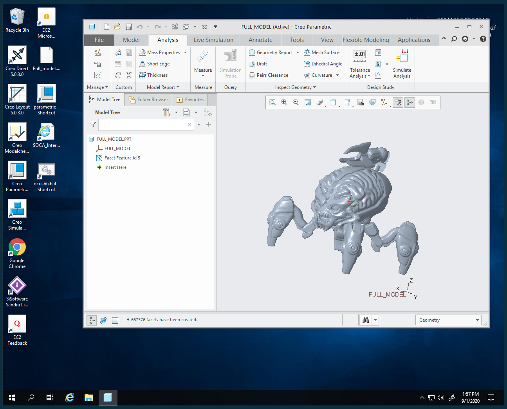

To prepare your image, you first need to configure your system. Click the Start button and search for `Powershell`

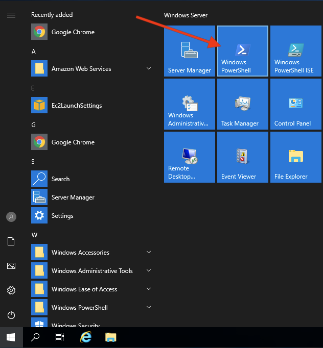

On the Powershell terminal, execute `C:\ProgramData\Amazon\EC2-Windows\Launch\Scripts\InitializeInstance.ps1 -Schedule`

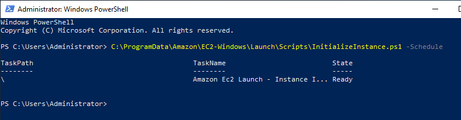

Go back to the Windows session list and retrieve the instance ID associated to your session (mouse hover the question mark icon)

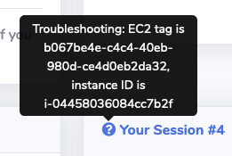

On your EC2 console and select your instance

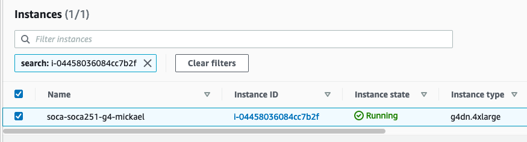

Click "Actions" -> "Image" -> "Create Image"

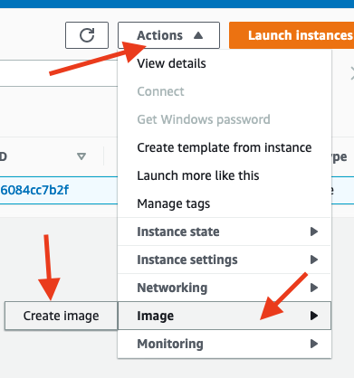

Choose a name and a description, make sure to check "No Reboot" then click Create Image

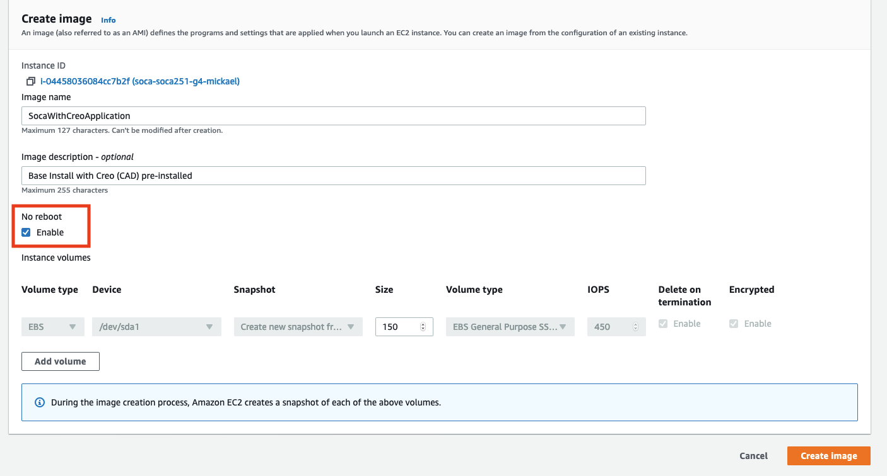

Navigate to the AMI tab and verify if your image status is "available"

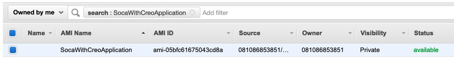

!!!warning "My Image is taking forever to be created"
    To check the progress of your image, navigate to "Snapshots" section and refer to the `Progress` column for all EBS volumes created by your image
    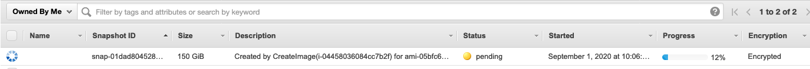

!!!info
    You will not be able to use your image until the status is available. 
    
    Creating an AMI may take a couple of hours depending the size of the image
    
    AMI is region specific
    
    [AMI has 3 syllabes and is pronounced "Ay-Em-I"](https://twitter.com/Werner/status/1182530158026055681).

Once your AMI is ready, login to your SOCA web interface and go to "AMI management" under "Admin" section

Fill out the form (specify the AMI ID, operating system, minimum storage requirement as well as pick a friendly label)

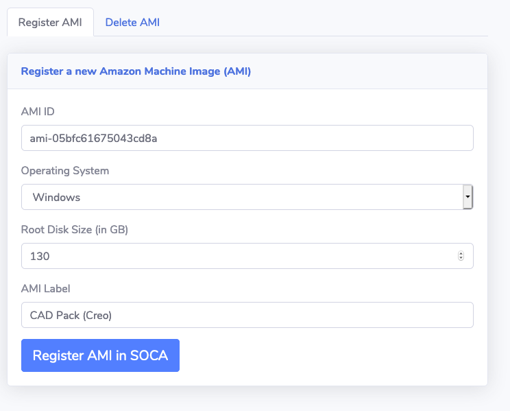

!!!note "What is root disk size?"
    Root disk size is the minimum storage required for your AMI to boot up. In other words, if you created your AMI with 150GB root disk, then you won't be able to launch any instance based on this AMI unless the associated EBS disk is greater or equal than the base storage.
    SOCA will automatically honor the minimum storage required by the image if users choose a lower value. 

Once done, click 'Register AMI in SOCA', you will get a success message if everything is configured correctly

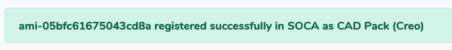

Now go back to the "Windows Session" section, this time you should be able to see your newly create image under `Software Stack`

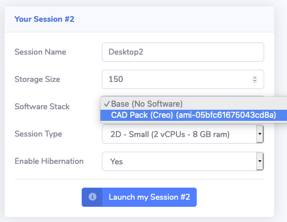

You can now launch your session with a pre-configured image.

## Linux

[Refer to this article to learn how to create Linux images](../../tutorials/reduce-compute-node-launch-time-with-custom-ami/)
