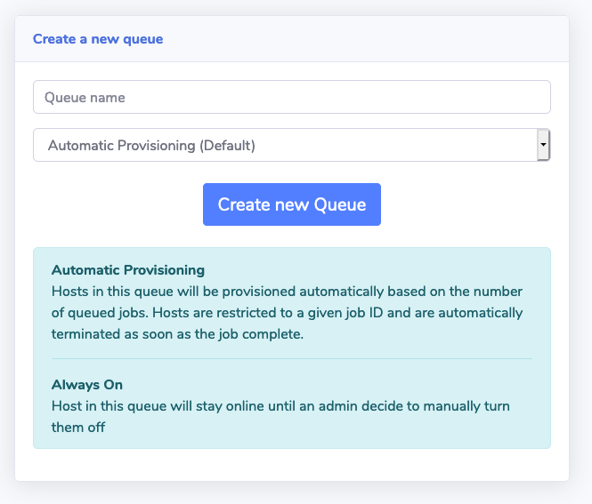
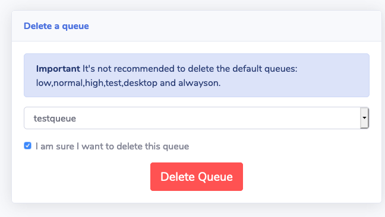

!!!info "Things to know before you start"
    By default, Scale-Out Computing on AWS creates 4 queues: high, normal (default), low and alwayson.

### Queue with automatic instance provisioning

#### Create the queue

##### Via the web UI

As an admin, click "Queue Management" section on the left sidebar. Select a queue name then choose "Automatic Provisioning"

##### Via command-line

On your scheduler host, run `qmgr` as root and enter the following commands:
~~~~bash                                
# Create queue name. Note: can't start with numerical character and it's recommended to use lowercase only
Qmgr:create queue <queue_name>

# Set the queue to execution
Qmgr:set queue <queue_name> queue_type = Execution

# Set default compute node - See below for more information
Qmgr:set queue <queue_name> default_chunk.compute_node = tbd

# Enable / Start the queue
Qmgr:set queue <queue_name> enabled = True
Qmgr:set queue <queue_name> started = True

# Exit
Qmgr:exit
~~~~

!!!info "What is compute_node=tbd"
    On Scale-Out Computing on AWS, unless you configure queue with AlwaysOn instances, nodes will be provisioned based on queue status. When you submit a job, Scale-Out Computing on AWS will automatically provision capacity for this job and compute_node is the scheduler making sure only one job can run on this instance. compute_node=tbd is the default value, making sure any new jobs won't run on existing (if any) nodes

#### Configure automatic host provisioning

If you want to enable automatic host provisioning, edit this file: `/apps/soca/$SOCA_CONFIGURATION/cluster_manager/settings/queue_mapping.yml`

##### Option1: I want to use the same settings as an existing queue

In this case, simply update the array with your new queue

~~~yaml hl_lines="3"
queue_type:
  compute:
    queues: ["queue1", "queue2", "queue3"] # <- Add your queue to the array
    instance_ami: "ami-1234567"
    instance_type: "c5.large"
    ...
~~~

##### Option2: I want to configure specific settings

In this case, you will first need to create a new section on the YAML file (see example with memory)

~~~yaml hl_lines="7"
queue_type:
  compute:
    queues: ["queue1"]
    instance_ami: "ami-1234567"
    instance_type: "c5.large"
    scratch_size: "100"
  memory: # <- Add new section
    queues: ["queue2"]
    instance_ami: "ami-9876543"
    instance_type: "r5.24xlarge"
    scratch_size: "600"
~~~

Finally, add a new crontab on the scheduler machine (as root). Use -c to path to the YAML file and -t to the YAML section you just created  

~~~bash
*/3 * * * * source /etc/environment;  /apps/soca/$SOCA_CONFIGURATION/python/latest/bin/python3 /apps/soca/$SOCA_CONFIGURATION/cluster_manager/dispatcher.py -c /apps/soca/$SOCA_CONFIGURATION/cluster_manager/settings/queue_mapping.yml -t memory
~~~

#### Automatic Host provisioning logs

All logs queues are stored under `/apps/soca/$SOCA_CONFIGURATION/cluster_manager/logs/<queue_name>`

### Queue with AlwaysOn instances

!!!danger "Important"
    - Scale-Out Computing on AWS automatically created one AlwaysOn queue for you called "alwayson" during the first installation  
    - In this mode, instances will never be stopped programmatically. You are responsible to terminate the capacity manually by deleting the associated CloudFormation stack

#### Create the queue

##### Via the web UI

As an admin, click "Queue Management" section on the left sidebar. Select a queue name then choose "Always On"

##### Via command-line

On your scheduler host, run `qmgr` as root and enter the following commands:

~~~bash
 # Create queue name. Note: can't start with numerical character and it's recommended to use lowercase only
Qmgr:create queue <queue_name>

# Set the queue to execution
Qmgr:set queue <queue_name> queue_type = Execution

# Enable / Start the queue
Qmgr:set queue <queue_name> enabled = True
Qmgr:set queue <queue_name> started = True

# Exit
Qmgr:exit
~~~
* * *

#### Start provisioning some capacity

Run `python3 apps/soca/cluster_manager/add_nodes.py` and enable `--keep_forever True` flag

~~~bash
# Launch 1 c5.large always on
python3 /apps/soca/$SOCA_CONFIGURATION/cluster_manager/add_nodes.py --instance_type c5.large \
    --desired_capacity 1 \
    --queue <queue_name> \
    --job_name instancealwayson \
    --job_owner mcrozes \
    --keep_forever True

 IMPORTANT:
 You specified --keep-forever flag. This instance will be running 24/7 until you MANUALLY terminate the Cloudformation Stack                            
~~~
If you need help with this script, run `python3 add_nodes.py -h`

#### Delete AlwaysOn capacity

Simply go to your CloudFormation console, locate the stack following the naming convention: soca-**cluster-name**-keepforever-**queue_name**-uniqueid and terminate it.  

#### Delete a queue

Via the web ui, go to "Queue Management" then navigate to the "Delete Queue" tab

