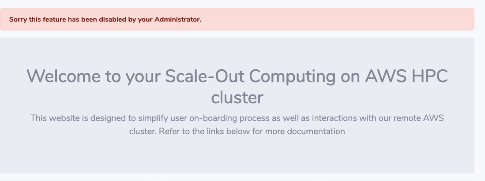

If required, SOCA administrators can disable web API or views by using `@disabled` decorator

## Disable an API

First, let's confirm a user can submit a job via the `/api/scheduler/job` endpoint:

~~~bash hl_lines="6"
 curl -k -X POST \
>    -H "X-SOCA-TOKEN: xxx" \
>    -H "X-SOCA-USER: mickael" \
>    -F payload="IyEvYmluL2Jhc2gKI1BCUyAtTiB0ZXN0am9iCiNQQlMgLVYgLWogb2UgLW8gdGVzdGpvYl9vdXRwdXQucWxvZwojUEJTIC1QIG15cHJvamVjdAojUEJTIC1xIG5vcm1hbAojUEJTIC1sIG5vZGVzPTEsaW5zdGFuY2VfdHlwZT1jNS5sYXJnZQovYmluL2VjaG8gIkhlbGxvIFdvcmxkIgo="  \
>    https://xxx.us-west-2.elb.amazonaws.com/api/scheduler/job
{"success": true, "message": "0"}
~~~

Edit `/apps/soca/$SOCA_CONFIGURATION/cluter_web_ui/api/v1/scheduler/pbspro/job.py` and import the new decorator

~~~python
from decorators import disabled
~~~

Locate  the API you want to disable and replace the current decorator with `@disabled`

Before:
~~~python
@private_api
def post(self):
    // code     
~~~

After:
~~~python hl_lines="1"
@disabled
def post(self):
   // code 
~~~

Restart SOCA web interface via `socawebui.sh stop/start` and validate you cannot use the API anymore

~~~bash hl_lines="6"
 curl -k -X POST \
>    -H "X-SOCA-TOKEN: xxx" \
>    -H "X-SOCA-USER: mickael" \
>    -F payload="IyEvYmluL2Jhc2gKI1BCUyAtTiB0ZXN0am9iCiNQQlMgLVYgLWogb2UgLW8gdGVzdGpvYl9vdXRwdXQucWxvZwojUEJTIC1QIG15cHJvamVjdAojUEJTIC1xIG5vcm1hbAojUEJTIC1sIG5vZGVzPTEsaW5zdGFuY2VfdHlwZT1jNS5sYXJnZQovYmluL2VjaG8gIkhlbGxvIFdvcmxkIgo="  \
>    https://xxx.us-west-2.elb.amazonaws.com/api/scheduler/job
{"success": false, "message": "This API has been disabled by your Administrator"}
~~~

If you want to re-enable the API, simply configure the decorator back to its previous version (`@private_api`).
Restart the web interface again and verify the API is now enabled:
```bash hl_lines="6"
 curl -k -X POST \
>    -H "X-SOCA-TOKEN: xxx" \
>    -H "X-SOCA-USER: mickael" \
>    -F payload="IyEvYmluL2Jhc2gKI1BCUyAtTiB0ZXN0am9iCiNQQlMgLVYgLWogb2UgLW8gdGVzdGpvYl9vdXRwdXQucWxvZwojUEJTIC1QIG15cHJvamVjdAojUEJTIC1xIG5vcm1hbAojUEJTIC1sIG5vZGVzPTEsaW5zdGFuY2VfdHlwZT1jNS5sYXJnZQovYmluL2VjaG8gIkhlbGxvIFdvcmxkIgo="  \
>    https://xxx.us-west-2.elb.amazonaws.com/api/scheduler/job
{"success": true, "message": "1"}
```

## Disable a view

Process is very similar, locate the HTTP view you want to restrict. For example edit `/apps/soca/$SOCA_CONFIGURATION/cluster_web_ui/views/remote_desktop.py`

Import the new decorator

~~~python
from decorators import login_required, disabled
~~~

Then replace the current decorator of the view you want to restrict with `@disabled`

~~~python hl_lines="2"
@remote_desktop.route('/remote_desktop', methods=['GET'])
@disabled
def index():
    // code
~~~

Restart the Web UI. Accessing the view will now redirect you back to your homepage


