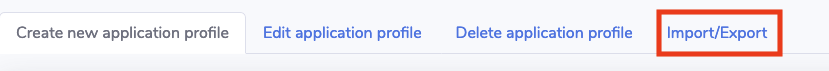
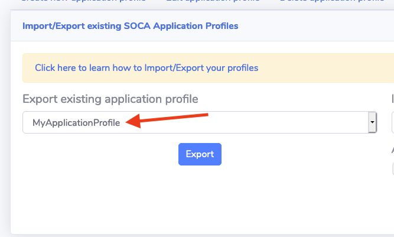
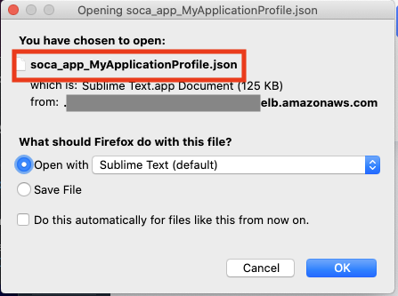
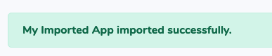

!!!configuration "Feature in preview"
    This feature is only available on beta builds
    
Refer to this page to learn how you can easily share your application profiles between multiple SOCA clusters.
    
## Export an existing application

To share your application profile, go to "Application Management" section and navigate to "Import/Export" tab

Select the application you want to export from the dropdown menu then click "Export"

This will download a `json` file. Share this `json` file with whoever want to be able to use your application profile on their SOCA environment

## Import an existing application

To import an application profile, go to "Application Management" section and navigate to "Import/Export" tab

Specify an application name,  upload a valid `json` then click Import

Your application will be imported successfully assuming the `json` provided is a valid SOCA application profile

Your application is now available on SOCA. You can edit it to make any change based on your own environment or start using it the way it is.
