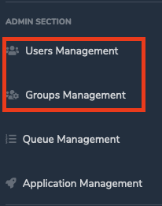
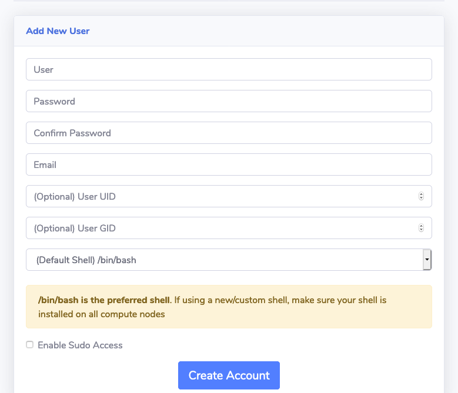
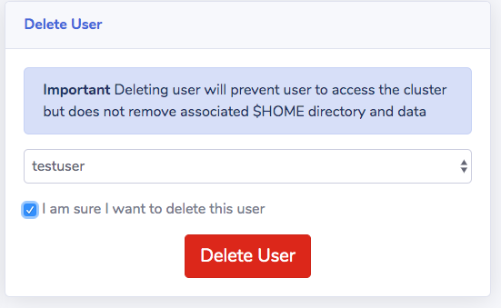
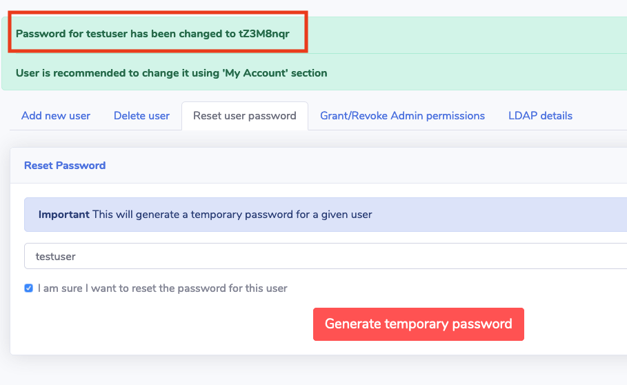
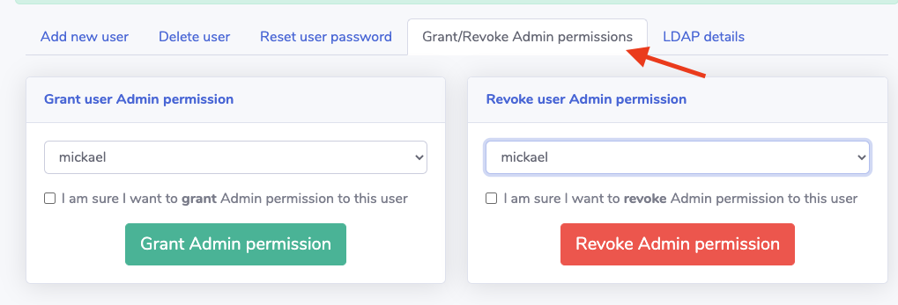
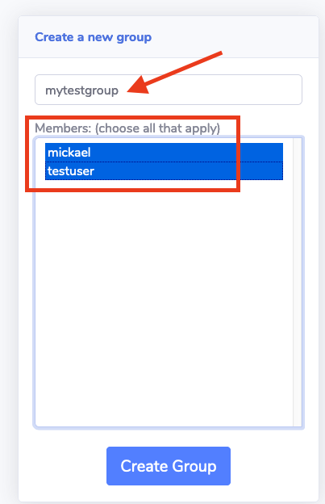
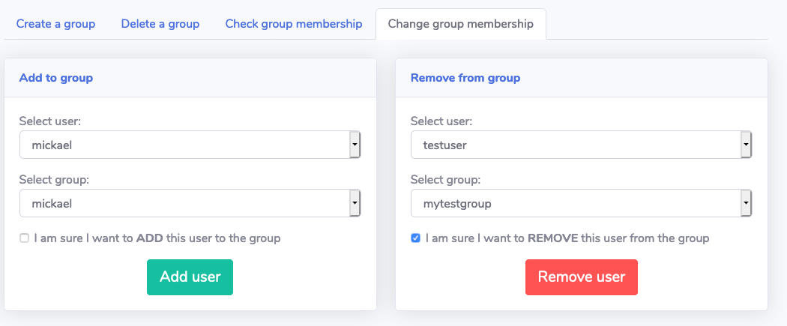
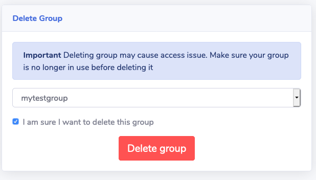

## Using Web UI

Log in to the Web UI with an admin account and locate "Users Management" or "Group Management" sections on the left sidebar.



!!!info
    Users and Group management are limited to admins users
    

### Users
#### Add users
To create a new user, simply fill out the "Create New User" form. Select whether or not the user will be an admin by checking  =="Enable Sudo Access"== checkbox. If needed, you can also manually force UID/GID or choose a shell different than `/bin/bash`.



You will see a success message if the user is created correctly


!!!info "What is a SUDO user?"
    Users will SUDO permissions will be admin on the cluster and authorized to run any sudo command. Make sure to limit this ability to HPC/AWS/Linux admins and other power users.

!!!info "Custom shell"
    SOCA uses `/bin/bash` by default but admins can specify any available shells installed on the system ( list available on `/etc/shells`)

#### Delete users
To delete a user, navigate to 'Delete Users' section then select the user you want to delete and check the checkbox.



You will see a success message if the user is deleted correctly.


!!!info
    Deleting a user will only delete the LDAP user. Associated $HOME directory is still preserved on /data/home

#### Reset password for a given user

Users can change their own password via the web ui. If needed, admins can also temporarily unlock a user by resetting the password on his/her behalf.



#### Manage SUDO (admin permission)

Admins can grant/revoke SUDO permissions for any user:
 


## Groups

#### Create a new group

To create a new group, simply select "Create a Group" and select the user(s) you want to add to this group.



#### Check group membership

You can check group membership by going to "Check group membership" tab.


#### Change group membership

If needed, you can add/remove users from a given groups.



#### Delete group

Lastly, to delete a group, simply navigate to "Delete Group" tab.



## Other LDAP operations

!!!warning "Attention"
    It's recommended to interact with OpenLDAP via the web ui interface.
    
Scale-Out Computing on AWS uses OpenLDAP and you can interact with your directory using LDIF directly.

!!!info "Scale-Out Computing on AWS LDAP Schema"
    - People: OU=People,DC=soca,DC=local
    - Groups: OU=Group,DC=soca,DC=local
    - Sudoers: OU=Sudoers,DC=soca,DC=local (This OU manages sudo permission on the cluster)

!!!success "Admin LDAP account credentials"
    - Bind DN (-D): cn=admin,dc=soca,dc=local 
    - Password (-y) /root/OpenLdapAdminPassword.txt

For example, if you want to create a new group, create a new LDIF file (mynewgroup.ldif) and add the following content:

```ldap
dn: cn=mynewgroup,ou=Group,dc=soca,dc=local
objectClass: top
objectClass: posixGroup
cn: mynewgroup
gidNumber: 6000
memberUid: mytestuser
```

Run the following `ldapadd` command to add your new group:
```bash
ldapadd -x -D cn=admin,dc=soca,dc=local -y /root/OpenLdapAdminPassword.txt -f mynewgroup.ldif
adding new entry "cn=mynewgroup,ou=Group,dc=soca,dc=local"
```

Finally valid your group has been created correctly using `ldapsearch`
```bash hl_lines="12"
# Validate with Ldapsearch
~ ldapsearch -x cn=mynewgroup
#Extended LDIF
#
# LDAPv3
# base DC=soca,DC=local (default) with scope subtree
# filter: cn=mynewgroup
# requesting: ALL
#

# mynewgroup, Group, soca.local
dn: cn=mynewgroup,ou=Group,dc=soca,dc=local
objectClass: top
objectClass: posixGroup
cn: mynewgroup
gidNumber: 6000
memberUid: mytestuser
```

Example for LDIF modify operation
```
dn: cn=mynewgroup,ou=Group,dc=soca,dc=local
changetype: modify
add: memberUid
memberUid: anotheruser
```
Example for LDIF delete operation
```
dn: cn=mynewgroup,ou=Group,dc=soca,dc=local
changetype: modify
delete: memberUid
memberUid:: anotheruser # you get the memberUid by running a simple ldapsearch first
```

## Give users permissions to submit job

By default, users can submit job to any queue, however you [can set up ACL at queue level if needed](../../security/manage-queue-acls/)