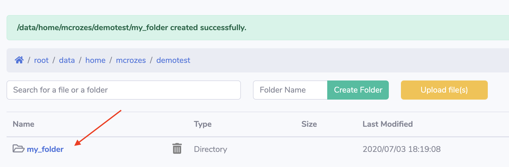
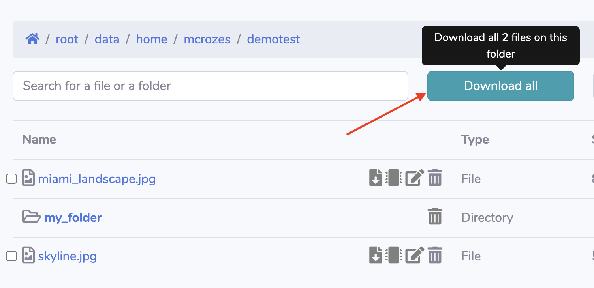
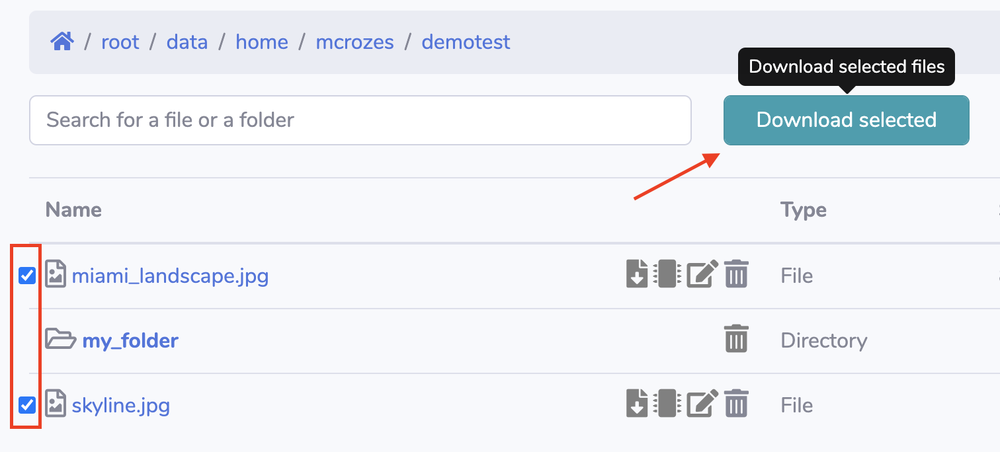
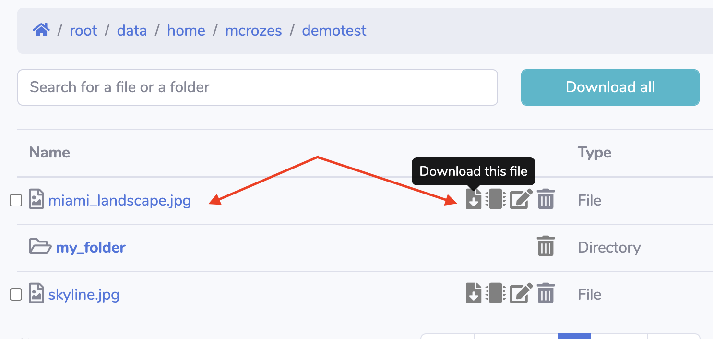
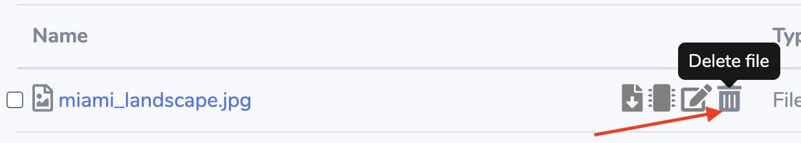
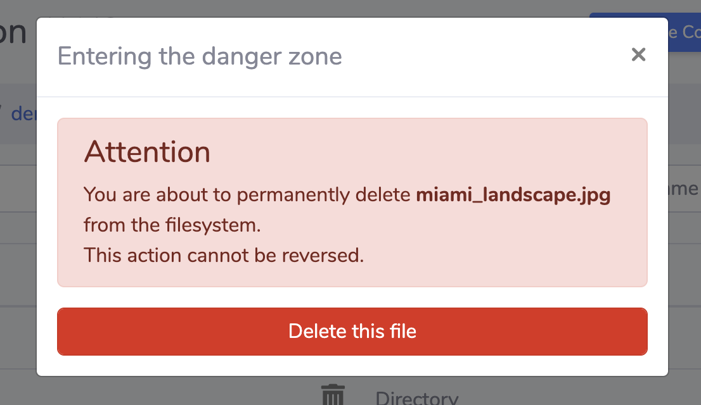
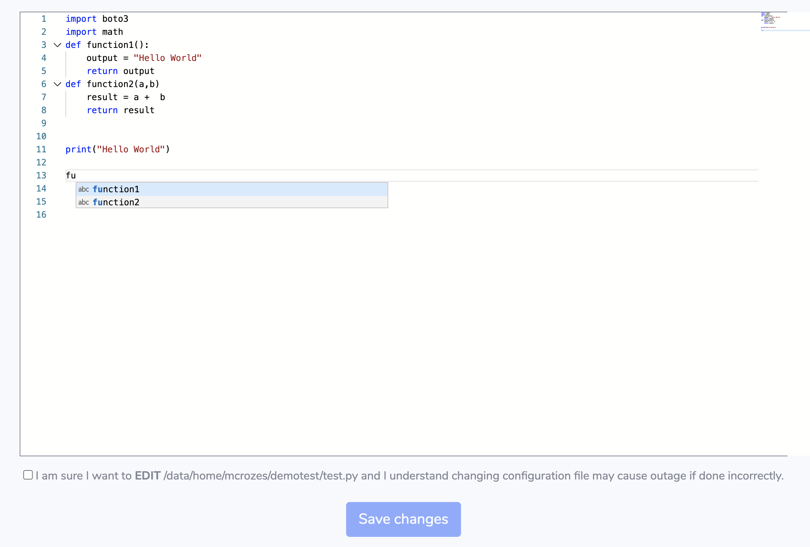
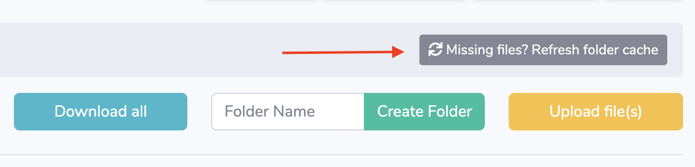

"My Files" section let each user access their filesystem via a web browser.

## Create a new folder

Click "Create Folder" to create a new folder un your current working directory.


Your folder will be created instantly and visible under the File Explorer section.



## Upload files

Click "Upload Files" button then drag and drop (or select) the files you want to upload.


!!!info
    Maximum upload size (default 5GB) and upload timeout (default 30 minutes) can be configure via `config.py`

## Download files

### All files in directory

Click "Download All" button to download all files from the current working directory (SOCA will create a zip archive)



### Multiple files

Select the files you want to download by checking the assigned checkboxes them click "Download Selected" button.



### Single file

To download a single file, click on the file name or use the first icon.



## Delete files

To delete a file, simply click the last icon located on the right of the file name.



This will open a confirmation window.



## Edit files

To edit a file, click the 3rd icon located on the right of the file name.


This will open a text editor. The editor includes syntax highlights and auto-completion.



Once you are done with your changes, check the checkbox and click "Save" button.


## Use file as simulation input

[Refer to this page for more information](../submit-hpc-jobs-web-based-interface/#submit-a-test-job)


## Files created via the filesystem are not visible

For better performance, SOCA cache the content of a directory by default for 2 minutes (this settings can be changed in `config.py` via DEFAULT_CACHE_TIME).
If you have created a file via SSH/DCV and this file is not yet visible, simply force a cache refresh by clicking the grey button.




## Permissions & Settings

The web interface rely on POSIX permissions. In other words, creating a file/folder is the same as running "touch" or "mkdir".

Web configuration parameters are listed on `/apps/soca/<YOUR_CLUSTER>/cluster_web_ui/config.py`. A restart is required if you change any of these settings.

```bash
    APPS_LOCATION = "/apps/"
    USER_HOME = "/data/home" # Adjust if you use a different location
    CHROOT_USER = False  # if True, user can only access their $HOME directory (aka: USER_HOME/<user>)
    PATH_TO_RESTRICT = []  # eg: /apps/folder1 -> users can't access anything under /apps/folder1
    DEFAULT_CACHE_TIME = 120  # 2 minutes. Change this value to optimize performance in case you have a large number of concurrent user
    MAX_UPLOAD_FILE = 5120  # 5 GB
    MAX_UPLOAD_TIMEOUT = 1800000  # 30 minutes
    MAX_SIZE_ONLINE_PREVIEW = 150000000  # in bytes (150mb by default), maximum size of file that can be visualized via the web editor
    MAX_ARCHIVE_SIZE = 150000000  # in bytes (150mb by default), maximum size of archive generated when downloading multiple files at once
    DAILY_BACKUP_COUNT = 15  # Keep 15 latest daily backups
```