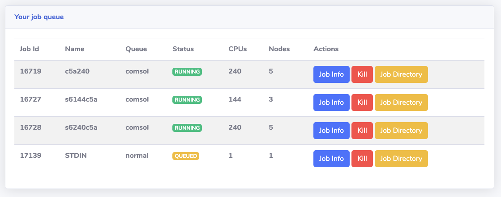
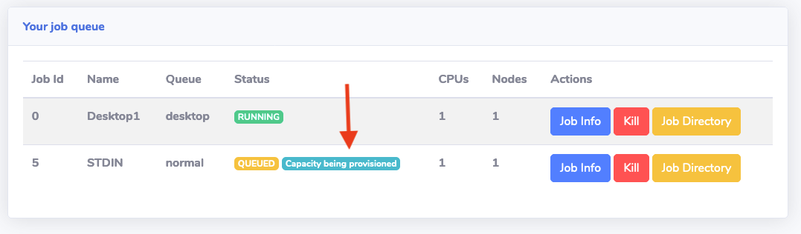
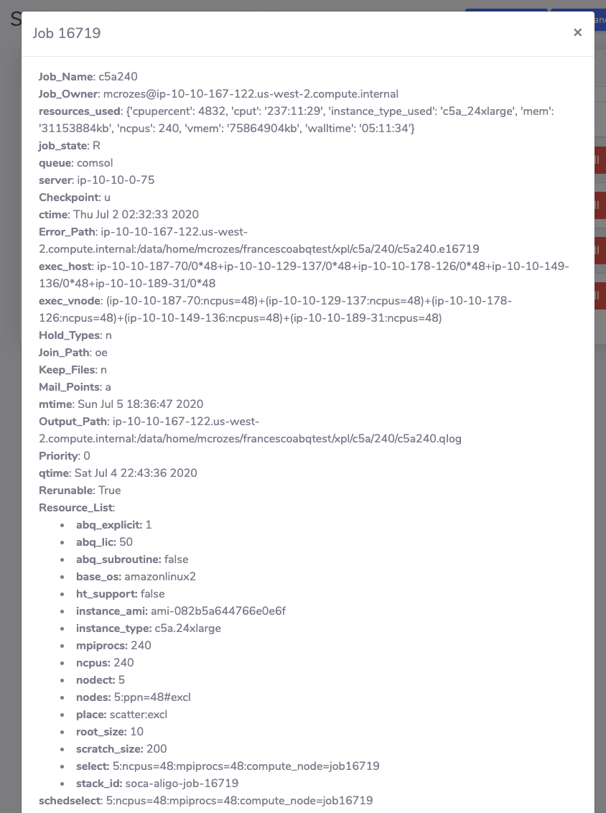
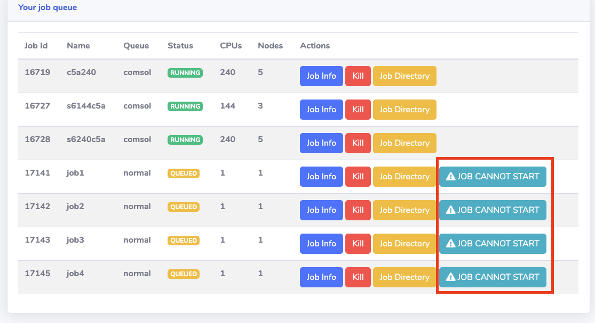
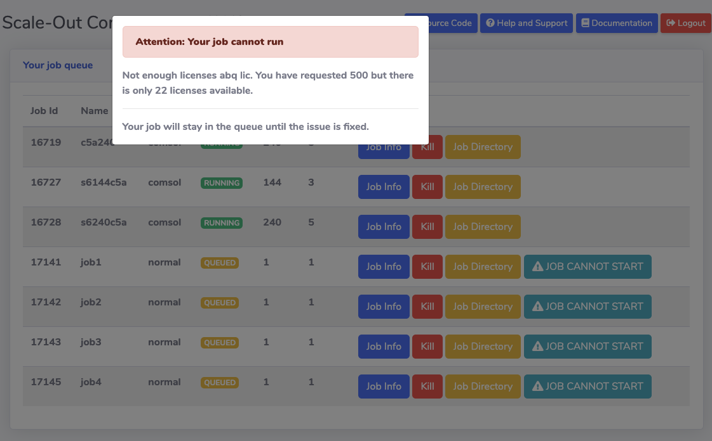
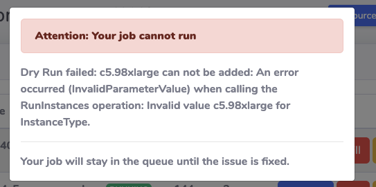
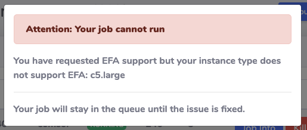

"My Job Queue" section let each user access their jobs information via the web interface.

SOCA automatically add a tag if capacity is being provisioned for a job in "queued" state.

## Retrieve job information

Click "Job Info" button to get information about your job.

## Access your job output

Click "Job Directory" button to access the job output location.

## Delete a job 

Click "Kill" button to remove a job from the queue.

## Understand why your job cannot start

There are multiple reasons why you job cannot start. To display useful information to the users, SOCA automatically add a visual tag to any jobs that won't be able to start due to misconfiguration.

Users can understand why their jobs are blocked by clicking the "Job cannot start" button. Some examples includes:

### Not enough software licenses

### Typo in the instance type

### Invalid configuration (request EFA but use an instance without EFA support)

### And more ...

- Limit of running jobs exceeded
- Limit of provisioning instance exceeded
- AWS Service limit errors (eg: cannot provision more EBS volume)
- Can't start job when "force_ri=True" if you do not have enough Reserved Instance availables
- ...

