!!!configuration "Feature in preview"
    This feature is only available on beta builds
    
    
## Using DCV session storage (Windows and Linux)

In addition of existing SCP/SFTP, you can now take advantage of [DCV session-storage feature](https://docs.aws.amazon.com/dcv/latest/adminguide/manage-storage.html). Session Storage is a folder from where you can upload/download files directly from DCV.

### Using the Web Browser

Click the  cloud icon (1) and select to "Upload Files" (2). Choose the file you want to upload from the explorer list.

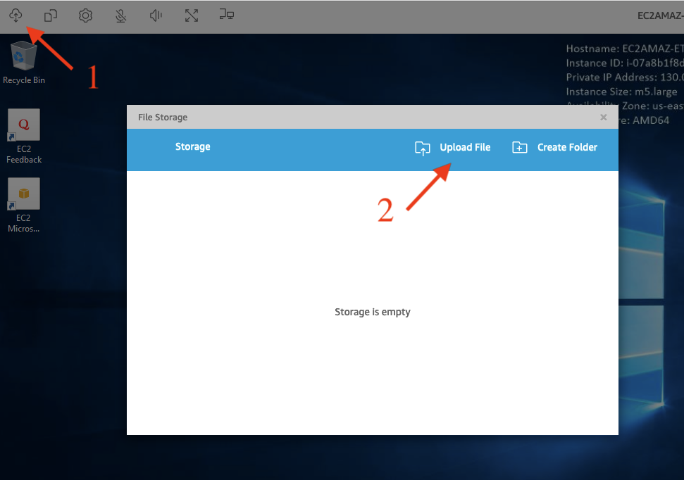

To check the progress of your upload/download, click on the "Notification bar"

Once your upload is finish, locate the file on your filesystem

- On Linux, your files will be uploaded to **$HOME/session-storage**
- On Windows, your files will be uploaded to **C:\session-storage**

!!!note "Download"
    Session Storage also let you download files directly from your DCV session.

### Using the native application

If you use the native application, Click "Connection > File Storage"

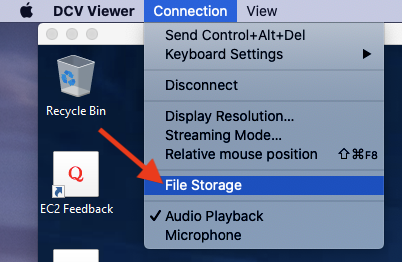

!!!note "Important"
    Although session storage is very handy, it's recommended to use traditional SFTP/SCP or [the Web UI to upload large file](../../web-interface/my-files/) to upload large files.

## Share data between Windows sessions

Unlike Linux desktop, Windows desktops do not share a common filesystem, meaning data hosted on your Windows Session #1 are not accessible to your Windows Session #2 out of the box. 

### On the machine you want to share

On the machine you want to share, first open a terminal, type "ipconfig" and note the IP of your session (130.0.157.1 in this example)

Right click on the folder you want to share. In my example I want to share the entire C:\ drive so I right click on C:\ and click Properties

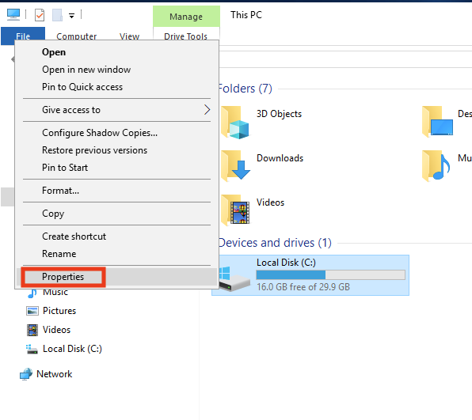

Navigate to "Sharing" tab and click "Advanced Sharing"

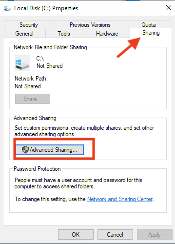

Check "Share this folder" box and specify a name (my_first_session in this example)

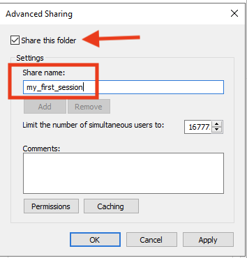

You can also click "Permissions" to manage who can access your files (default to read-only). In this example I simply give "Everyone" Read/Write access. Please note "Everyone" still require users to be able to successfully authenticate to your machine.

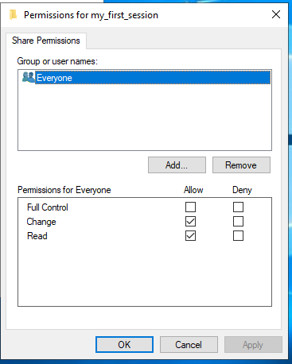

Finally, you can verify if you disk is correctly shared

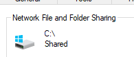

### On the machine you want to access the share

On the file explorer, right click "Network" tab and click "Map Network Drive"

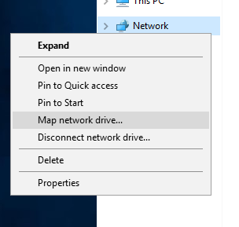

If it's your first time, you will need to enable "Network Sharing", simply click "Ok"

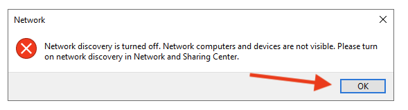

This will open a new ribbon, click on it and click "Turn on Discovery and File Sharing"

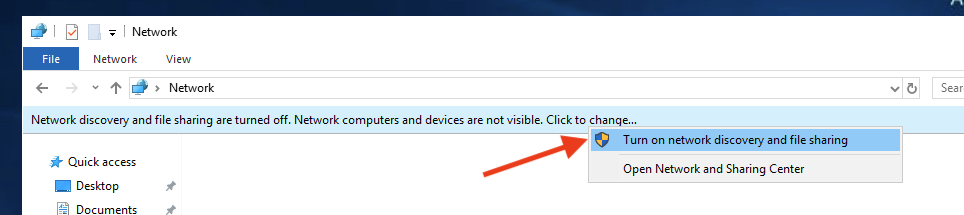

You will be prompted for your sharing settings. You can use both settings but we usually recommend limiting to Private Network only

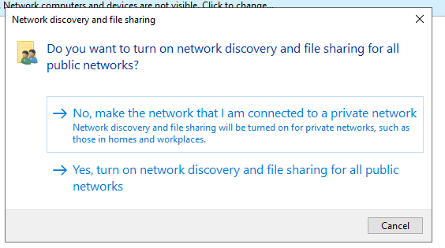

Now you have enabled file sharing, right click "Network" tab and click "Map Network Drive" again. This time you will be prompted with a new window asking you the location of your share
Specify **\\<ip>\\<share_name>**, then click "Connect using different credentials"

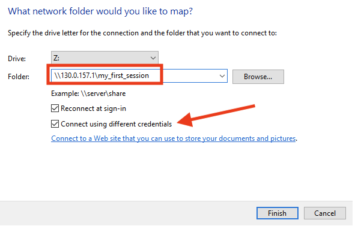

Go back to SOCA and retrieve your Windows session you want to share the folder from. Click "Get Password" and note the password. Please note each Windows sessions have a unique password.

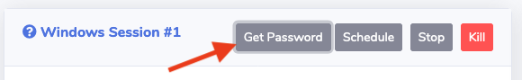

Go back to your Windows and then enter your SOCA username (or Administrator) and the password your just retrieved from SOCA.

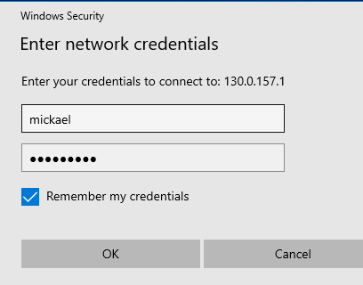

You are done. You can now access your share from the file explorer

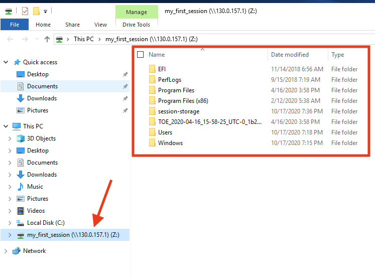