!!!configuration "Feature in preview"
    This feature is only available on beta builds
    
    
## Using DCV session storage (Windows and Linux)

In addition of existing SCP/SFTP, you can now take advantage of [DCV session-storage feature](https://docs.aws.amazon.com/dcv/latest/adminguide/manage-storage.html). Session Storage is a folder from where you can upload/download files directly from DCV.

### Using the Web Browser

Click the  cloud icon (1) and select to "Upload Files" (2). Choose the file you want to upload from the explorer list.


To check the progress of your upload/download, click on the "Notification bar"


Once your upload is finish, locate the file on your filesystem

- On Linux, your files will be uploaded to **$HOME/session-storage**
- On Windows, your files will be uploaded to **C:\session-storage**


!!!note "Download"
    Session Storage also let you download files directly from your DCV session.

### Using the native application

If you use the native application, Click "Connection > File Storage"


!!!note "Important"
    Although session storage is very handy, it's recommended to use traditional SFTP/SCP or [the Web UI to upload large file](../../web-interface/my-files/) to upload large files.

## Share data between the cluster and on-prem and between VDI nodes using AWS Transfer Family SFTP

Frequent SFTP transfers of big files done via the [Web UI](../../web-interface/my-files/) may affect performance of the head node. Also users will not be able to reach their home directories using SFTP via the head node in case the head node is not available (e.g. due to the maintenance).

To address the situations, we recommend to establish a dedicated AWS Transfer SFTP endpoint for the cluster home directories of SOCA users.

To establish the SFTP endpoint in the AWS Console navigate to the service "AWS Transfer Family" and press "Create server":


Choose the "SFTP" protocol:

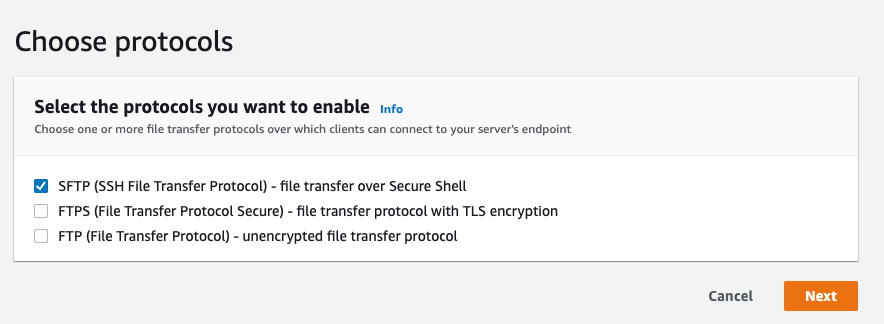

Choose "Service managed" identity provider:

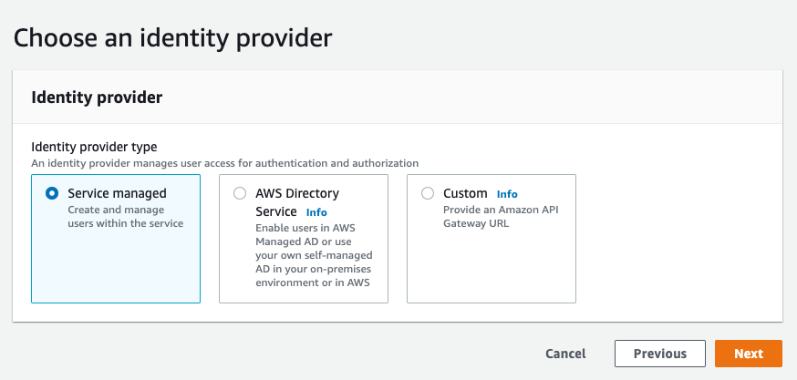

Choose "Endpoint type" depending on your setup: pick "VPC hosted" in case you have a private deployment of SOCA and you have network connectivity with your on-prem network or if you want to control access to your public SFTP endpoint by IP with a security group. In this example we use a "Publicly accessible" endpoint:

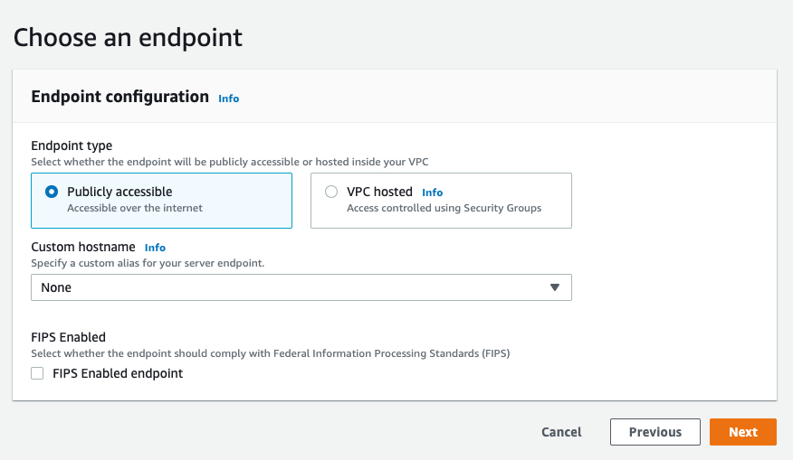

Choose a domain - in our case "Amazon EFS":

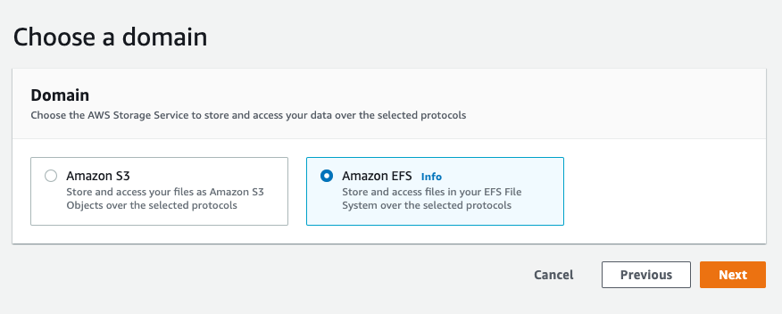

Configure additional details - choose "Create a new role" in the "Logging role", the rest input fields leave with their default values:

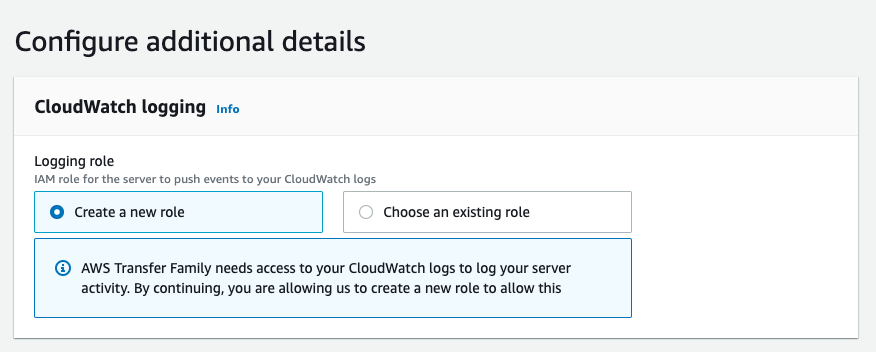

In the "Review and create" press "Create server":

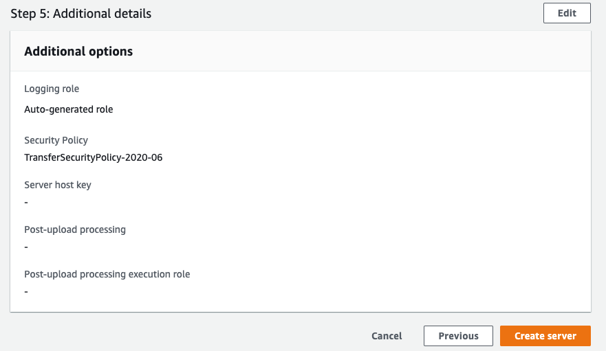

To register users allowed to access the SFTP endpoint we need to create a  IAM role for EFS access, gather the users uid, guid and their public SSH key.

To create the IAM role for EFS access in the AWS Console go to "IAM > Roles" and click "Create role":

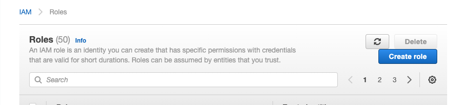

Choose the "Transfer" service:

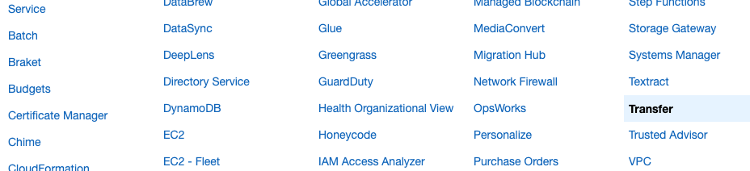

Choose the `AmazonElasticFileSystemClientReadWriteAccess` managed policy:

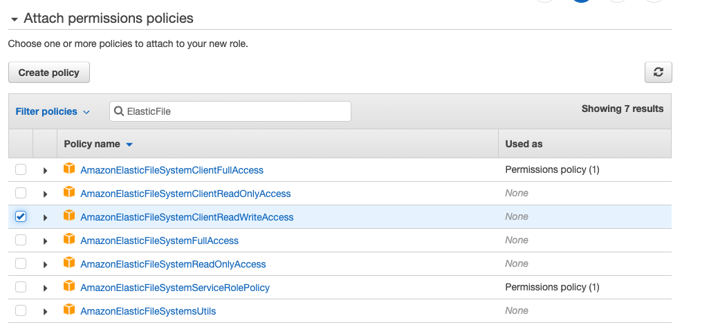

Give the role name "TransferEFSClient" and save it:

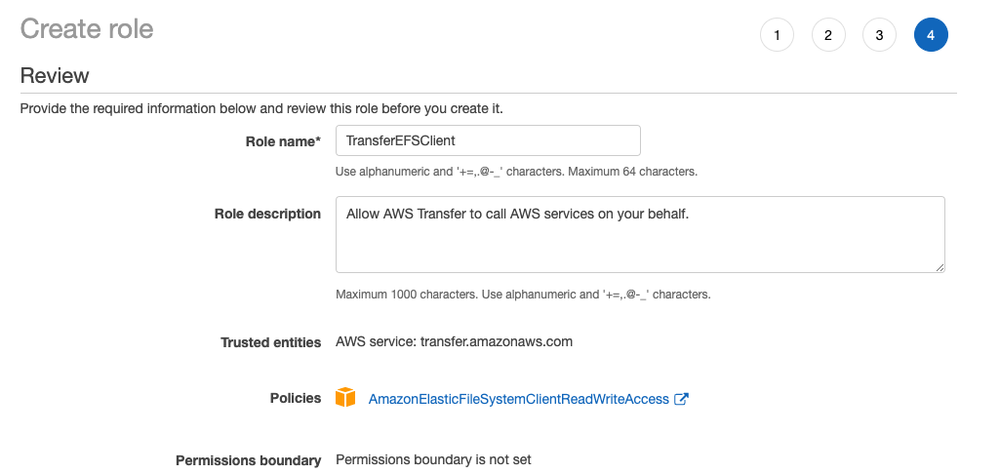

To get the user's "uid" and "guid" login to the SOCA's head node with SSH and execute:

```bash
id <username>
```

```bash
id oleg
uid=5001(oleg) gid=5001(oleg) groups=5001(oleg)
```

To get the user's public key, retrieve it from the file `/home/data/<username>/.ssh/id_rsa.pub` in the same SSH session the to SOCA's head node.

Then navigate to the newly created SFTP server in the AWS Console and click "Add user":

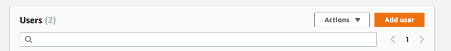

Type the user name, User ID, Group ID, choose Role "TransferEFSClient", pick the "EFSData" filesystem belonging to SOCA as the "Home directory" and type `/home/<username>` in the directory name:

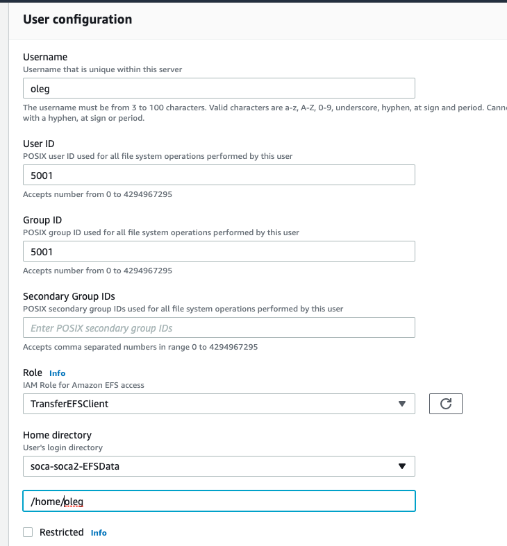

Paste the public SSH key into "SSH public keys" field:

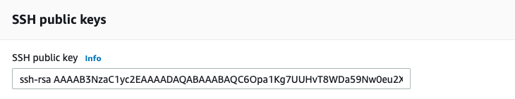

To test your new SFTP endpoint grab you _private_ SSH key (e.g. via SOCA Web UI Dashboard on the page "SSH access"):

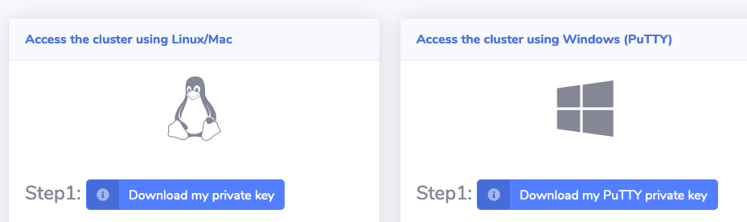

Get the name of your SFTP endpoint in the "Endpoint details" in AWS Console:

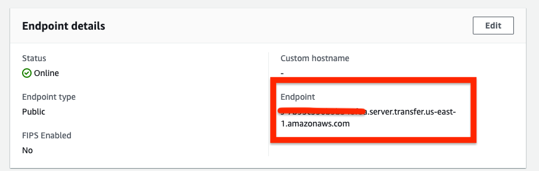

Use your favorite SFTP client to access the SFTP endpoint. I use sftp from OpenSSH in the example below:

```bash
sftp -i ~/Downloads/oleg_soca_privatekey.pem oleg@<sftp-endpoint>
```

You should get a successful connection and be able to transfer file between your local machine and your home directory in the cluster bypassing the SOCA's head node.

You can also use the SFTP endpoint to access your cluster home directory from Windows VDI machines.

## Share data between Windows sessions

Unlike Linux desktop, Windows desktops do not share a common filesystem, meaning data hosted on your Windows Session #1 are not accessible to your Windows Session #2 out of the box. 

### On the machine you want to share

On the machine you want to share, first open a terminal, type "ipconfig" and note the IP of your session (130.0.157.1 in this example)


Right click on the folder you want to share. In my example I want to share the entire C:\ drive so I right click on C:\ and click Properties


Navigate to "Sharing" tab and click "Advanced Sharing"


Check "Share this folder" box and specify a name (my_first_session in this example)


You can also click "Permissions" to manage who can access your files (default to read-only). In this example I simply give "Everyone" Read/Write access. Please note "Everyone" still require users to be able to successfully authenticate to your machine.


Finally, you can verify if you disk is correctly shared


### On the machine you want to access the share

On the file explorer, right click "Network" tab and click "Map Network Drive"


If it's your first time, you will need to enable "Network Sharing", simply click "Ok"


This will open a new ribbon, click on it and click "Turn on Discovery and File Sharing"


You will be prompted for your sharing settings. You can use both settings but we usually recommend limiting to Private Network only


Now you have enabled file sharing, right click "Network" tab and click "Map Network Drive" again. This time you will be prompted with a new window asking you the location of your share
Specify **\\<ip>\\<share_name>**, then click "Connect using different credentials"


Go back to SOCA and retrieve your Windows session you want to share the folder from. Click "Get Password" and note the password. Please note each Windows sessions have a unique password.


Go back to your Windows and then enter your SOCA username (or Administrator) and the password your just retrieved from SOCA.


You are done. You can now access your share from the file explorer

