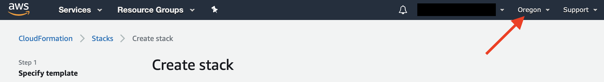

# Lab 1: Deploy Environment

We want you to have hands-on experience deploying your own cluster, and in this module we will have you walk through the process of launching a cluster in your temporary AWS account.  This cluster will be provisioned in the background. For the subsequent modules you'll access a pre-built cluster where EDA tools and licenses have been provisioned. 

## Step 1: Launch stack

This automated AWS CloudFormation template deploys a scale-out computing environment in the AWS Cloud.

1. Sign in to the AWS Management Console and click the Launch Stack link below to launch the scale-out-computing-on-aws AWS CloudFormation template.

    [**Launch Stack**](https://console.aws.amazon.com/cloudformation/home?region=us-west-2#/stacks/new?&templateURL=https://s3.amazonaws.com/solutions-reference/scale-out-computing-on-aws/latest/scale-out-computing-on-aws.template)

1. Verify the launch region is **Oregon**

    

    !!! important
        The template must be launched in **Oregon** for this workshop.

1. On the **Create stack** page, you should see the template URL in the **Amazon S3 URL** text box and choose **Next**.

1. On the **Specify stack** details page, assign a name to your solution stack.  We recommend naming it "dvcon".

    !!! warning
         The stack name must be less than 20 characters and must be lower-case only.

1. Under **Parameters**, modify the the last four parameters, which are marked with **REQUIRED**.  Leave all other fields with their default values.  These are variables passed the CloudFormation automation that deploys the environment.

    |Parameter|Default|Description
    ----------|-------|-----------
    |**Install Location**|
    |Installer S3 Bucket|`solutions-reference`|The default AWS bucket name. Do not change this parameter unless you are using a custom installer.
    |Installer Folder|`scale-out-computing-on-aws/latest`|The default AWS folder name. Do not change this parameter unless you are using a custom installer.
    |**Linux Distribution**|
    |Linux Distribution|AmazonLinux2|The preferred Linux distribution for the scheduler and compute instances.  Do not change this parameter.
    |Custom AMI|<Optional input>|If using a customized Amazon Machine Image, enter the ID. Leave this field blank.
    |**Network and Security**|
    |EC2 Instance Type for Scheduler node|m5.large|The instance type for the scheduler.  Do not change this parameter.
    |VPC Cluster CIDR|10.0.0.0/16|Choose the CIDR (/16) block for the VPC. Do not change this parameter.
    |IP Address|See description|**REQUIRED** The public-facing IP address that is permitted to log into the environment.  You can leave it at default, but we recommend you change it to your public-facing IP address. You can find your public-facing IP address at http://checkip.amazonaws.com.  Add the /32 suffix to the IP number. 
    |Key Pair Name|ee-default-keypair|**REQUIRED** Select the `ee-default-keypair` provided by the workshop.
    |**Default LDAP User**|
    |User Name|<Requires input>|**REQUIRED** Set a username for the default cluster user.
    |Password|<Requires input>|**REQUIRED** Set a password for the default cluster user. (5 characters minimum, uppercase/lowercase/digit only)

1. Choose **Next**.

1. On the **Configure Stack Options** page, choose **Next**.

1. On the **Review** page, review the settings and check the two boxes acknowledging that the template will create AWS Identity and Access Management (IAM) resources and might require the CAPABILITY_AUTO_EXPAND capability.

1. Choose **Create stack** to deploy the stack.

You can view the status of the stack in the AWS CloudFormation console in the **Status** column. You should see a status of `CREATE_COMPLETE` in approximately 35 minutes.

By now you've learned how to deploy Scale-Out Computing on AWS in an AWS account. For the purpose of this workshop, you'll login to a pre-built setup that has the following:

    * Synopsys VCS software pre-installed,
    * A license server with valid licenses, and
    * Workshop test case

You can now move on to the next lab. Click **Next**.
