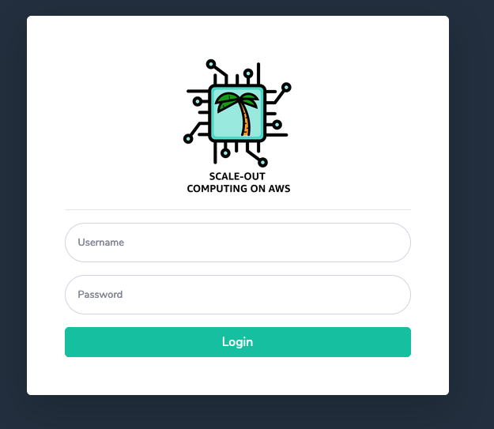
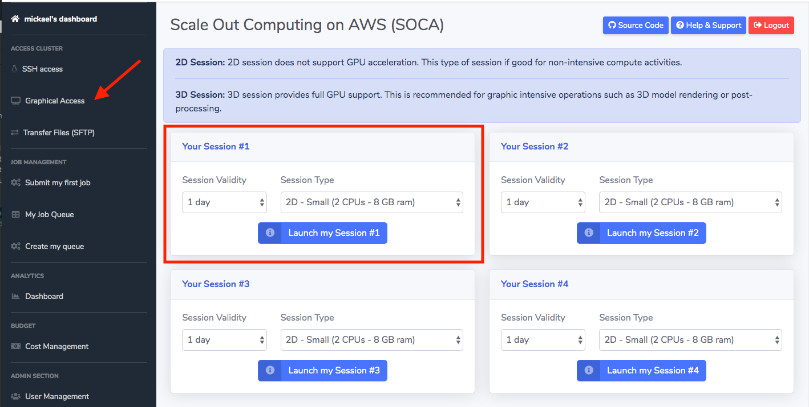

# Lab 2: Login to SOCA Console and Launch Remote Desktop Session

The goal of this module is to login to SOCA console and start a remote desktop session from which you will run applications and submit jobs into the cluster.  You will use the cluster's management console to start and monitor the session.

## Step 1: Login to SOCA console

1. Click on the link below to login to SOCA console

    [**Login to SOCA console**](https://soca-tko-viewer-1490821021.us-west-2.elb.amazonaws.com/login)
    
    

    !!! note 
        Your web browser will warn you about a certificate problem with the site.  To open the webpage, you need to authorize the browser to trust the self-signed security certificate.  In a production deployment, you would upload a Server Certificate to the Elastic Load Balancer endpoint.

1. Log in using the web UI using the following credentials:

    username: user + table id (for example: user1, user12, user24, etc...)

    password: provided in the session

## Step 2: Launch remote desktop server

Follow these instructions to start a full remote desktop experience in your new cluster:

1. Click **Graphical Access** on the left sidebar.

    

1. Select  **1 day** in the **Session Validity** popup menu.

1. Choose **2D - Medium (8 vCPUs - 32GB ram)** in the **Session Type** popup menu.

1. Click **Launch my Session #1**

After you click **Launch my session**, a new job is submitted into the queue that will instruct AWS to provision a server with 8 vCPUs and 32GB of memory and install all desktop required packages including Gnome. 

You will see an message asking you to wait up to 20 minutes before being able to access your remote desktop, but it should take around 10 minutes to deploy the remote desktop server.

!!! note
    You can monitor the deployment of the remote desktop server by observing the status of the corresponding job under "My Job Queue". 

Please wait till the desktop instance is ready before moving on to the next step.  Click **Next** once the job status on "My Job Queue" is **RUNNING**.
