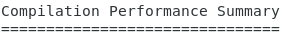

# Lab 3: Login to Remote Desktop and Compile Design

The goal with this lab is to evaluate the remote visualization experience using a graphical EDA tool.

## Step 1: Log into your session

By now your remote desktop session should be ready and you should see the following under **Your Session #1**:

1. Click **Open Session directly on a browser** to log into the remote desktop session in your new cluster using the username and password you created in the steps above.

    !!! note
        You can also access the session with the NICE DCV native clients, which are available for Mac, Linux, and Windows from https://download.nice-dcv.com

1. Start a new terminal session by going to **Applications → Favorites → Terminal** in the desktop manager.

## Step 2: Copy test case

1. Copy the test case to your home directory by typing ``cp -r /data/NVDLA_export /fsx/`whoami` `` at the command prompt and hit enter

    !!! note
        /data is a mount point for **Amazon Elastic File System** which provides a simple, scalable elastic NFS file system. /fsx is a mount point for **Amazon FSx for Lustre** which provides a Lustre file system suitable for high performance computing (HPC) workloads such as EDA

1. Change directory to test case ``cd /fsx/`whoami`/NVDLA_export`` and hit enter
1. Source environment settings by typing `. setup.sh` and hit enter 

## Step 3: Compile the test case
 
1.  Change directory to verif/sim `cd verif/sim` and hit enter

1. Compile the test case by typing `make clean comp comp_verdi` then hit enter.

1. You should see the test case is getting compiled and at the end should see: 

You've completed this lab. Click **Next**.
