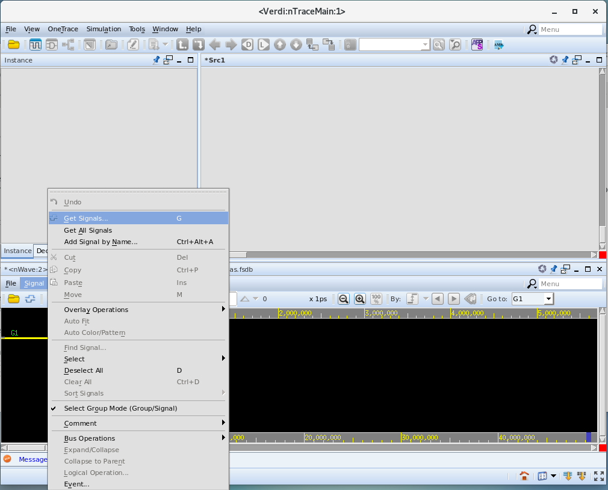
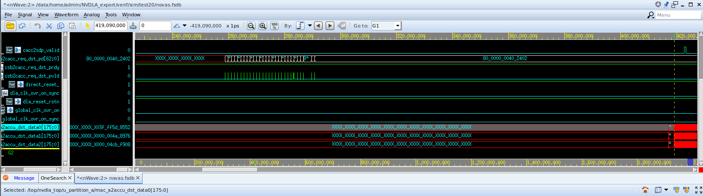

# Lab 5: Bring up Verdi

This module provides instructions for loading a graphical tool to debug a design which is commonly used in integrated cicuit design workflows.

### Step 1: Start Verdi and load test20 database

1. Start Verdi and load test20 waveform database by typing the command `verdi -ssf test20/novas.fsdb`. When Verdi GUI comes-up, click Ok to ignore the license expiration warning.
    

### Step 2: Select Signals

1. On the lower pane, click on **Signal** then on the pop-up click on **Get Signals**
    

1. On the left pane, expand **+ top(top)** then expand **+ nvdla_top(NV_nvdla)** then click on **u_parition_a(NV_NVDLA_partition_a)**

1. In the middle pane, click on **accu2sc_credit_size[2:0]** then hit shift and click on **mac_a2accu_data2[175:0]** then click **OK**
    

### Step 3: Search for Signal Transition

1. On the lower left pane, click on **a2accu_dst_data0[175:0]** and click **twice** on the **Search Forward** button to find the time where the bus changes to non-zero values and observe the timestamp 419,090,000 ps
    

### Step 4: Exit Verdi

1. On the upper pane, click on **File** menu item then click on **Exit** to close Verdi. Click **Yes** on the exit confirmation question

Click **Next** to move to the next lab.
