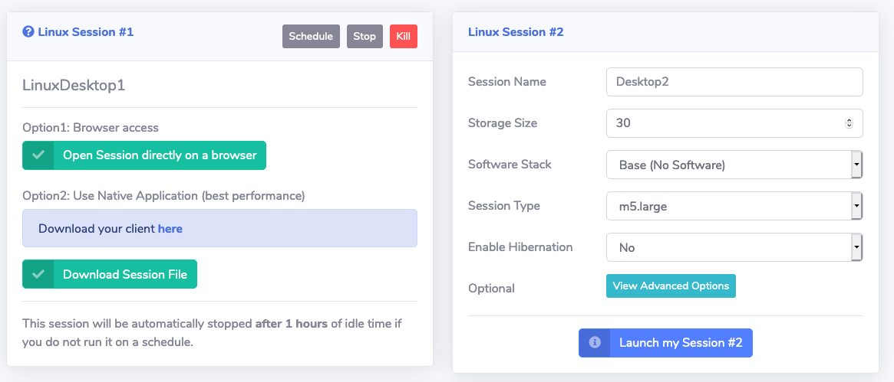

# Lab 2: Login to Remote Desktop and Copy Lab Data

The goal with this lab is to log in to the remote cloud desktop visualization and experience using it. You'll also copy the data required for the subsequent labs.

## Step 1: Log into your session

By now your remote desktop session should be ready and you should see the following under **Your Session #1**:

1. Click **Open Session directly on a browser** to log into the remote desktop session in the cluster.

    !!! note
        You can also access the session with the NICE DCV native clients, which are available for Mac, Linux, and Windows from https://download.nice-dcv.com

1. Start a new terminal session by going to **Applications → System Tools → Terminal** in the desktop manager.

## Step 2: Copy lab data 

1. Create a working directory for your user under `/fsxl/` by typing ``mkdir /fsxl/`whoami` `` at the command prompt and hit enter. This should create a directory under /fsxl with the username assigned to you earlier in the session

1. Copy the lab data to your working directory by typing ``cp -r /data/synopsys/lab_data /fsxl/`whoami` `` at the command prompt and hit enter

    !!! note
        /data is a mount point for **Amazon Elastic File System** which provides a simple, scalable elastic NFS file system. /fsxl is a mount point for **Amazon FSx for Lustre** which provides a Lustre file system suitable for high performance computing (HPC) workloads such as EDA

1. Change directory to test case ``cd /fsxl/`whoami`/lab_data`` and hit enter

1. Source environment settings by typing `source setup.csh` and hit enter 

In this lab you learned how to log in to desktop cloud visualiztion instance, and copied the lab data.

You've completed this lab. Click **Next** to move to the next lab.
