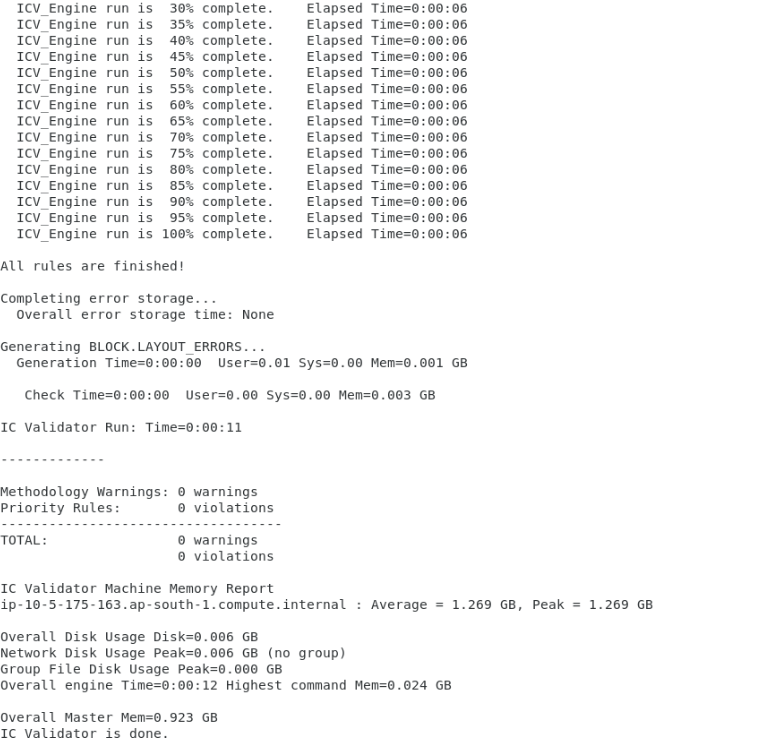

# Lab 4: Run EXPLORER Test Case

Explorer analysis gives users options to quickly check on multiple design weaknesses.

ICV DRC Explorer runs on dynamically selected parts of signoff runset. This mode comes very handy while running designs that are still in maturing state. 

In the lab you will see DRCs caused from instance overlap, DRCs caused from re-use of old blocks that have diffrent width and spacing requirements.

IC Validator offers Explorer functions both on DRC and LVS. This lab only talks about DRC Explorer.

## Step 1: Run the EXPLORER test case
 
1. Change directory to EXPLORER test case by typing `cd ../EXPLORER` and hit enter.

1. Run the test case by typing `./runme` then hit enter.

1. ICV should run directly on the remote desktop host (i.e, doesn't submit a job to the scheduler) and should generate a log similar to this

    

In this lab you learned how to run ICV DRC Explorer.

Click **Next** to move to the next lab.
