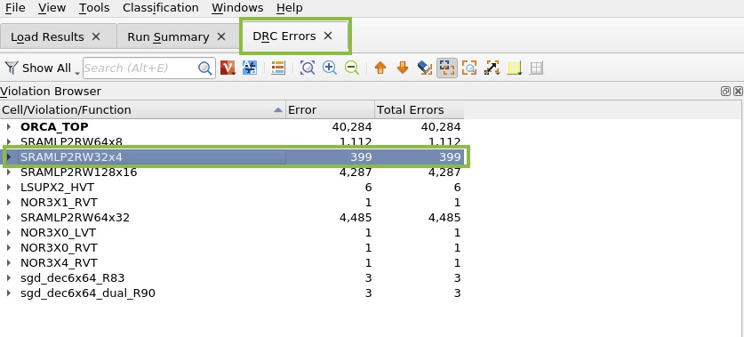
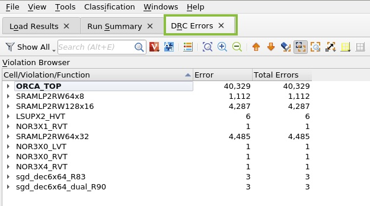
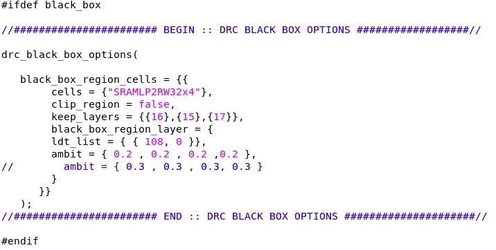
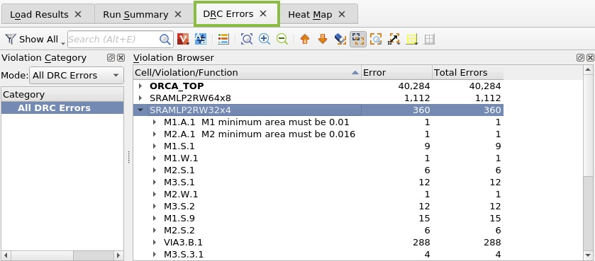
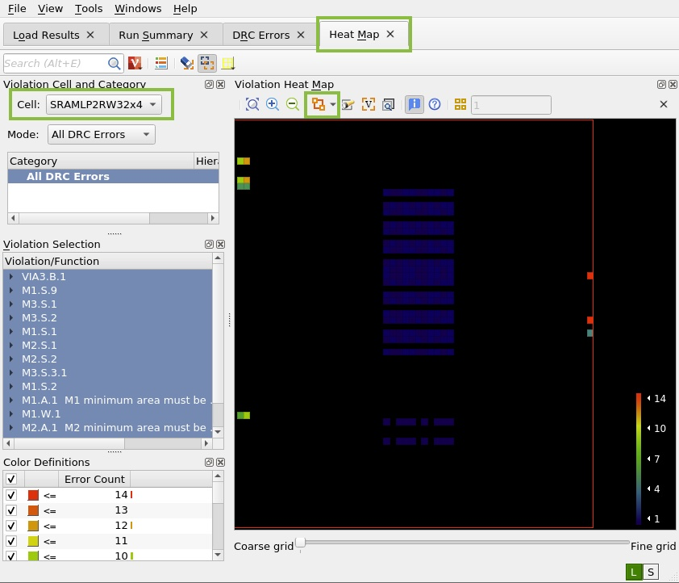
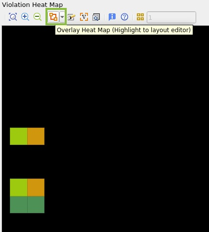
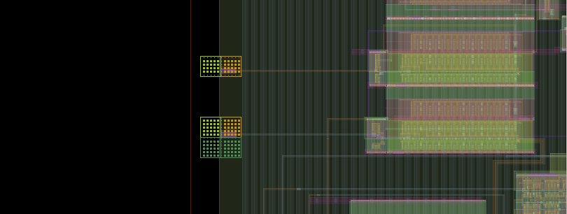

# Lab 5: Run BBOX Test Case

The idea for this lab is to show you how to validate designs before all the building blocks are completed which allows for parallel development.

## Step 1: Run the test case without black_box configuration
 
1. Change directory to BBOX test case by typing `cd ../BBOX` and hit enter.

1. Edit the runme script to uncomment the command under #cmd1 (make sure that cmd2 and cmd3 are commented out). You can use vim, gvim, or gedit to edit the file. This command runs without defining -D black_box variable which should show the original DRCs reported.

1. Run the test case by typing `./runme` then hit enter.

1. After the run is completed, open ICV Workbench by typing `icvwb TOP_BB.oas`. Then click on ICV_VUE and browse to black_box_run/ORCA_TOP.vue

1. Click on DRC Errors and notice there are **399 errors** for cell **SRAMLP2RW32X4**.

    

1. Close VUE and ICV Worbench windows.

## Step 2: Run with black_box configuration

1. Edit the runme script to uncomment the command under #cmd2 (comment cmd1 and cmd3). This command defines -D black_box and provides an options set in black_box.rs file passed via -runset_config option.

1. Run the test case by typing `./runme` then hit enter.

1. After the run is completed, open ICV Workbench by typing `icvwb TOP_BB.oas`. Then click on ICV_VUE and browse to black_box_run/ORCA_TOP.vue

1. Click on DRC Errors and notice there are **no violations** reported for **SRAMLP2RW32x4** as black_box is set for the cell.

    

1. Close VUE and ICV Worbench windows.

## Step 3: black_box with ambit

1. Edit the runme script to uncomment the command under #cmd3 (comment cmd1 and cmd2). This command provides for heat map generation. VUE automatically reads and creates the heat map tab in the VUE GUI. 

    -hm --> top-cell heat map 

    -hm_cell --> subcell heat map

1. Edit black_box.rs configuration file by uncommenting the following lines:

    ambit --> this will enable ICV to read polygons till the value provided from the reference layer.

    clip_region = false --> to consider the entire polygon which is interacting with the ambit region. By default, it is true i.e. to clip polygons till the exclude region.

    

1. Run the test case by typing `./runme` then hit enter.

1. After the run is completed, open ICV Workbench by typing `icvwb TOP_BB.oas`. Then click on ICV_VUE and browse to black_box_run/ORCA_TOP.vue

1. Click on DRC Errors and notice there are **58 violations** reported for black_box cell **SRAMLP2RW32x4** with ambit = 0.2

    

## Step 4: Heat Map

1. Click the Heat Map tab to start debugging. The Error Heat Map is a graphical interface used to visualize error distributions.

1. Once the tab is opened, heat map quickly shows where all diagnostic warnings are flaged. Change the cell to "SRAMLP2RW32x4"
    

1. Zoom-in to the upper left error hotspot in heatmap. To view both Heat Maps and design shapes in ICVWB, overlay the heat map. Select "Overlay Heat Map" from the options list in the Violation heat Map window.

    

    Overlay heat map to the layout 

    

1. Close VUE and ICV Worbench windows.

In this lab you learned how to run ICV for the black box test case.

Click **Next** to move to the wrap-up section.
