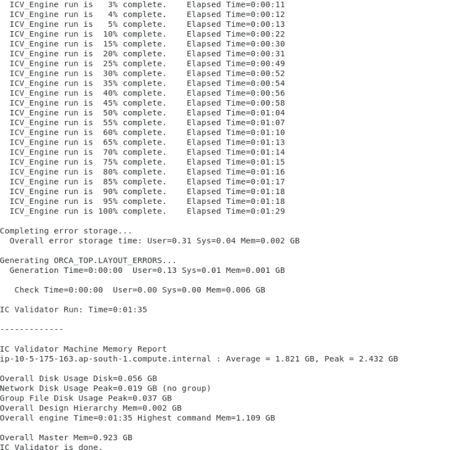

# Lab 5: Run BBOX Test Case

## Step 1: Run the BBOX test case
 
1. Change directory to BBOX test case by typing `cd ../BBOX` and hit enter.

1. Edit the runme script to uncomment the command under #cmd1. You can use vi or gedit to edit the file.

1. Run the test case by typing `./runme` then hit enter.

1. ICV should run directly on the remote desktop host (i.e, doesn't submit a job to the scheduler) and should generate a log similar to this

    

In this lab you learned how to run ICV BBOX test case.

Click **Next** to move to the next lab.
