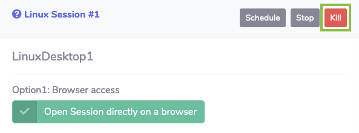
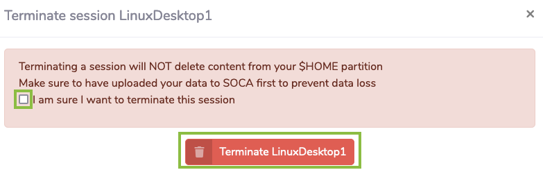

# Wrap-up

Congratulations! You've completed this Tutorial.

## Clean up

1. Go back to the SOCA portal and click on the **Kill** red button above the Linux Desktop Session.

    

1. Then click on the checkbox **I am sure I want to terminate this session** then click on **Terminate LinuxDesktop1**

    

## Next steps

1. Please complete the session survey.
