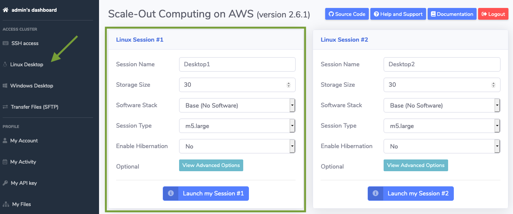

# Lab 2: Login to SOCA Web UI and Launch Remote Desktop Session

The goal of this module is to log in to SOCA web interface and start a remote desktop session from which you will run applications and submit jobs into the cluster. You will use the cluster's management portal to start and monitor the session.

## Step 1: Login to SOCA Web UI

1. Click one of the links below depending on the session you're attending to log in to corresponding SOCA web interface

    [**Click here for North America Sessions**](https://soca-tko260-viewer-1219550143.us-west-2.elb.amazonaws.com/login){target=_blank}

[]: # '[**Click here for North America - Private Session**](https://soca-vcs-viewer-1127745173.us-east-1.elb.amazonaws.com/login){target=_blank}'

    [**Click here for Israel/EMEA Sessions**](https://soca-261-frankfurt-viewer-601308495.eu-central-1.elb.amazonaws.com/login){target=_blank}

    [**Click here for Asia Sessions**](http://soca-workshop-viewer-1241784048.ap-southeast-1.elb.amazonaws.com/login){target=_blank}
    
    

    !!! note 
        Your web browser will warn you about a certificate problem with the site.  To open the webpage, you need to authorize the browser to trust the self-signed security certificate.  In a production deployment, you would upload a Server Certificate to the Elastic Load Balancer endpoint.

1. Log in to the web UI using the following credentials:

    username: provided during tutorial session

    password: provided during tutorial session

## Step 2: Launch remote desktop server

Follow these instructions to start a full remote desktop experience in your new cluster:

1. Click **Linux Desktop** on the left sidebar.

    

Under **Linux Session #1** group:

1. Select  **CentOS 7 - x86_64** in the **Software Stack** dropdown menu.

1. Choose **2D - Medium (8 vCPUs - 32GB ram)** in the **Session Type** dropdown menu.

1. Click **Launch my Session #1**

After you click **Launch my session**, the SOCA solution will create a new EC2 instance with 8 vCPUs and 32GB of memory and install all desktop required packages including Gnome. 

You will see a message asking you to wait up to 10 minutes before being able to access your remote desktop.

!!! warning
    Please wait till the desktop instance is ready before moving on to the next step.

In this lab you learned how to use SOCA web portal to create a desktop cloud visualization instance so you can access the compute cluster. 

Click **Next** once the status of Linux Session #1 changes and you see green button labeled **Open Session directly on a browser**.
