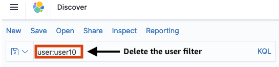
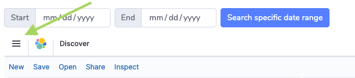
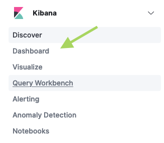

# Lab 6: Explore Analytics Dashboard

## Step 1: Open My Activity

Return to the SOCA web UI and click on the **My Activity** section on the left sidebar and wait a minute for OpenSearch (formerly Elasticsearch) Kibana dashboard to load.

The OpenSearch (formerly Elasticsearch) dashboard attempts to filter the jobs view for the logged-in user. However, data is refereshed every hour from the SOCA cluster to OpenSearch (formerly Elasticsearch). If you see **No results match your search criteria**, delete the user filter from the search field.

You should see information about recent jobs submitted to the cluster for all users. You might need to update the duration dropdown just above the chart to see older or more recent job data.

If you click on the small arrow to the left of the date/time, you'll see all metadata information saved into the analytics dashboard for this specific job. The metadata information is available in Table or JSON format. Here is an example of how it looks in JSON format. Notice that it includes an estimated price calculated based on job duration and instance type.

## Step 2: Explore Cluster Dashboard

Above the chart click on the three-horizontal bars (a.k.a hamburger button) next to OpenSearch (formerly Elasticsearch) Discover label.

Then under the Kibana section, click on **Dashboard**

Then click on **Cluster dashboard**. The cluster administrator can setup various visualizations in the dashboard.  

!!! note
    The results of what you'll see in the cluster might be different from the example images below. Move your cursor above the visualizations to see pop-ups with more relevant information. You can also zoom in or out on the charts with date/time on the x-axis to see more details.

Here are a few examples:

### Jobs per user split by instance type

  
    

### Instance types split by user

### Number of instances in the cluster

In this lab you learned how to explore the analytics dashboard in SOCA cluster.

Click **Next** to move to the next lab.
