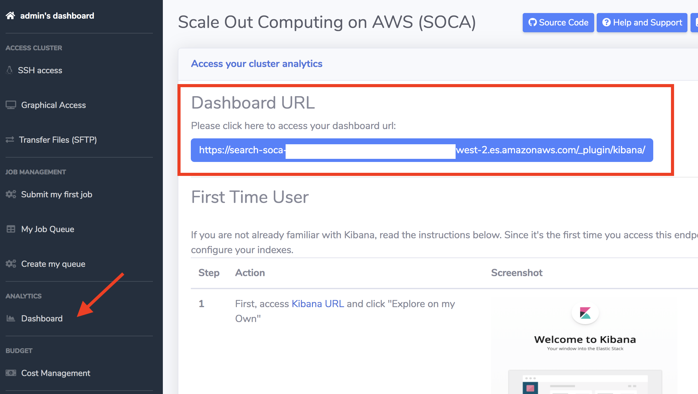
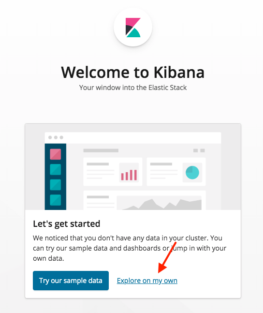
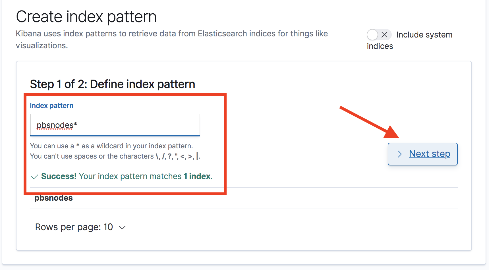
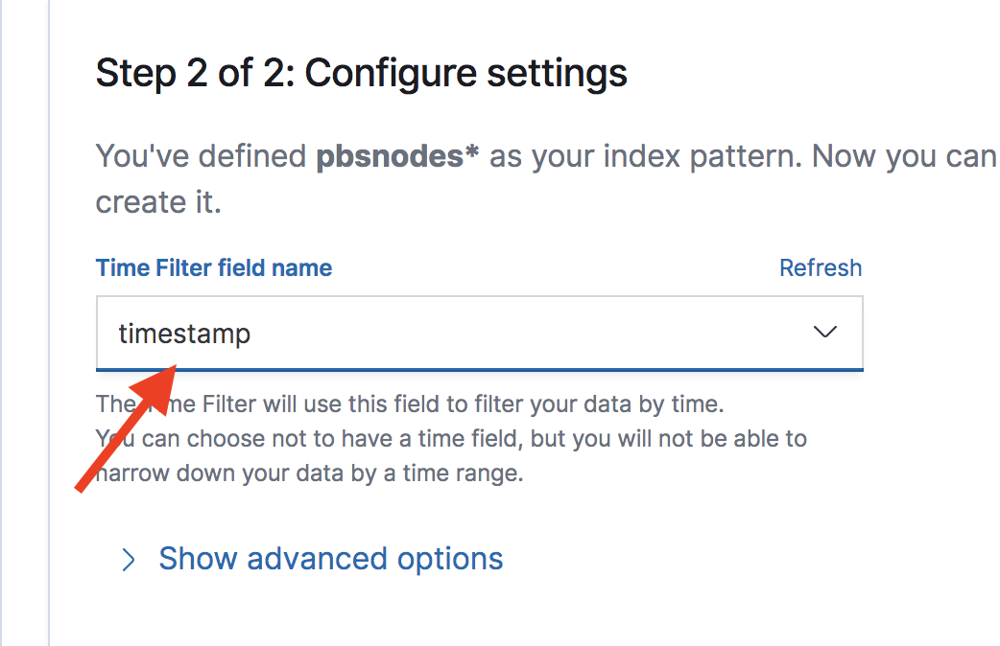
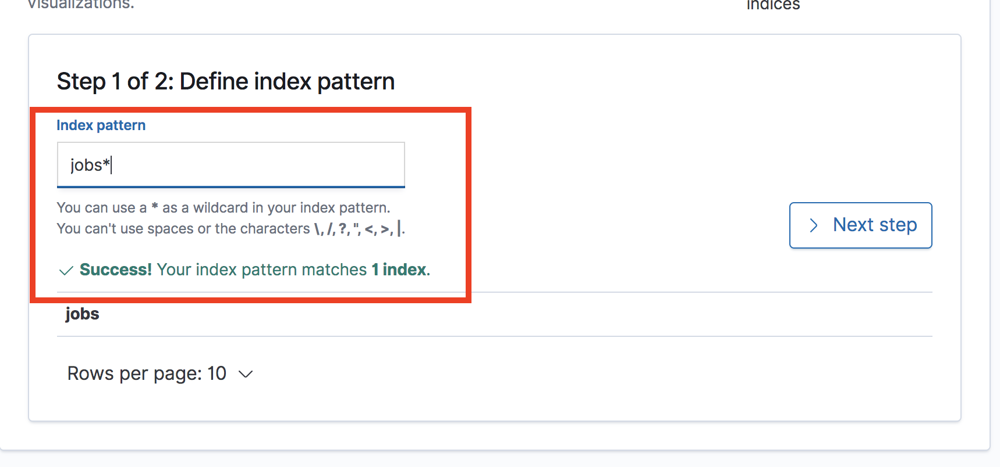
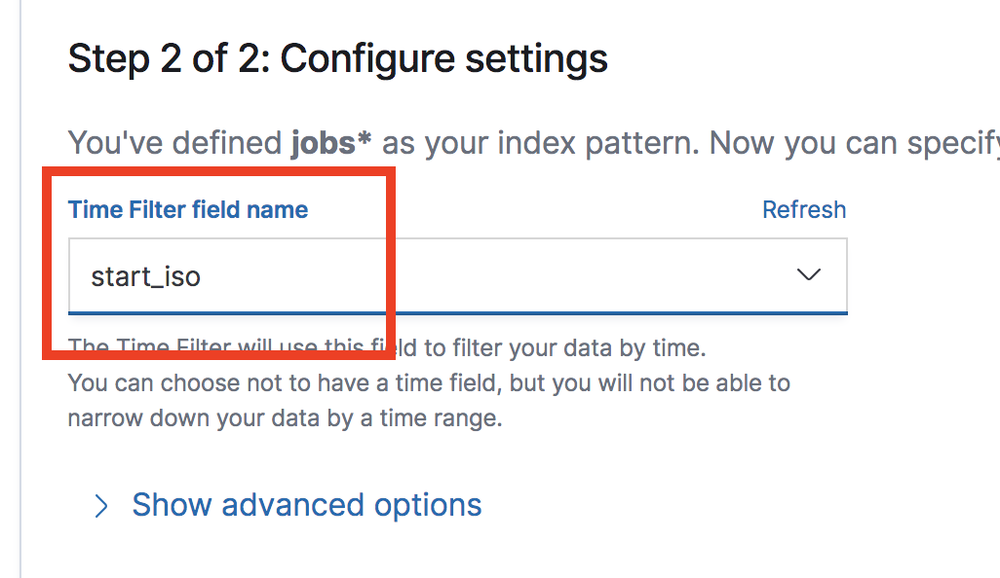
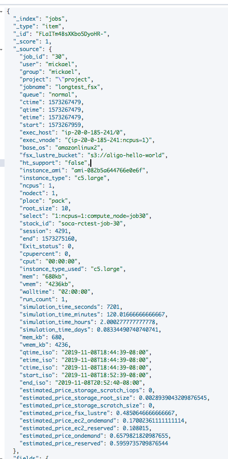

# Lab 7: Explore Analytics Dashboard

## Step 1: Open Cluster Dashboard

Return to the your cluster web UI and click on the **Analytics** section on the left sidebar.




## Step 2: Add Data to your Cluster

By default, job information is ingested by the analytics system on an hourly basis.

1. Log back into the **scheduler host** via SSH as `ec2-user` and run the follow command to force immediate ingestion into ElasticSearch:

    ```bash
    source /etc/environment; /apps/soca/$SOCA_CONFIGURATION/python/latest/bin/python3 /apps/soca/$SOCA_CONFIGURATION/cluster_analytics/job_tracking.py
    ```

## Step 3: Create Indexes

Since it's the first time you access this endpoint, you will need to configure your indexes.  
First, access Kibana URL and click "Explore on my Own"



Go under Management and Click Index Patterns


Create your first index by typing **pbsnodes***.



Click next, and then specify the Time Filter key (**timestamp**). Once done, click Create Index Pattern.



Repeat the same operation for **jobs*** index 



This time,  select **start_iso** as time filter key.




Once your indexes are configured, go to Kibana, select "Discover" tab to start visualizing the data


### Index Information

|  | Cluster Node Information | Job Information |
| ------------------------ | ----------- | ---------- | 
| Kibana Index Name       | pbsnodes         | jobs        | 
| Data ingestion       | /apps/soca/cluster_analytics/cluster_nodes_tracking.py         | /apps/soca/cluster_analytics/job_tracking.py        | 
| Recurrence     | 1 minute         | 1 hour **(note: job must be terminated to be shown on ElasticSearch)**       | 
| Data uploaded         | Host Info (status of provisioned host, lifecycle, memory, cpu etc ..)         | Job Info (allocated hardware, licenses, simulation cost, job owner, instance type ...)        | 
| Timestamp Key   | Use "timestamp" when you create the index for the first time         | use "start_iso" when you create the index for the first time        | 

____

## Examples

#### Cluster Node


#### Job Metadata




# Generate Graph

## Money spent by instance type

!!!example "Configuration"
    * Select "Vertical Bars" and "jobs" index
    * Y Axis (Metrics):
        * Aggregation: Sum
        * Field: estimate_price_ondemand
    * X Axis (Buckets):
        * Aggregation: Terms
        * Field: instance_type_used.keyword
        * Order By: metric: Sum of estimated_price_on_demand
    * Split Series (Buckets):
        * Sub Aggregation: Terms
        * Field: instance_type_used
        * Order By:  metric: Sum of price_on_demand


## Jobs per user split by instance type

!!!example "Configuration"
    * Select "Vertical Bars" and "jobs" index
    * Y Axis (Metrics):
        * Aggregation: count
    * X Axis (Buckets):
        * Aggregation: Terms
        * Field: user.keyword
        * Order By: metric: Count
    * Split Series (Buckets):
        * Sub Aggregation: Terms
        * Field: instance_type_used
        * Order By: metric: Count
 
  
    
## Most active projects 

!!!example "Configuration"
    * Select "Pie" and "jobs" index
    * Slice Size (Metrics):
        * Aggregation: Count
    * Split Slices (Buckets):
        * Aggregation: Terms
        * Field: project.keyword
        * Order By: metric: Count
    


## Instance type launched by user

!!!example "Configuration"
    * Select "Heat Map" and "jobs" index
    * Value (Metrics):
        * Aggregation: Count
    * Y Axis (Buckets):
        * Aggregation: Term
        * Field: instance_type_used
        * Order By: metric: Count
    * X Axis (Buckets):
        * Aggregation: Terms
        * Field: user
        * Order By: metric: Count


## Number of nodes in the cluster

!!!example "Configuration"
    * Select "Lines" and "pbsnodes" index
    * Y Axis (Metrics):
        * Aggregation: Unique Count
        * Field: Mom.keyword
    * X Axis (Buckets):
        * Aggregation: Date Histogram,
        * Field: timestamp
        * Interval: Minute


## Find the price for a given simulation

Each job comes with `estimated_price_ondemand` and `estimated_price_reserved` attributes which are calculated based on: `number of nodes * ( simulation_hours * instance_hourly_rate ) `


